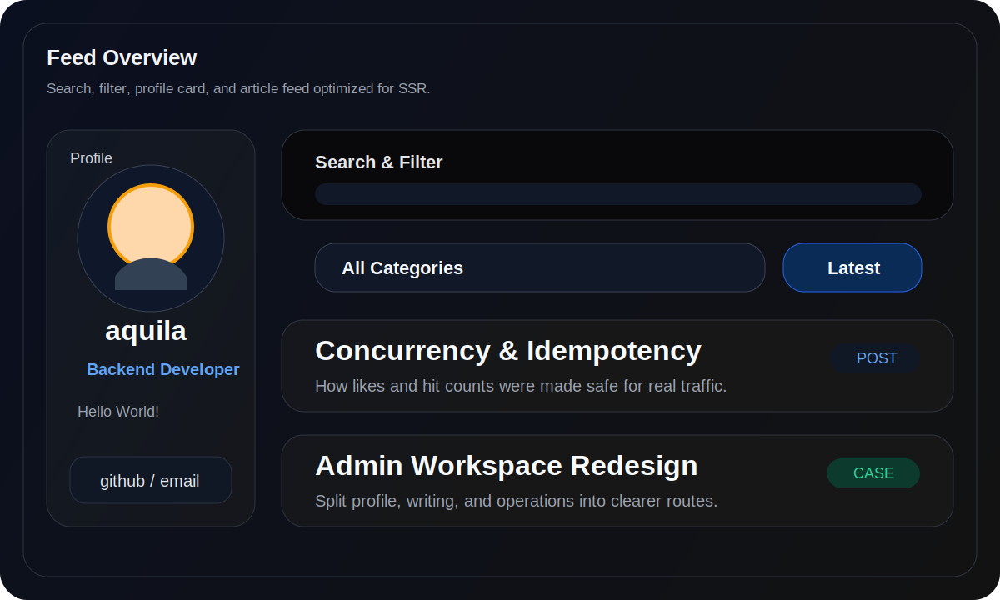
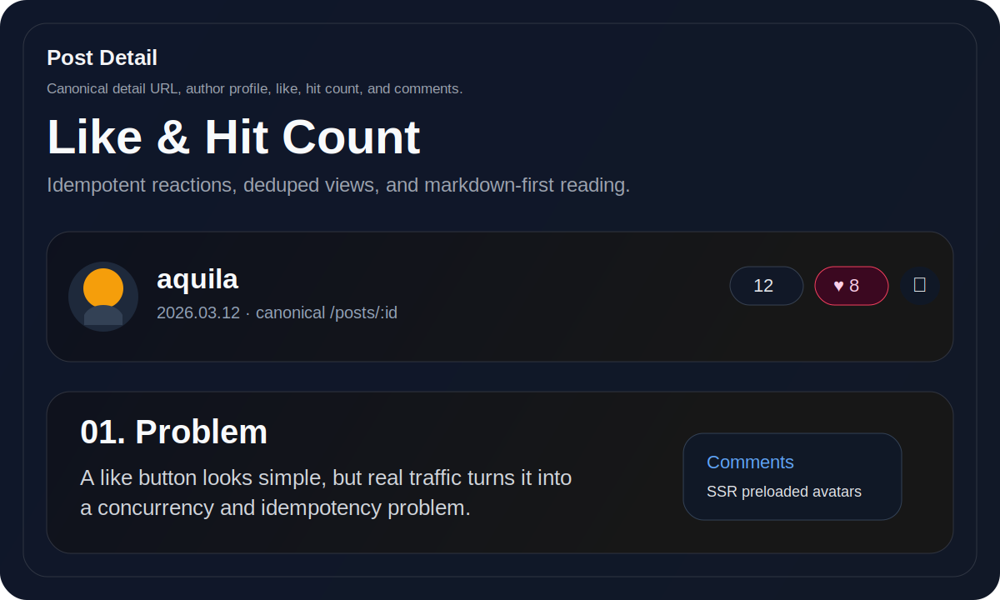
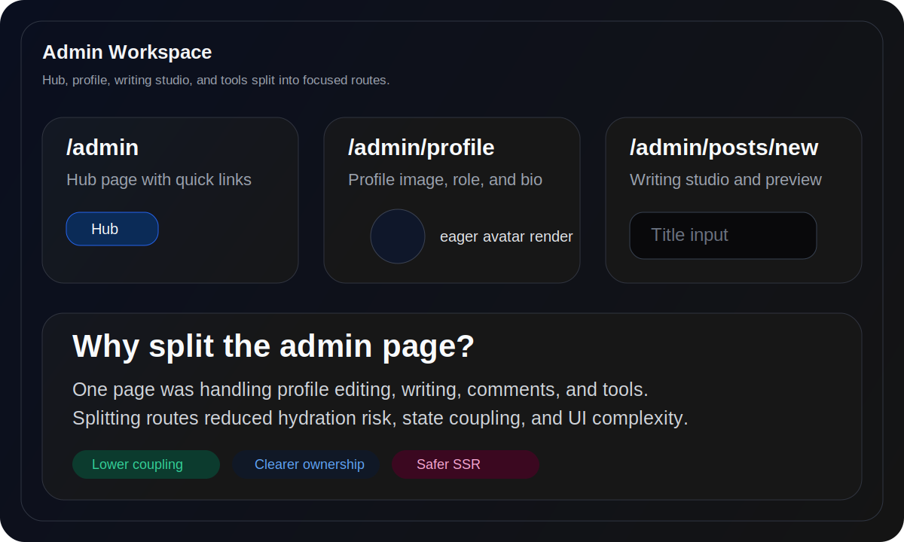
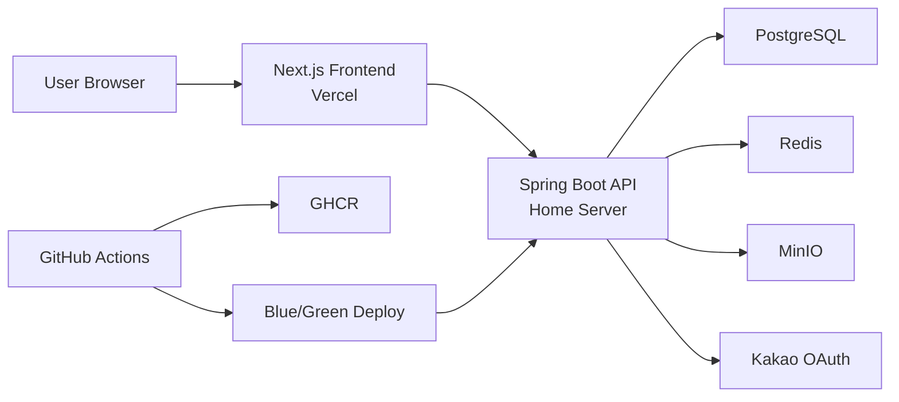
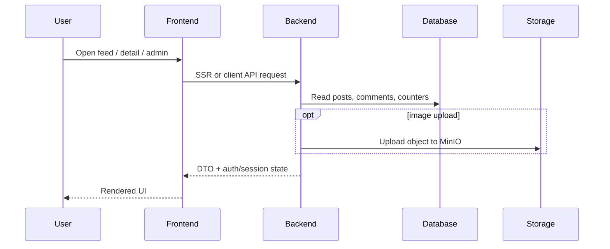

# Aquila Blog

개인 기술 블로그를 넘어, `콘텐츠 발행`, `인증`, `운영 자동화`, `홈서버 배포`, `실서비스 트러블슈팅`까지 직접 설계하고 운영한 풀스택 프로젝트입니다.

## Project Snapshot

| 항목 | 내용 |
| --- | --- |
| Frontend | Next.js Pages Router, React Query, Emotion |
| Backend | Spring Boot 4, Kotlin, JPA, PostgreSQL |
| Infra | Vercel, Home Server, Docker Compose, Caddy, Cloudflare Tunnel |
| Storage | PostgreSQL, Redis, MinIO |
| Auth | ID/PW 로그인, Kakao OAuth, 이메일 인증 회원가입, Cookie 기반 세션 |
| Deployment | GitHub Actions + GHCR + Blue/Green Deploy |

## Why This Project Exists

이 프로젝트는 단순한 블로그 구현이 아니라, 아래 질문에 답하기 위해 만들었습니다.

- 정적 블로그와 CMS의 중간 지점에서 어떤 설계가 가장 운영하기 좋은가
- 개인 규모 서비스에서도 인증, 이미지 저장, 배포 안정성을 얼마나 실무적으로 가져갈 수 있는가
- "기능 구현"을 넘어 "운영 가능한 구조"를 어떻게 설계하고 검증할 것인가

## What I Built

### 사용자 경험

- 메인 피드, 검색, 정렬, 카테고리 필터
- Markdown 기반 글 상세 페이지
- 댓글, 좋아요, 조회수
- 일반 로그인과 Kakao OAuth 로그인
- 이메일 인증 기반 회원가입
- 관리자 프로필, 글 작성, 운영 도구

### 운영 관점

- `Front(Vercel)` + `Back(Home Server)` 하이브리드 아키텍처
- Blue/Green 배포
- Redis 기반 로그인 제한과 조회수 dedupe
- MinIO 기반 게시글/프로필 이미지 저장
- 캐시와 SSR을 함께 활용한 빠른 초기 렌더

## Representative Screens

<table>
  <tr>
    <td width="33%">
      
      <p><strong>Feed Experience</strong><br/>검색, 카테고리 필터, 프로필 카드, 정렬이 한 화면에서 동작하는 메인 피드</p>
    </td>
    <td width="33%">
      
      <p><strong>Post Detail</strong><br/>canonical URL, 작성자 정보, 댓글, 좋아요/조회수 흐름을 포함한 상세 화면</p>
    </td>
    <td width="33%">
      
      <p><strong>Admin Workspace</strong><br/>허브, 프로필, 글 작업실, 도구를 분리한 관리자 워크스페이스</p>
    </td>
  </tr>
</table>

## System Overview



## Request Flow



## Key Design Decisions

## 1. Front와 Back을 분리한 이유

정적 페이지 생성만으로는 관리자 도구, 인증, 댓글, 이미지 업로드, 운영성 요구를 감당하기 어려웠습니다.  
그래서 `Next.js`는 사용자 경험과 SSR에 집중시키고, `Spring Boot`는 도메인 로직과 인증, 저장소 접근을 맡도록 역할을 분리했습니다.

## 2. 홈서버 + Vercel 하이브리드 구성을 선택한 이유

- 프론트는 글로벌 배포와 빠른 캐시가 중요
- 백엔드는 데이터, 스토리지, 운영 제어권이 중요

이 요구가 달라서, 프론트는 Vercel에 두고 백엔드는 홈서버에서 직접 운영하는 구성을 택했습니다.

## 3. "서비스 규모에 맞는 설계"를 우선한 이유

이 프로젝트는 대형 서비스가 아니기 때문에, 모든 문제를 대규모 분산 시스템처럼 풀지 않았습니다.

대신 아래 기준을 유지했습니다.

- 과한 복잡도는 피한다
- 하지만 운영 중 실제로 깨질 수 있는 지점은 방치하지 않는다
- 기존 구조를 무너뜨리지 않고 확장한다

예:

- 좋아요: 토글 API 대신 `PUT/DELETE` 멱등 API 도입
- 조회수: 이벤트 수집 시스템 대신 `Redis dedupe + TTL` 도입
- 이미지: 외부 스토리지 직접 URL + 버전 파라미터 사용

## Portfolio Highlights

### 아키텍처 리팩터링

- 백엔드 구조를 `adapter / application / domain` 방향으로 정리
- ArchUnit 규칙으로 레이어 위반을 테스트로 고정
- 관리자 화면을 허브/프로필/글 작업실/운영 도구로 분리

### 운영 안정성

- Blue/Green 배포 파이프라인 구축
- MinIO 초기화 실패 시 앱 전체를 죽이지 않도록 방어 로직 추가
- 로그인 시도 제한과 Redis fallback 설계

### 사용자 경험 개선

- SSR + React Query hydrate로 인증 상태와 프로필 이미지 지연 최소화
- 상세 페이지 canonical URL을 `/posts/:id`로 정리
- 모바일/반응형 레이아웃 흔들림 제거

## Documentation Map

포트폴리오 관점에서 문서를 읽으려면 아래 순서를 추천합니다.

1. [문서 인덱스](docs/README.md)
2. [System Architecture](docs/design/System-Architecture.md)
3. [Domain Design](docs/design/Domain-Design.md)
4. [Infrastructure Architecture](docs/design/Infrastructure-Architecture.md)
5. [좋아요/조회수 동시성·멱등성 개선기](docs/troubleshooting/post-like-hit-concurrency.md)

## Repository Structure

```text
.
├── back          # Spring Boot + Kotlin API
├── front         # Next.js frontend
├── deploy        # home server deployment scripts
├── docs          # architecture / operations / troubleshooting
└── .github       # CI/CD workflows
```

세부 구조 설명:

- [Package Structure](docs/design/package-structure.md)

## Validation

프로젝트 변경 시 기본적으로 아래 검증을 통과시켰습니다.

```bash
cd back && ./gradlew test --rerun-tasks
cd front && npm run lint
cd front && npm run build
```

운영성 변경은 추가로 아래 관점에서 확인했습니다.

- 인증/세션 회귀 여부
- 관리자 경로 접근 제어
- 이미지 업로드/표시
- 홈 피드 반영
- 배포 후 헬스체크

## What This Project Demonstrates

- 단순 CRUD를 넘어선 서비스 설계 능력
- 운영 중 발생하는 문제를 구조와 테스트로 해결하는 방식
- 서비스 규모에 맞는 기술 선택
- 프론트엔드/백엔드/인프라를 하나의 시스템으로 다루는 시각

## Notes

- 운영 가이드는 이제 `README`가 아니라 `docs` 아래 문서로 분리해 두었습니다.
- 이 저장소의 문서는 "어떻게 만들었는가"뿐 아니라 "왜 그렇게 선택했는가"를 함께 설명하는 포트폴리오 자료를 목표로 합니다.
