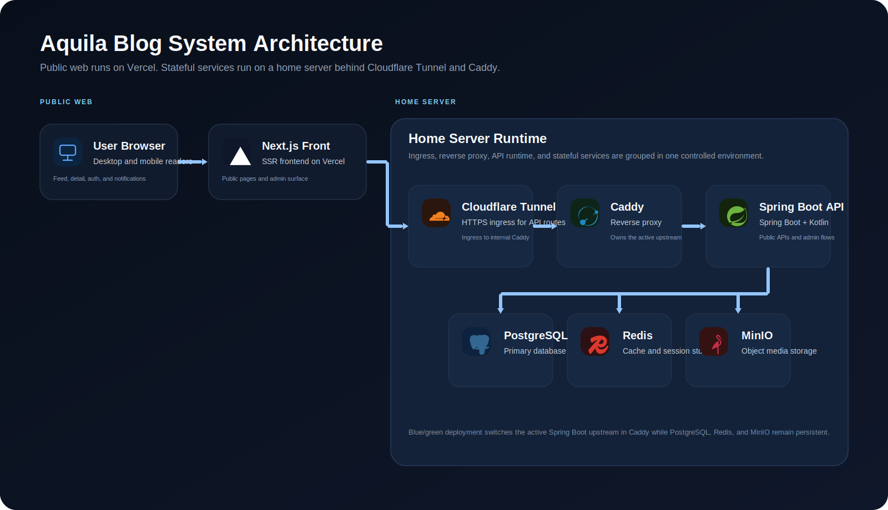

# Aquila Blog

운영 가능한 기술 블로그를 목표로 설계한 풀스택 프로젝트입니다.  
단순한 게시글 CRUD보다 `실서비스 운영`, `장애 복구`, `배포 자동화`, `회귀 방지`에 더 큰 비중을 두고 설계했습니다.

- Live: [https://www.aquilaxk.site](https://www.aquilaxk.site)
- Troubleshooting Portfolio: [docs/troubleshooting/00-INDEX.md](docs/troubleshooting/00-INDEX.md)
- System Architecture: [docs/design/System-Architecture.md](docs/design/System-Architecture.md)
- DevOps Guide: [docs/design/DevOps.md](docs/design/DevOps.md)



## 프로젝트 개요

Aquila Blog는 개인 블로그 수준을 넘어, 실제 운영 환경에서 오래 버틸 수 있는 콘텐츠 플랫폼을 직접 설계하고 운영해 보기 위해 만든 프로젝트입니다.

- 프런트는 `Next.js 14 + SSR`, 백엔드는 `Spring Boot 4 + Kotlin`으로 구성했습니다.
- 인프라는 `Vercel + Home Server` 하이브리드 구조로 나눴고, 홈서버에는 `Caddy + Cloudflare Tunnel + PostgreSQL + Redis + MinIO`를 올렸습니다.
- 기능보다 운영을 우선해 `Blue/Green 배포`, `runtime-split`, `OpenAPI 계약 검증`, `E2E/성능 회귀 테스트`, `트러블슈팅 문서화`를 핵심 자산으로 관리합니다.

## 왜 이 프로젝트가 차별점이 있는가

- `운영 가능성`을 기능 수보다 앞에 두었습니다.
  - Blue/Green 배포, steady-state guard, doctor/recover 스크립트, Prometheus metrics를 운영 경로에 포함했습니다.
- `문제가 터졌을 때 복구 가능한 구조`를 만들었습니다.
  - 공개 읽기 경로 fallback, 캐시 fail-open, degraded 응답, 권한/런타임 경계 테스트를 유지합니다.
- `문서화와 검증`을 같은 레벨로 다룹니다.
  - 설계 문서, 트러블슈팅 포트폴리오, OpenAPI 드리프트 체크, Playwright smoke/perf/a11y/live, Storybook gate를 함께 운영합니다.

## 핵심 기능

### Public

- 피드 / 탐색 / 검색 / 상세 조회
- Markdown 렌더링
  - Mermaid
  - 코드 하이라이팅
  - GitHub Alert 스타일 콜아웃
- 좋아요 / 조회수 / 댓글 / 실시간 알림(SSE)

### Content Studio

- 관리자 글 작업실
  - 목록 관리 / 작성 / 수정 / 발행 / 임시발행
  - 태그 / 카테고리 / 썸네일 / 미리보기 요약 편집
  - AI 태그 추천 fail-open
- 관리자 프로필 편집
- soft delete / 복구 / 영구 삭제 운영 플로우

### Auth & Platform

- 이메일 로그인 + Kakao OAuth
- 쿠키 기반 인증(`apiKey`, `accessToken`)
- 이미지 업로드 및 정리
  - MinIO 저장
  - 임시 업로드 -> 활성화 -> 지연 삭제 lifecycle

### Operations

- Blue/Green 배포 + rollback
- runtime-split(`read`, `admin`, `worker`) 운영
- `doctor.sh`, `recover.sh`, `steady_state_guard.sh`
- OpenAPI 계약 드리프트 체크
- Playwright smoke / perf / a11y / live 테스트

## 화면 및 운영 플로우

실제 서비스 화면 기준으로 `2026-03-26`에 캡처한 이미지를 사용했습니다.

### Feed


메인 피드에서 태그 필터, 검색, 카드형 목록을 바로 탐색할 수 있습니다.

### Post Detail


상세 화면은 태그, 작성 메타, 본문, 좌측 반응 액션, 우측 목차를 한 화면에서 확인하도록 구성했습니다.

### Admin Workspace


관리자 글 작업실은 작성 흐름, 메타데이터 편집, 미리보기를 같은 화면에서 이어서 처리하도록 정리했습니다.

### Content Publish Flow

일반적인 콘텐츠 서비스의 CMS 흐름과 비슷하게 `초안 -> 메타데이터 보강 -> 미리보기 검수 -> 발행 -> 운영 피드백` 순서로 설계했습니다.

| 단계 | 화면 / 주체 | 핵심 액션 | 저장 / 반영 대상 | 운영 체크포인트 |
| --- | --- | --- | --- | --- |
| 1. Draft Start | `/admin/posts/new` 관리자 | 제목/본문 초안 작성, 신규 작성과 기존 글 수정 분기, 브라우저 임시저장 | `post.title`, `post.content`, 브라우저 임시저장 | 초안 유실 방지, 신규/수정 흐름 분리 |
| 2. Metadata Enrichment | 글 작업실 | 태그 입력, AI 태그 추천, 공개 범위/목록 노출/썸네일/요약 조정 | `post_tag_index`, `post_attr`, `uploaded_file` | 태그 품질, 썸네일 연결, 공개 정책 확인 |
| 3. Preview QA | 글 작업실 미리보기 | Markdown, 코드 블록, Mermaid, 이미지 렌더 결과 확인 | `post.content_html`, 본문 내 이미지 참조 | 발행 전 렌더 깨짐, 이미지 누락, 서식 오류 점검 |
| 4. Publish Control | 관리자 발행 API | 발행, 비공개 전환, soft delete, 복구, 영구 삭제 | `post.published`, `post.listed`, `post.deleted_at` | listed/published 조합, 운영 rollback 가능 여부 |
| 5. Delivery & Feedback | 공개 피드/상세, 알림 | 피드 노출, 상세 조회, 댓글/좋아요/알림 반영 | `post_attr`, `post_comment`, `post_like`, `member_notification` | 댓글/좋아요 집계, SSE 알림, 운영 도구 점검 |

### ERD

README에서는 전체 스키마를 모두 그리기보다, 서비스 구조를 빠르게 이해할 수 있도록 핵심 테이블만 표로 정리했습니다.

핵심 관계는 아래 4줄로 이해하면 됩니다.

- `member -> post -> post_comment / post_like`
- `member -> member_notification`
- `post -> post_attr / post_tag_index`
- `uploaded_file -> post` 또는 `member profile`

#### Core Identity & Content

| Entity | 설명 |
| --- | --- |
| `member` | 사용자 계정, 관리자 판별, 로그인 정책 저장<br>핵심: `login_id`, `nickname`, `email`, `api_key`, `remember_login_enabled`, `ip_security_enabled`, `deleted_at`<br>관계: `post`, `post_comment`, `post_like`, `member_notification`의 기준 사용자 |
| `member_attr` | 프로필 카드, 카운트, 확장 속성 저장<br>핵심: `subject_id`, `name`, `int_value`, `str_value`<br>관계: `member` 1:N 확장 테이블 |
| `post` | 게시글 본문과 공개 상태 저장<br>핵심: `author_id`, `title`, `content`, `content_html`, `published`, `listed`, `deleted_at`<br>관계: `member` N:1, `post_comment`/`post_like`/`post_attr`/`post_tag_index` 1:N |
| `post_attr` | 좋아요 수, 댓글 수, 조회수, 메타 파생값 저장<br>핵심: `subject_id`, `name`, `int_value`, `str_value`<br>관계: `post` 1:N 확장 테이블 |
| `post_tag_index` | 태그 필터와 검색용 인덱스 저장<br>핵심: `post_id`, `tag`, `created_at`<br>관계: `post` 1:N, 발행 메타데이터에서 파생 생성 |

#### Engagement & Delivery

| Entity | 설명 |
| --- | --- |
| `post_comment` | 댓글과 대댓글 저장<br>핵심: `author_id`, `post_id`, `parent_comment_id`, `content`, `deleted_at`<br>관계: `member` N:1, `post` N:1, self-reference 1:N |
| `post_like` | 사용자-게시글 좋아요 관계 저장<br>핵심: `liker_id`, `post_id`<br>관계: `member` N:1, `post` N:1, `(liker_id, post_id)` 유니크 |
| `member_notification` | 댓글/답글 기반 알림 저장<br>핵심: `receiver_id`, `actor_id`, `type`, `post_id`, `comment_id`, `read_at`<br>관계: `member` 수신자/행위자 참조, `post`/`post_comment` 이벤트 기반 |
| `uploaded_file` | MinIO 오브젝트 lifecycle 추적<br>핵심: `object_key`, `purpose`, `status`, `owner_type`, `owner_id`, `purge_after`, `deleted_at`<br>관계: 글 이미지/프로필 이미지와 연결되며 blob는 MinIO에 저장 |

#### Operations & Security

| Entity | 설명 |
| --- | --- |
| `task` | 비동기 작업 큐와 재시도 상태 저장<br>핵심: `uid`, `aggregate_type`, `aggregate_id`, `task_type`, `status`, `retry_count`, `next_retry_at`<br>관계: 배치/정리 작업의 운영 상태 추적 |
| `auth_security_event` | 로그인/세션 보안 이벤트 저장<br>핵심: `event_type`, `member_id`, `login_identifier`, `remember_login_enabled`, `ip_security_enabled`, `reason`<br>관계: 인증 정책 변경과 보안 이벤트 관측 |

## 기술 스택

| 영역 | 스택 |
| --- | --- |
| Frontend | Next.js 14, React 18, TypeScript, Emotion, React Query |
| Content Rendering | react-markdown, Mermaid, rehype-pretty-code, Shiki |
| Backend | Spring Boot 4, Kotlin, Spring Security, JPA, QueryDSL, Flyway |
| Data | PostgreSQL, Redis, MinIO |
| Infra | Vercel, Home Server, Caddy, Cloudflare Tunnel, GHCR |
| Quality | ktlint, ArchUnit, Playwright, Storybook, k6, OpenAPI contract check |

## 아키텍처 포인트

### 1. Hybrid Runtime

- Front는 Vercel에서 SSR/브라우저 런타임을 맡습니다.
- Back는 홈서버에서 운영하며, `all` 모드뿐 아니라 `read`, `admin`, `worker` 런타임 분리도 지원합니다.

### 2. Safe Deployment

- 홈서버 배포는 `deploy/homeserver/blue_green_deploy.sh` 기준으로 동작합니다.
- cutover 이후 외부 프로브 실패 시 rollback을 우선합니다.
- `steady_state_guard.sh`를 통해 Caddy mount sync, readiness, backend 단일 실행 규칙을 상시 점검합니다.

### 3. Defensive Read Path

- 캐시 stampede 완화(`@Cacheable(sync=true)`)
- bulkhead + timeout
- cursor 실패 시 page API fallback
- Redis 역직렬화 실패 시 source fallback

### 4. Contract & Regression Guard

- 백엔드 OpenAPI 산출물을 프런트 계약으로 동기화합니다.
- UI 회귀는 Storybook + Playwright smoke/perf/a11y/live로 검증합니다.
- 트러블슈팅 문서는 원인, 대책, 검증을 같이 기록합니다.

## 프로젝트 구조

```text
.
├── front/                  # Next.js 14 frontend + Storybook + Playwright
├── back/                   # Spring Boot 4 + Kotlin backend
├── deploy/homeserver/      # Blue/Green 배포/복구/운영 스크립트
├── docs/design/            # 시스템/도메인/DevOps 설계 문서
├── docs/troubleshooting/   # 운영 장애/회귀 대응 포트폴리오
├── perf/k6/                # 공개 읽기 경로 성능 시나리오
└── docs/assets/portfolio/  # README/포트폴리오용 다이어그램 및 화면 자산
```

## 로컬 실행

### 사전 준비

- Java 24
- Node.js LTS
- Yarn Classic
- Docker Compose

### 1. 개발용 인프라 실행

```bash
docker compose -f back/devInfra/docker-compose.yml up -d
```

- PostgreSQL: `localhost:5432`
- Redis: `localhost:6379`
- MinIO: `localhost:9000`, console `localhost:9001`

### 2. 백엔드 실행

```bash
cd back
./gradlew bootRun
```

- 로컬 Swagger UI: [http://localhost:8080/swagger-ui/index.html](http://localhost:8080/swagger-ui/index.html)
- AI 태그 추천을 실제로 확인하려면 `CUSTOM__AI__TAG__GEMINI__API_KEY` 설정이 필요합니다.

### 3. 프런트 실행

```bash
cd front
yarn install
NEXT_PUBLIC_BACKEND_URL=http://localhost:8080 \
BACKEND_INTERNAL_URL=http://localhost:8080 \
yarn dev
```

- Front: [http://localhost:3000](http://localhost:3000)

## 품질 게이트

### Backend

```bash
cd back
./gradlew ktlintCheck
./gradlew compileKotlin
./gradlew test
```

- `./gradlew test`는 `back/testInfra/docker-compose.yml` 기반 Postgres/Redis를 자동 부트스트랩합니다.

### Frontend

```bash
cd front
yarn lint
yarn test:e2e:smoke
yarn test:e2e:perf
yarn test:e2e:a11y
yarn storybook:gate
yarn contracts:check
```

## 대표 트러블슈팅

README에서 모두 나열하지 않고, 면접/리뷰 관점에서 읽기 좋은 문서만 추렸습니다.

- [백엔드 테스트 OOM + ArchitectureGuard 회귀 동시 복구](docs/troubleshooting/18-backend-test-oom-and-architecture-guard-regression.md)
- [Blue/Green + Caddy upstream 드리프트 복구](docs/troubleshooting/07-bluegreen-caddy-drift.md)
- [라이브 502 반복 + AI 태그 추천 500 + 계약 드리프트 동시 복구](docs/troubleshooting/19-live-origin-502-ai-tag-contract-drift.md)
- [runtime-split 배포창 연쇄 회귀 복구](docs/troubleshooting/20-runtime-split-auth-and-e2e-regression-retrospective.md)
- [관리자 글 작업실 UX 압축](docs/troubleshooting/22-admin-manage-list-ux-compaction.md)
- 전체 인덱스: [docs/troubleshooting/00-INDEX.md](docs/troubleshooting/00-INDEX.md)

## 관련 문서

- 시스템 구조: [docs/design/System-Architecture.md](docs/design/System-Architecture.md)
- 인프라/배포: [docs/design/Infrastructure-Architecture.md](docs/design/Infrastructure-Architecture.md)
- DevOps 운영 기준: [docs/design/DevOps.md](docs/design/DevOps.md)
- 데이터 설계: [docs/design/Database-Design.md](docs/design/Database-Design.md)
- 프런트 구현 가이드: [docs/design/Frontend-Working-Guide.md](docs/design/Frontend-Working-Guide.md)
- 백엔드 세부 설명: [back/README.md](back/README.md)

## 프로젝트에서 강조하고 싶은 점

이 프로젝트는 "블로그를 만들었다"보다 "블로그를 운영했다"에 가깝습니다.  
SSR/인증/배포/스토리지/관측/회귀 테스트를 실제 운영 흐름 안에 묶어 두었고, 장애가 났을 때 원인과 재발 방지를 문서와 테스트로 남기는 방식을 프로젝트의 기본 규칙으로 삼았습니다.
