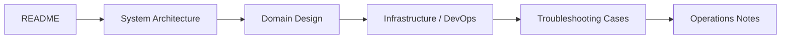

# Documentation Guide

이 문서들은 단순 참고 자료가 아니라, 이 프로젝트를 어떻게 설계했고 어떤 운영 문제를 어떻게 풀었는지를 보여주는 포트폴리오 자료입니다.

## Reading Path

처음 보는 사람에게는 아래 순서를 추천합니다.

## Document Categories

## 1. Architecture

| 문서 | 무엇을 보여주는가 | 추천 대상 |
| --- | --- | --- |
| [System Architecture](design/System-Architecture.md) | 시스템 전체 구조와 주요 읽기/쓰기 흐름 | 프로젝트 전체를 빠르게 파악하려는 사람 |
| [Domain Design](design/Domain-Design.md) | 도메인 경계, 액터, 핵심 규칙 | 백엔드 설계 의도를 보려는 사람 |
| [Infrastructure Architecture](design/Infrastructure-Architecture.md) | 실제 운영 인프라와 트래픽 흐름 | 배포/런타임 구성을 보려는 사람 |
| [Database Design](design/Database-Design.md) | 저장소 역할 분리와 데이터 모델 | 데이터 설계를 보려는 사람 |
| [Package Structure](design/package-structure.md) | 코드베이스 구조와 리팩터링 방향 | 코드 읽기 진입점을 찾는 사람 |
| [Frontend Working Guide](design/Frontend-Working-Guide.md) | 프론트 UX 수정 기준과 화면별 원칙 | 프론트 화면을 계속 다듬어야 하는 사람 |
| [Backend Auth Member Guide](design/Backend-Auth-Member-Guide.md) | 로그인/회원가입 백엔드 지원 범위와 한계 | 인증/회원 흐름을 바꾸려는 사람 |
| [Signup Verification Working Guide](design/Signup-Verification-Working-Guide.md) | 이메일 인증 회원가입 플로우와 구현 기준 | 인증 회원가입을 이어서 다듬어야 하는 사람 |

## 2. Delivery & Operations

| 문서 | 무엇을 보여주는가 | 추천 대상 |
| --- | --- | --- |
| [DevOps](design/DevOps.md) | CI/CD, Blue/Green 배포, 운영 규칙 | 배포 자동화와 안정성을 보려는 사람 |
| [Git Workflow](design/Git-Workflow.md) | 변경 검증과 배포 흐름 | 협업/배포 기준을 보려는 사람 |
| [SW Connect Service Plan](design/sw-connect-service-plan.md) | 서비스 간 연결 계약과 약한 지점 | 통합 관점을 보려는 사람 |
| [Session Handoff](session-handoff.md) | 운영 체크포인트와 빠른 트리아지 | 실제 운영 시나리오를 보려는 사람 |

## 3. Troubleshooting

| 문서 | 무엇을 보여주는가 | 핵심 주제 |
| --- | --- | --- |
| [좋아요/조회수 동시성·멱등성 개선기](troubleshooting/post-like-hit-concurrency.md) | 선택지 비교, 설계 결정, 검증 과정 | 멱등성, 동시성, Redis dedupe, DB atomic update |

## How To Read This As a Portfolio

이 문서 세트는 아래 질문에 답하도록 구성했습니다.

- 어떤 문제를 정의했는가
- 어떤 선택지를 비교했는가
- 왜 현재 서비스 규모에서 그 선택이 최적이었는가
- 실제로 어떻게 검증했는가

즉, 단순한 "구현 설명"보다 `의사결정 과정`과 `운영 가능한 결과물`을 보여주는 데 초점을 두고 있습니다.

## Working Docs Policy

아래 working guide 문서들은 일회성 메모가 아니라, 실제 구현을 진행하면서 계속 읽고 수정하는 기준 문서다.

- Frontend Working Guide
- Backend Auth Member Guide
- Signup Verification Working Guide

새 기능을 길게 다룰 필요가 생기면 `design/` 아래에 새 guide를 추가하고, 작업이 끝나면 문서 인덱스에도 함께 반영한다.

## Suggested Paths By Interest

### 백엔드 설계에 관심 있다면

1. [Domain Design](design/Domain-Design.md)
2. [Package Structure](design/package-structure.md)
3. [좋아요/조회수 동시성·멱등성 개선기](troubleshooting/post-like-hit-concurrency.md)

### 인프라/배포에 관심 있다면

1. [Infrastructure Architecture](design/Infrastructure-Architecture.md)
2. [DevOps](design/DevOps.md)
3. [Session Handoff](session-handoff.md)

### 제품 관점에서 전체를 보고 싶다면

1. [System Architecture](design/System-Architecture.md)
2. [Domain Design](design/Domain-Design.md)
3. [좋아요/조회수 동시성·멱등성 개선기](troubleshooting/post-like-hit-concurrency.md)
