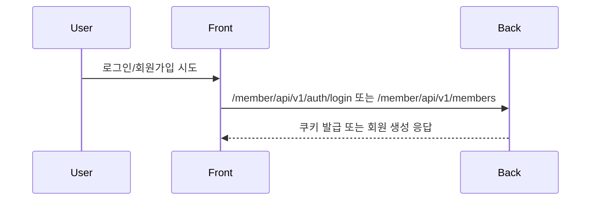

# Backend Auth Member Guide

Last updated: 2026-03-13

## 3줄 요약

- 로그인/회원/인증 관련 작업이면 이 문서를 먼저 보고, 이메일 인증 회원가입만 바꿀 때는 `Signup-Verification-Working-Guide.md`를 추가로 본다.
- 현재 기준은 일반 로그인 + 카카오 OAuth + 이메일 인증 회원가입 지원이며, 콜백 URL은 `${custom.site.backUrl}` 기준으로 고정한다.
- 프론트 UX를 바꾸더라도 백엔드가 이미 지원하는 범위와 아직 없는 기능을 먼저 구분해야 한다.

## 이 문서의 목적

이 문서는 프론트 인증 UX를 바꾸려 할 때, 백엔드가 현재 어디까지 지원하는지와 어떤 기능이 아직 없는지를 빠르게 확인하기 위한 기준 문서다.

특히 아래 질문에 답하도록 만든다.

- 지금 로그인은 어떻게 동작하는가
- 회원가입은 어떤 방식인가
- 이메일 인증 기반 가입은 이미 있는가
- 프론트에서 가능한 것과 백엔드 추가 개발이 필요한 것은 무엇인가

## 현재 백엔드 인증/회원 흐름

## 현재 지원 기능

### 로그인

- 일반 로그인
  - `POST /member/api/v1/auth/login`
  - 입력: `username`, `password`
- 카카오 OAuth 로그인
  - `/oauth2/authorization/kakao`
  - redirect-uri: `${custom.site.backUrl}/login/oauth2/code/{registrationId}`
  - `redirectUrl` 쿼리는 callback URL이 아니라 로그인 성공 후 프론트로 되돌아갈 주소를 `state`에 실어 보내는 값이다

관련 파일:

- [ApiV1AuthController.kt](../../back/src/main/kotlin/com/back/boundedContexts/member/adapter/web/ApiV1AuthController.kt)
- [AuthTokenService.kt](../../back/src/main/kotlin/com/back/boundedContexts/member/application/service/AuthTokenService.kt)
- [SecurityConfig.kt](../../back/src/main/kotlin/com/back/global/security/config/SecurityConfig.kt)

### 회원가입

- 직접 가입 방식
  - `POST /member/api/v1/members`
  - 입력: `username`, `password`, `nickname`

관련 파일:

- [ApiV1MemberController.kt](../../back/src/main/kotlin/com/back/boundedContexts/member/adapter/web/ApiV1MemberController.kt)
- [MemberApplicationService.kt](../../back/src/main/kotlin/com/back/boundedContexts/member/application/service/MemberApplicationService.kt)
- [MemberUseCase.kt](../../back/src/main/kotlin/com/back/boundedContexts/member/application/port/input/MemberUseCase.kt)

## 현재 추가된 기능

### 1. 이메일 인증 기반 회원가입

추가됨:

- `POST /member/api/v1/signup/email/start`
- `GET /member/api/v1/signup/email/verify?token=...`
- `POST /member/api/v1/signup/complete`

관련 파일:

- `back/src/main/kotlin/com/back/boundedContexts/member/subContexts/signupVerification/application/service/MemberSignupVerificationService.kt`
- `back/src/main/kotlin/com/back/boundedContexts/member/subContexts/signupVerification/adapter/web/ApiV1SignupVerificationController.kt`
- `back/src/main/kotlin/com/back/boundedContexts/member/subContexts/signupVerification/model/MemberSignupVerification.kt`

### 2. 메일 발송 인프라

추가됨:

- `spring-boot-starter-mail`
- SMTP adapter
- test profile용 fake mail sender
- 회원가입 메일은 UTF-8 HTML 본문과 UTF-8 subject를 함께 사용하고, subject에 깨진 문자(`�`)가 섞이면 코드 기본 제목으로 대체한다
- UTF-8 HTML 회원가입 메일 템플릿과 CTA 버튼

관련 파일:

- `back/build.gradle.kts`
- `back/src/main/resources/application.yaml`
- `back/src/main/kotlin/com/back/boundedContexts/member/subContexts/signupVerification/adapter/mail/SmtpSignupVerificationMailSenderAdapter.kt`
- `back/src/main/kotlin/com/back/boundedContexts/member/subContexts/signupVerification/adapter/mail/TestSignupVerificationMailSenderAdapter.kt`
- `back/src/main/kotlin/com/back/boundedContexts/member/subContexts/signupVerification/application/service/SignupMailDiagnosticsService.kt`
- `back/src/main/kotlin/com/back/global/system/adapter/web/ApiV1AdmSystemController.kt`

관리자 운영 점검용 API:

- `GET /system/api/v1/adm/mail/signup`
- `GET /system/api/v1/adm/mail/signup?checkConnection=true`
- `POST /system/api/v1/adm/mail/signup/test`

## 현재 프론트가 할 수 있는 것과 없는 것

| 요구 | 프론트만으로 가능 여부 | 이유 |
| --- | --- | --- |
| 상단 Login을 모달로 바꾸기 | 가능 | 로그인 API는 이미 있음 |
| Signup 버튼을 네비에서 제거 | 가능 | UI 구조 변경 |
| 로그인 모달 안에서 회원가입 진입 | 가능 | 링크/모달 상태로 처리 가능 |
| 댓글창에서 로그인 모달 띄우기 | 가능 | 로그인 API는 이미 있음 |
| 메일 입력 후 인증 메일 발송 | 가능 | start API 추가 |
| 메일 링크 검증 후 가입 단계 진입 | 가능 | verify API 추가 |
| 인증 완료 이메일만 최종 가입 허용 | 가능 | signup session token으로 보호 |

## 권장 구현 순서

### 1단계. 프론트 인증 진입 구조 정리

- 상단 `Login` 모달화
- `Signup` 직접 노출 제거
- 로그인 모달 내부에서 회원가입 진입

이 단계는 현재 백엔드와 충돌하지 않는다.

### 2단계. 프론트 회원가입 UX를 이메일 인증 기반으로 재구성

흐름:

1. 로그인 모달 내부에서 회원가입 클릭
2. 이메일 입력
3. 인증 메일 발송 성공 상태 표시
4. 메일 링크 클릭
5. 최종 가입 폼 진입
6. 가입 완료 후 일반 로그인

## 구현 시 고려해야 할 백엔드 모델

이메일 인증 기반으로 가려면 최소 아래 개념이 필요하다.

| 개념 | 역할 |
| --- | --- |
| signup verification token | 인증 링크 검증 |
| pending signup session | 인증 완료 후 최종 가입 단계 보호 |
| verified email state | 검증된 이메일만 가입 허용 |
| expiration | 링크 만료 처리 |
| resend policy | 무분별한 메일 발송 방지 |

## 현재 가장 먼저 참고할 백엔드 파일

- `back/src/main/kotlin/com/back/boundedContexts/member/adapter/web/ApiV1AuthController.kt`
- `back/src/main/kotlin/com/back/boundedContexts/member/adapter/web/ApiV1MemberController.kt`
- `back/src/main/kotlin/com/back/boundedContexts/member/application/service/MemberApplicationService.kt`
- `back/src/main/kotlin/com/back/boundedContexts/member/subContexts/signupVerification/application/service/MemberSignupVerificationService.kt`
- `back/src/main/kotlin/com/back/boundedContexts/member/subContexts/signupVerification/adapter/web/ApiV1SignupVerificationController.kt`
- `back/src/main/resources/application.yaml`
- `back/build.gradle.kts`

## 주의할 점

- 현재 로그인 식별자는 `email`이 아니라 `username`이다.
- 회원가입도 `email` 필드 없이 동작한다.
- 따라서 이메일 인증 가입을 넣는 순간, 가입 도메인과 프론트 폼 구조를 같이 재설계해야 한다.
- 프론트에서 모달 UI만 먼저 바꾸는 것은 안전하지만, 이메일 인증 흐름을 프론트만으로 흉내 내면 곧 구조 충돌이 난다.

## 결론

현재 기준에서:

- 로그인 모달화 완료
- 회원가입 네비 제거 완료
- 이메일 인증 기반 가입 백엔드 API 추가 완료
- 이제 프론트 최종 가입 UX와 운영 검증을 계속 다듬는 단계다
