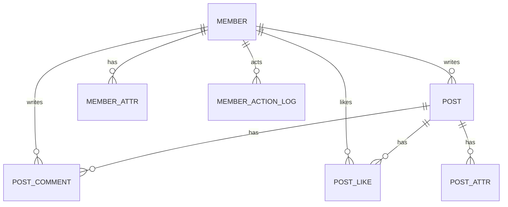

# Database Design

Last updated: 2026-03-12

## 이 문서가 보여주는 것

이 문서는 저장소를 단순히 나열하는 것이 아니라, 왜 `PostgreSQL + Redis + MinIO` 조합을 선택했고 각 저장소에 어떤 책임을 분배했는지를 보여준다.

## 목적

현재 프로젝트의 데이터 저장소는 `PostgreSQL + Redis + MinIO` 조합이다. 정규 데이터와 검색 인덱스는 PostgreSQL이 맡고, 세션/캐시/분산락은 Redis가 맡으며, 게시글 이미지 바이너리는 MinIO(S3 호환 스토리지)에 저장한다.

## 저장소 역할 매트릭스

| 저장소 | 주 역할 | 대표 데이터 | 장애 시 영향 |
| --- | --- | --- | --- |
| PostgreSQL | 정규 데이터 저장, 검색 인덱스 | 회원, 게시글, 댓글, 좋아요, 액션 로그, 작업 큐 | 글/회원/관리자 기능 대부분 중단 |
| Redis | 세션, 캐시, 분산 락 | 로그인 세션, 캐시 키, ShedLock 상태 | 로그인 유지, 일부 운영 작업 저하 |
| MinIO | 바이너리 오브젝트 저장 | 게시글 이미지, 관리자 프로필 이미지 | 이미지 업로드/조회 실패 |

## 핵심 엔티티

| 엔티티 | 역할 | 핵심 컬럼 |
| --- | --- | --- |
| `member` | 사용자 계정, 관리자 판별 기준 | `username`, `password`, `nickname`, `api_key`, `deleted_at` |
| `member_attr` | 사용자 확장 속성/집계 저장 | `subject_id`, `name`, `int_value`, `str_value` |
| `post` | 게시글 본문과 공개 상태 저장 | `author_id`, `title`, `content`, `published`, `listed`, `deleted_at` |
| `post_attr` | 게시글 파생 수치 저장 | `subject_id`, `name`, `int_value`, `str_value` |
| `post_comment` | 댓글 저장 | `author_id`, `post_id`, `content` |
| `post_like` | 사용자-게시글 좋아요 관계 | `liker_id`, `post_id` |
| `member_action_log` | 사용자 행동 이력 저장 | `type`, `primary_type`, `primary_id`, `secondary_type`, `actor_id`, `data` |
| `task` | 비동기 작업 큐 | `uid`, `aggregate_type`, `aggregate_id`, `task_type`, `status`, `payload` |

## 관계

## 데이터 배치 방식

| 데이터 종류 | 저장 위치 | 예시 | 비고 |
| --- | --- | --- | --- |
| 정규 엔티티 | PostgreSQL 메인 테이블 | `member`, `post`, `post_comment` | 트랜잭션 대상 |
| 파생 수치 | Attr 테이블 | 좋아요 수, 댓글 수, 조회 수 | 집계/확장용 |
| 비정형 본문 | `post.content` | Markdown, YAML front matter | 태그/카테고리 메타 포함 가능 |
| 세션/캐시 | Redis | 인증 세션, 캐시 엔트리 | 휘발성/재생성 가능 |
| 바이너리 파일 | MinIO | 업로드 이미지 | DB에는 object key만 남음 |

## 설계 포인트

- `member`, `post`는 모두 soft delete를 사용한다. 실제 삭제 대신 `deleted_at`을 채우고, 기본 조회에는 `@SQLRestriction("deleted_at IS NULL")`가 적용된다.
- 게시글 가시성은 `published`와 `listed` 두 플래그로 나뉜다.
- 현재 태그와 카테고리는 별도 테이블로 정규화되어 있지 않다.
  게시글 DTO에 별도 필드가 없기 때문에, 프론트엔드는 본문 상단 메타데이터(YAML front matter 또는 `tags:`/`categories:` 라인)를 파싱해 보강한다.
- 게시글 이미지 자체는 DB에 저장하지 않고 MinIO object key만 Markdown 본문에 들어간다.
- 좋아요 수, 댓글 수, 조회 수 같은 파생 수치는 `post_attr`에 저장한다.
- 사용자별 프로필 카드/추가 속성/카운트는 `member_attr` 확장 테이블을 사용한다.

## 인덱스 및 검색 전략

- `member`는 `username`, `nickname` 대상 PGroonga 인덱스를 사용한다.
- `post`는 `title`, `content` 대상 PGroonga 인덱스를 사용한다.
- `post`는 목록/정렬 성능을 위해 `listed + created_at`, `listed + modified_at`, `author_id + created_at`, `author_id + modified_at` 조합 인덱스를 둔다.
- `post_like`는 `(liker_id, post_id)` 유니크 제약으로 중복 좋아요를 방지한다.
- `member_attr`, `post_attr`는 `(subject_id, name)` 유니크 제약으로 속성 중복 저장을 막는다.
- `task`는 pending 작업 poll 비용을 줄이기 위해 `(status, next_retry_at)` 복합 인덱스를 둔다.

## 조회 패턴과 테이블 영향

| 조회 시나리오 | 주 테이블 | 보조 데이터 |
| --- | --- | --- |
| 메인 글 목록 | `post`, `member` | `post_attr` 집계값 |
| 글 상세 | `post`, `member` | `post_attr`, `post_like` |
| 댓글 목록 | `post_comment`, `member` | `post` |
| 관리자 전체 검색 | `post`, `member` | PGroonga 검색 인덱스 |
| 관리자 프로필 표시 | `member`, `member_attr` | 프로필 이미지 URL |

## Redis 사용 범위

- Spring Session 저장소
- 애플리케이션 캐시
- ShedLock 기반 분산 락
- 로그인 시도 제한 카운터/차단 TTL 키
- 운영 헬스체크에서 ping 대상으로 사용

## MinIO 사용 범위

- 게시글 이미지 업로드
- object key는 `CUSTOM_STORAGE_KEYPREFIX/yyyy/MM/<uuid>.<ext>` 형식으로 생성
- 업로드 실패나 endpoint 설정 오류가 있어도 앱 전체를 죽이지 않도록 방어 코드가 들어가 있다

## 현재 제약

- 태그/카테고리는 아직 백엔드의 정규 검색 필드가 아니다.
- 이미지 메타데이터 테이블이 없으므로 이미지 사용 추적, 고아 파일 정리, 파일 단위 권한 모델은 없다.
- 관리자/운영성 데이터는 일부 환경변수와 `member.username` 규칙에 의존한다.

## 향후 정규화 후보

| 후보 | 이유 | 기대 효과 |
| --- | --- | --- |
| `post_tag`, `tag` | 본문 파싱 의존 제거 | 검색/필터 정확도 향상 |
| `post_category`, `category` | 관리자 분류 체계 강화 | 목록/SEO/추천 단순화 |
| `uploaded_file` | 이미지 추적 필요 | orphan cleanup, 용량 분석 |
