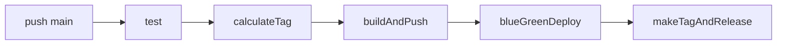
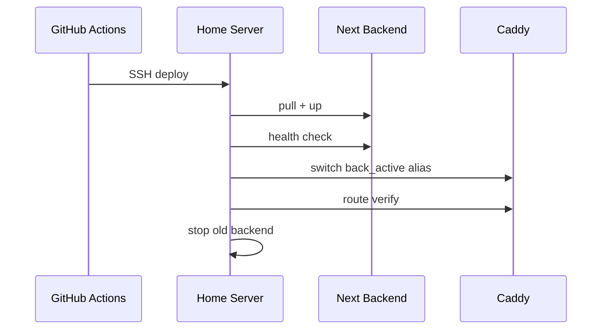

# DevOps

Last updated: 2026-03-12

## 이 문서가 보여주는 것

이 문서는 배포를 자동화했다는 사실보다, 개인 서비스에서도 어떤 수준까지 배포 안정성과 운영 검증을 가져갈 수 있었는지를 보여주는 자료다.

## 배포 파이프라인 요약

`main` 브랜치에 push되면 `.github/workflows/deploy.yml`이 실행된다.



1. `test`
   백엔드 테스트를 Docker 기반 Postgres/Redis 위에서 수행한다.
2. `calculateTag`
   GHCR 이미지 태그와 릴리즈 태그를 계산한다.
3. `buildAndPush`
   `back/Dockerfile`로 백엔드 이미지를 빌드해 GHCR에 push한다.
4. `blueGreenDeploy`
   Tailscale + SSH로 홈서버에 접속해 blue/green 배포를 수행한다.
5. `makeTagAndRelease`
   배포 성공 시 GitHub release/tag를 생성한다.

## 운영 런타임

- Frontend: Vercel
- Backend: 홈서버 Docker Compose
- Reverse proxy: Caddy
- External ingress: Cloudflare Tunnel
- Data: PostgreSQL, Redis, MinIO
- Artifact registry: GHCR

## 홈서버 배포 파일

- `deploy/homeserver/docker-compose.prod.yml`
- `deploy/homeserver/blue_green_deploy.sh`
- `deploy/homeserver/rollback_last_deploy.sh`
- `deploy/homeserver/create_deploy_backup.sh`
- `deploy/homeserver/Caddyfile`
- `deploy/homeserver/.env.prod.example`

## 핵심 Secrets

GitHub Actions 기준 필수값:

- `TS_AUTHKEY`
- `HOME_SSH_USER`
- `HOME_APP_DIR`
- `HOME_TAILSCALE_HOST` 또는 `HOME_TS_HOST` 또는 `HOME_SSH_HOST`
- `HOME_SSH_KEY`
- `HOME_SERVER_ENV`

선택값:

- `HOME_SSH_PORT`
- `HOME_KNOWN_HOSTS`
- `HOME_GHCR_USERNAME`
- `HOME_GHCR_TOKEN`

회원가입 이메일 인증을 실제로 쓰려면 아래 값도 필요하다.

- `SPRING__MAIL__HOST`
- `SPRING__MAIL__PORT`
- `SPRING__MAIL__USERNAME`
- `SPRING__MAIL__PASSWORD`
- `SPRING__MAIL__PROPERTIES__MAIL__SMTP__AUTH`
- `SPRING__MAIL__PROPERTIES__MAIL__SMTP__STARTTLS__ENABLE`
- `CUSTOM__MEMBER__SIGNUP__MAIL_FROM`
- `CUSTOM__MEMBER__SIGNUP__MAIL_SUBJECT`
- `CUSTOM__MEMBER__SIGNUP__VERIFY_PATH`
- `CUSTOM__MEMBER__SIGNUP__EMAIL_EXPIRATION_SECONDS`
- `CUSTOM__MEMBER__SIGNUP__SESSION_EXPIRATION_SECONDS`

## Secret 책임 표

| Secret | 사용 위치 | 책임 |
| --- | --- | --- |
| `HOME_SERVER_ENV` | 홈서버 `.env.prod` 생성 | 운영 환경변수 단일 원본 |
| `TS_AUTHKEY` | GitHub Actions | Tailscale 연결 |
| `HOME_SSH_KEY` | GitHub Actions | 서버 SSH 접속 |
| `HOME_APP_DIR` | GitHub Actions -> SSH 원격 실행 | 서버 Git 저장소 경로 |
| `HOME_GHCR_USERNAME`, `HOME_GHCR_TOKEN` | 홈서버 GHCR login | private image pull |

## 중요한 운영 규칙

- `HOME_SERVER_ENV`가 배포 시점마다 `deploy/homeserver/.env.prod`를 덮어쓴다.
  즉, 서버의 로컬 `.env.prod`가 아니라 GitHub Secret이 사실상 운영 환경의 source of truth다.
- 로그인 시도 제한은 Redis가 살아 있으면 Redis TTL 키를 사용해 인스턴스 간 상태를 공유하고, Redis가 없을 때만 인메모리 fallback을 사용한다.
- storage 관련 값은 placeholder 치환에 의존하지 말고 완성된 문자열로 넣어야 한다.
  예: `CUSTOM_STORAGE_SECRETKEY=${MINIO_ROOT_PASSWORD}` 금지, 실제 비밀번호 문자열 사용.
- `#`가 들어가는 값은 반드시 큰따옴표로 감싼다.
  예: `MINIO_ROOT_PASSWORD="V7#qL2m@9Tz!4xRb8KpD"`
- `CUSTOM_STORAGE_ENDPOINT`는 `http://minio_1:9000` 같은 완성된 URI여야 한다.
- 배포 스크립트는 이제 `http:` 같은 깨진 endpoint나 `${...}` placeholder가 남아 있으면 즉시 실패시킨다.
- task processor 기본값은 `60초` poll, `50건` batch이며, `CUSTOM__TASK__PROCESSOR__FIXED_DELAY_MS`, `CUSTOM__TASK__PROCESSOR__BATCH_SIZE`로 조정한다.
- 파일 정리 잡 기본값은 `1시간` poll, `100건` batch이며, temp/profile/post attachment 보존기간도 env로 조정할 수 있다.

## Blue/Green 전환 원칙

- Caddy는 색상별 서비스명을 직접 바라보지 않고 `back_active:8080`으로 라우팅한다.
- 신규 컨테이너가 올라오면 readiness check 통과 후 `back_active` alias를 새 컨테이너로 옮긴다.
- alias 전환 직후 Caddy를 다시 reload해서 `back_active`의 새 IP를 기준으로 upstream을 재해석하게 만든다.
- 직접 backend health probe는 Tomcat의 Host 검증에 걸리지 않도록 `back-blue`, `back-green` 같은 HTTP-safe alias로 호출한다.
- Caddy 라우팅 검증이 끝나기 전에는 기존 active를 내리지 않는다.
- 실패 시 rollback 스크립트가 backup 상태를 기준으로 복구한다.



## 배포 검증 단계

| 단계 | 검증 내용 | 실패 시 |
| --- | --- | --- |
| storage env 검사 | endpoint, secret placeholder 확인 | 배포 중단 |
| auth throttle 확인 | Redis 연결 및 TTL 키 동작 | brute-force 완화 불능 |
| 신규 backend 기동 | `/actuator/health/readiness` 가 `200` 응답 | cutover 전 중단 |
| alias 전환 | `back_active` IP 일치 여부 | rollback 시도 |
| Caddy 경유 검증 | `Host` 헤더 기반 `/actuator/health/readiness` 가 `200` 응답 | rollback 시도 |
| post-check | active backend와 alias 1:1 매칭 확인 | workflow 실패 |

- 배포 readiness는 `ping,db`만 포함한다.
  외부 SMTP 상태는 관리자용 메일 진단 API에서 별도로 확인하고, 메일 서버 일시 장애 때문에 전체 롤아웃이 막히지 않게 한다.

## 운영 체크리스트

- 배포 후 `https://api.<domain>/actuator/health` 응답 확인
- `GET /system/api/v1/adm/mail/signup`으로 회원가입 메일 준비 상태 확인
- 필요 시 `POST /system/api/v1/adm/mail/signup/test`로 테스트 메일 1통 발송
- 프론트 로그인/회원가입/API 쿠키 흐름 확인
- 연속 로그인 실패 시 차단 상태가 인스턴스 간 일관되게 유지되는지 확인
- 관리자 페이지의 글 목록, 글 발행, 서버 상태 조회 확인
- task backlog가 있으면 1분 내 `PENDING -> PROCESSING/COMPLETED`로 이동하는지 확인
- 관리자 프로필 이미지/글 이미지 업로드가 필요한 경우 MinIO 환경변수와 업로드 API 확인
- 이미지 정리 정책을 바꿨다면 `uploaded_file` 상태(`TEMP`, `PENDING_DELETE`)와 MinIO 사용량 추이를 같이 본다
- Cloudflare Tunnel이 `caddy:80`으로 정상 연결되는지 확인

## 자주 보는 장애 유형

- `401` / `CORS`:
  프론트 도메인, API 도메인, 쿠키 도메인 설정 불일치
- `502`:
  Caddy upstream alias 불일치, backend 미기동, DNS resolve 실패
- `URISyntaxException: http:`:
  `CUSTOM_STORAGE_ENDPOINT`가 운영 Secret에서 깨진 상태
- `MinIO password blank`:
  `HOME_SERVER_ENV`에 값이 누락되었거나 `#` 때문에 뒷부분이 주석 처리됨
- `503` on `/profileImageFile` or `/posts/images`:
  MinIO env 비활성화, placeholder 미치환, bucket/client init 실패
- 업로드는 되는데 나중에 파일이 정리되지 않음:
  `uploaded_file` purge job 설정, `CUSTOM__STORAGE__RETENTION__*` 값, 본문/프로필 참조 여부 확인

## 장애 대응 우선순위

| 증상 | 가장 먼저 볼 곳 | 다음 액션 |
| --- | --- | --- |
| 프론트 로그인 실패 | 브라우저 네트워크 탭 | CORS, cookie domain, `/auth/me` 확인 |
| API 502 | Caddy 로그, active alias | backend 컨테이너/resolve 확인 |
| 배포 중 restart loop | backend 로그 | env, DB, Redis, MinIO 연결 확인 |
| 회원가입 메일이 안 감 | `/system/api/v1/adm/mail/signup` | SMTP host/from/username/password, 연결 여부 확인 |
| 글 발행 후 반영 안 됨 | 목록 API 응답, 캐시 헤더, revalidate hook | `/post/api/v1/posts`, `Cache-Control`, `/api/revalidate` 확인 |

## 로컬/서버에서 자주 쓰는 명령

```bash
./deploy/homeserver/doctor.sh
./deploy/homeserver/blue_green_deploy.sh
./deploy/homeserver/rollback_last_deploy.sh
docker compose --env-file deploy/homeserver/.env.prod -f deploy/homeserver/docker-compose.prod.yml ps
docker compose --env-file deploy/homeserver/.env.prod -f deploy/homeserver/docker-compose.prod.yml logs -f back_blue
```
