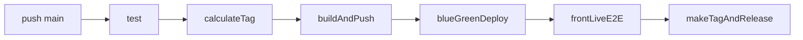
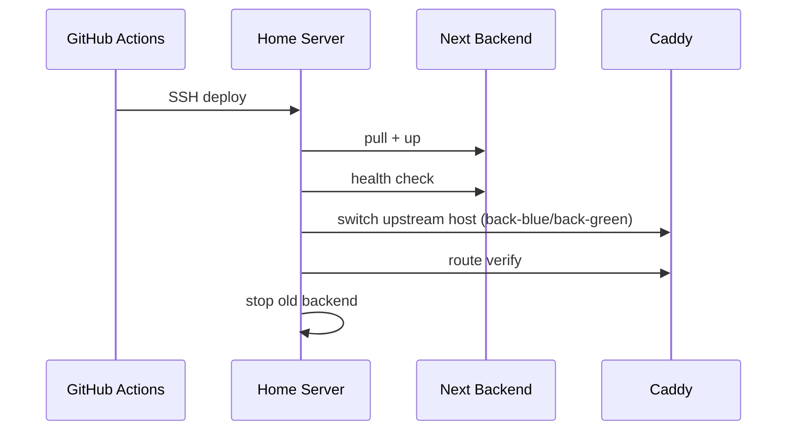

# DevOps

Last updated: 2026-03-19

## 3줄 요약

- CI/CD 흐름과 배포 단계 확인이 필요할 때 이 문서를 먼저 읽는다.
- 현재 `main` push는 테스트 -> 이미지 빌드 -> blue/green 배포 -> release 생성으로 이어진다.
- PR/feature CI에서 Flyway migration 파일명 규칙, 백엔드 ktlint, 프론트 lint를 필수 게이트로 검사한다.
- `security.yml` 워크플로에서 Dependency Review + CodeQL을 상시 실행해 공급망/정적보안 점검을 자동화한다.
- 런타임 구조는 `Infrastructure-Architecture.md`, 운영 체크는 `session-handoff.md`와 같이 보는 게 빠르다.
- 운영 가용성 모니터링은 GitHub Actions 스케줄 워크플로가 아니라 외부 Uptime 도구(Uptime Kuma/Better Stack/UptimeRobot)로 분리한다.

## 이 문서가 보여주는 것

이 문서는 배포를 자동화했다는 사실보다, 개인 서비스에서도 어떤 수준까지 배포 안정성과 운영 검증을 가져갈 수 있었는지를 보여주는 자료다.

## 배포 파이프라인 요약

`main` 브랜치에 push되면 `.github/workflows/deploy.yml`이 실행된다.



1. `test`
   백엔드 테스트를 `back/testInfra/docker-compose.yml` 기반의 격리된 Postgres/Redis 위에서 수행한다.
2. `calculateTag`
   GHCR 이미지 태그와 릴리즈 태그를 계산한다.
3. `buildAndPush`
   `back/Dockerfile`로 백엔드 이미지를 빌드해 GHCR에 push한다.
4. `blueGreenDeploy`
   Tailscale + SSH로 홈서버에 접속해 blue/green 배포를 수행한다.
   실행 전 `.env.prod`의 `CF_TUNNEL_TOKEN`, `CLOUDFLARED_IMAGE`, `DB_IMAGE`, `MINIO_IMAGE`를 검증하고
   이미지 ref에 `latest`가 포함되면 배포를 중단한다.
5. `frontLiveE2E`
   배포 직후 운영 프론트 도메인에서 Playwright live smoke를 실행한다.
   (로그인 -> `/admin`/`/admin/profile`/`/admin/tools`/`/admin/posts/new` -> 로그아웃)
   대상 URL은 `CUSTOM_PROD_FRONTURL`(secret/var) 우선, 없으면 `HOME_SERVER_ENV` 내부 `CUSTOM_PROD_FRONTURL`/`HOME_FRONT_BASE_URL`을 자동 파싱해 사용한다.
6. `makeTagAndRelease`
   배포 성공 시 GitHub release/tag를 생성한다.

## 운영 런타임

- Frontend: Vercel
- Backend: 홈서버 Docker Compose
- Reverse proxy: Caddy
- External ingress: Cloudflare Tunnel
- Data: PostgreSQL, Redis, MinIO
- Artifact registry: GHCR

## 운영 모니터링 원칙

- 배포 파이프라인(`.github/workflows/deploy.yml`)은 배포 성공/실패 판정만 담당한다.
- 운영 가용성 체크는 외부 모니터링 도구(Uptime Kuma, Better Stack, UptimeRobot)로 분리한다.
- GitHub Actions 스케줄 모니터링 워크플로(`monitor-homeserver.yml`)는 알림 노이즈와 커밋 체크 오염 이슈로 제거했다.

## Uptime Kuma 연결(홈서버 기본안)

현재 홈서버 compose에는 `uptime_kuma` 서비스가 포함되어 있다.

### 1) 홈서버 `.env.prod`에 모니터 도메인 추가

```env
MONITOR_DOMAIN=status.<your-domain>
```

### 2) Cloudflare Tunnel Public Hostname 추가

- Hostname: `status.<your-domain>`
- Service: `http://caddy:80`

### 3) Uptime Kuma 초기 설정

- `https://status.<your-domain>` 접속 후 관리자 계정 생성
- Monitor 등록: `https://api.<your-domain>/actuator/health`
- Status Page 생성(예: slug `aquila`)

### 4) 프론트(예: Vercel) same-origin 프록시 설정(권장)

관리자 iframe에서 cross-origin 콘솔 에러를 피하려면, 프론트 도메인 경로(`/status/*`)로 Uptime Kuma를 프록시한다.

```env
# server-side (public 노출 불필요)
UPTIME_KUMA_PROXY_ORIGIN=https://status.<your-domain>

# client-side
NEXT_PUBLIC_UPTIME_KUMA_STATUS_PATH=/status/<slug>
NEXT_PUBLIC_UPTIME_KUMA_URL=/status/<slug>
```

- `front/next.config.js` rewrites가 `/status/*`, `/assets/*`, `/api/status-page/*`를 `UPTIME_KUMA_PROXY_ORIGIN`으로 전달한다.
- 기본 임베드 URL은 `NEXT_PUBLIC_UPTIME_KUMA_STATUS_PATH`이며, 필요 시 `NEXT_PUBLIC_MONITORING_EMBED_URL`로 수동 override 가능하다.
- `NEXT_PUBLIC_GRAFANA_EMBED_URL`은 하위호환 fallback으로만 유지한다.

## 홈서버 배포 파일

- `deploy/homeserver/docker-compose.prod.yml`
- `deploy/homeserver/blue_green_deploy.sh`
- `deploy/homeserver/rollback_last_deploy.sh`
- `deploy/homeserver/create_deploy_backup.sh`
- `deploy/homeserver/Caddyfile`
- `deploy/homeserver/.env.prod.example`
- `back/testInfra/docker-compose.yml`

## 핵심 Secrets

GitHub Actions 기준 필수값:

- `TS_AUTHKEY`
- `HOME_SSH_USER`
- `HOME_APP_DIR`
- `HOME_TAILSCALE_HOST` 또는 `HOME_TS_HOST` 또는 `HOME_SSH_HOST`
- `HOME_SSH_KEY`
- `HOME_SERVER_ENV`
- `CI_DB_PASSWORD`
- `CI_REDIS_PASSWORD`
- `E2E_ADMIN_USERNAME`
- `E2E_ADMIN_PASSWORD`

선택값:

- `HOME_SSH_PORT`
- `HOME_KNOWN_HOSTS`
- `HOME_GHCR_USERNAME`
- `HOME_GHCR_TOKEN`
- `E2E_LIVE_ADMIN_USERNAME`
- `E2E_LIVE_ADMIN_PASSWORD`

회원가입 이메일 인증을 실제로 쓰려면 아래 값도 필요하다.

- `SPRING__MAIL__HOST`
- `SPRING__MAIL__PORT`
- `SPRING__MAIL__USERNAME`
- `SPRING__MAIL__PASSWORD`
- `SPRING__MAIL__PROPERTIES__MAIL__SMTP__AUTH`
- `SPRING__MAIL__PROPERTIES__MAIL__SMTP__STARTTLS__ENABLE`
- `CUSTOM__MEMBER__SIGNUP__MAIL_FROM`
- `CUSTOM__MEMBER__SIGNUP__MAIL_SUBJECT`
- `CUSTOM__MEMBER__SIGNUP__VERIFY_PATH`
- `CUSTOM__MEMBER__SIGNUP__EMAIL_EXPIRATION_SECONDS`
- `CUSTOM__MEMBER__SIGNUP__SESSION_EXPIRATION_SECONDS`

## Secret 책임 표

| Secret | 사용 위치 | 책임 |
| --- | --- | --- |
| `HOME_SERVER_ENV` | 홈서버 `.env.prod` 생성 | 운영 환경변수 단일 원본 |
| `CI_DB_PASSWORD`, `CI_REDIS_PASSWORD` | `deploy.yml` / `ci.yml` test job | Gradle이 자동으로 올리는 test infra와 Spring test profile 비밀번호 정합성 유지 |
| `E2E_LIVE_ADMIN_USERNAME`, `E2E_LIVE_ADMIN_PASSWORD` | `deploy.yml` frontLiveE2E | 라이브 E2E 전용 계정 자격증명(최우선 사용) |
| `E2E_ADMIN_USERNAME`, `E2E_ADMIN_PASSWORD` | `deploy.yml` frontLiveE2E | 배포 후 운영 도메인 실연동 smoke 검증 |
| `TS_AUTHKEY` | GitHub Actions | Tailscale 연결 |
| `HOME_SSH_KEY` | GitHub Actions | 서버 SSH 접속 |
| `HOME_APP_DIR` | GitHub Actions -> SSH 원격 실행 | 서버 Git 저장소 경로 |
| `HOME_GHCR_USERNAME`, `HOME_GHCR_TOKEN` | 홈서버 GHCR login | private image pull |

## Live E2E 계정/데이터 리셋 정책

- 라이브 E2E는 운영 관리자 개인 계정 대신 전용 계정(`E2E_LIVE_ADMIN_*`)을 기본값으로 사용한다.
- 전용 계정이 비어 있으면 `CUSTOM__E2E__ADMIN__*` → `CUSTOM__ADMIN__*` → `E2E_ADMIN_*` 순서로 fallback 한다.
- 라이브 E2E 시나리오는 최소 1개 UI 로그인 경로를 유지하고, 나머지 운영 플로우 검증은 API 로그인 기반으로 안정성을 확보한다.
- 라이브 E2E 브라우저 매트릭스는 최소 `Chromium + WebKit` 2종을 유지한다.
- 전용 계정 데이터는 테스트 전용 식별값(예: 제목 prefix, 태그 prefix)을 사용해 운영 데이터와 분리한다.
- 테스트로 생성된 데이터는 실행 직후 정리하거나, 최소 주 1회 정리 배치를 실행한다.
- 전용 계정 비밀번호/토큰은 정기(권장: 월 1회) 또는 사고 직후 즉시 교체한다.

## 중요한 운영 규칙

- `HOME_SERVER_ENV`가 배포 시점마다 `deploy/homeserver/.env.prod`를 덮어쓴다.
  즉, 서버의 로컬 `.env.prod`가 아니라 GitHub Secret이 사실상 운영 환경의 source of truth다.
- `HOME_SERVER_ENV`에는 `CF_TUNNEL_TOKEN`, `CLOUDFLARED_IMAGE`, `DB_IMAGE`, `MINIO_IMAGE`를 포함하는 것을 권장한다.
- 이미지 키가 누락되면 배포 스크립트는 서버 로컬 Docker cache(`cloudflare/cloudflared:latest`, `jangka512/pgj:latest`, `minio/minio:latest`)의 `RepoDigest`를 조회해 pin 값으로 자동 보강을 시도한다. 보강 실패 시 배포를 중단한다.
- `cloudflared`는 cutover 전/후 컨테이너 상태(`running`, restart count)와 tunnel registration 로그를 검사한다.
- `blueGreenDeploy` 완료 전 공인 API 도메인(`https://API_DOMAIN/actuator/health/readiness`) 외부 도달성까지 검증한다. `status=000` timeout이 지속되면 `cloudflared`를 1회 재시작 후 재검증한다.
- `blue_green_deploy.sh` 성공 이후의 후속 검증(post-check)에서 실패해도 backup 기준 자동 rollback을 수행해야 한다. (blue_green_deploy 실패와 동일 정책)
- `back_blue`, `back_green`에는 container healthcheck(readiness probe)가 설정되며, `autoheal` 서비스가 `unhealthy` 컨테이너를 자동 재시작한다.
- `doctor.sh`는 back/caddy/cloudflared/autoheal의 health 상태와 restartCount를 함께 출력해 정체/재시작 루프를 빠르게 식별한다.
- `yarn test:e2e:live`는 `PLAYWRIGHT_LIVE_MULTI_BROWSER=true`로 실행되며 `Chromium + WebKit` 2개 프로젝트를 검증한다.
- `frontLiveE2E` job은 실행 전 preflight를 수행한다. 프론트(`/login`) 확인 후 API는 `/actuator/health/readiness` -> `/member/api/v1/auth/me` -> `/member/api/v1/auth/login` 순서로 도달성과 로그인 가능 여부를 확인한다.
- `frontLiveE2E`의 API base URL은 추측(`api.<front-host>`)보다 `CUSTOM_PROD_BACKURL`/`HOME_SERVER_ENV`에 정의된 백엔드 URL을 우선 사용한다.
- preflight 기본값은 `5회` 재시도, `--connect-timeout 5`, `--max-time 15`, `curl --retry 2`이며 `E2E_PREFLIGHT_*` 환경변수로 조정할 수 있다.
- 기본값으로 IPv4 우선(`E2E_PREFLIGHT_FORCE_IPV4=true`)을 사용해 `status=000` 타임아웃 재발을 줄인다.
- `frontLiveE2E` job은 `PLAYWRIGHT_LIVE_FAIL_FAST=true`, `--max-failures=1`, `--reporter=line`로 실행해 첫 치명 실패에서 빠르게 종료한다.
- `frontLiveE2E` job은 30초 heartbeat 로그(`[live-e2e] still running ...`)를 출력해 무출력 대기를 방지한다.
- `front/e2e/live.spec.ts`는 UI 로그인 경로 테스트를 최소 1개 유지한다. (회귀 방지)
- dev/test 프로파일의 DB/Redis 비밀번호 기본값은 비워 두고, 테스트 실행 시 Gradle이 주입하는 값(`CI_DB_PASSWORD`, `CI_REDIS_PASSWORD`)을 사용한다.
- 로그인 시도 제한은 prod에서 Redis 의존을 기본으로 한다. Redis가 준비되지 않으면 로그인 시도 자체를 `503`으로 막아 보호 일관성을 유지한다.
- dev/test에서는 Redis가 없을 때만 인메모리 fallback을 사용한다.
- Redis fallback 인메모리 키는 무한정 쌓이지 않도록 상한/주기 정리(`*_MEMORY_MAX_ENTRIES`, `*_MEMORY_CLEANUP_INTERVAL_SECONDS`)를 적용한다.
- storage 관련 값은 placeholder 치환에 의존하지 말고 완성된 문자열로 넣어야 한다.
  예: `CUSTOM_STORAGE_SECRETKEY=${MINIO_ROOT_PASSWORD}` 금지, 실제 비밀번호 문자열 사용.
- `#`가 들어가는 값은 반드시 큰따옴표로 감싼다.
  예: `MINIO_ROOT_PASSWORD="V7#qL2m@9Tz!4xRb8KpD"`
- `CUSTOM_STORAGE_ENDPOINT`는 `http://minio_1:9000` 같은 완성된 URI여야 한다.
- 배포 스크립트는 이제 `http:` 같은 깨진 endpoint나 `${...}` placeholder가 남아 있으면 즉시 실패시킨다.
- `back/./gradlew test`는 `back/testInfra/docker-compose.yml`을 자동으로 기동하고, Postgres/Redis가 준비될 때까지 기다린 뒤 테스트를 실행한다.
- `back/./gradlew test`는 이제 테스트 task가 실제로 실행될 때만 test infra를 올린다. `UP-TO-DATE` 또는 스킵된 경우에는 Docker bootstrap 비용을 쓰지 않는다.
- test infra는 dev infra와 분리된 전용 포트/볼륨을 사용한다. 기본 포트는 Postgres `15432`, Redis `16379`이다.
- test workflow는 별도 `docker compose up/down`를 직접 실행하지 않고, Gradle의 자동 bootstrap 흐름을 그대로 사용한다.
- 순수 로직 테스트는 가능하면 `@SpringBootTest`를 피하고 plain unit test로 유지한다. 전체 컨텍스트를 띄우는 테스트는 DB/Redis/MockMvc가 실제로 필요한 경우에만 쓴다.
- task processor 기본값은 `60초` poll, `50건` batch이며, `CUSTOM__TASK__PROCESSOR__FIXED_DELAY_MS`, `CUSTOM__TASK__PROCESSOR__BATCH_SIZE`로 조정한다.
- task processor는 동시 실행 상한(`CUSTOM__TASK__PROCESSOR__MAX_CONCURRENT`) 내에서만 작업을 집행한다.
- task handler 실행은 `CUSTOM__TASK__PROCESSOR__HANDLER_TIMEOUT_SECONDS`를 넘기면 timeout 실패로 기록하고 재시도 정책으로 넘긴다.
- non-prod에서도 queue worker 동작을 기본으로 유지한다. (`CUSTOM__TASK__PROCESSOR__INLINE_WHEN_NOT_PROD=false`)
- `PROCESSING` 상태가 `CUSTOM__TASK__PROCESSOR__PROCESSING_TIMEOUT_SECONDS`를 넘기면 stale task로 판단하고 다음 poll에서 자동 복구한다.
- task retry 정책은 task type별로 다르게 가진다.
  `global.revalidate.home`은 짧고 빠르게 재시도하고, `member.signupVerification.sendMail`은 더 긴 간격과 더 많은 재시도를 사용한다.
- 게시글 작성 idempotency 레코드는 보존기간/배치 기준으로 정리한다.
  (`CUSTOM__POST__IDEMPOTENCY__RETENTION_DAYS`, `CUSTOM__POST__IDEMPOTENCY__CLEANUP__*`)
- 파일 정리 잡 기본값은 `1시간` poll, `100건` batch이며, temp/profile/post attachment 보존기간도 env로 조정할 수 있다.
- 파일 정리 잡은 `TEMP`, `PENDING_DELETE` 파일을 함께 대상으로 보며, purge 후보 수가 `CUSTOM__STORAGE__RETENTION__CLEANUP_SAFETY_THRESHOLD`를 넘기면 전체 중단 대신 배치 크기를 임계치로 제한해 점진적으로 정리한다.
- 파일 purge 참조 판정은 ownerId 기반 확인을 먼저 수행하고, 필요할 때만 전체 fallback 조회를 수행한다.
- 좋아요는 토글 경로에서 원자 증감으로 반영하고, reconciliation 잡이 최근 변경분을 재검산해 attr 불일치를 보정한다.
- 로그인 성공 시 `apiKey`를 회전하고, 인증 쿠키 TTL은 `apiKey`/`accessToken`을 분리 운영한다.
- prod 관리자 계정 자동 비밀번호 회전은 기본 비활성화다. (`CUSTOM__ADMIN__BOOTSTRAP__ROTATE_PASSWORD_ON_STARTUP=false`)
- 운영 의도에 따라 비밀번호 회전이 필요할 때만 위 값을 `true`로 명시해 적용한다.
- prod는 PGroonga 필수 검증(`custom.pgroonga.required=true`) + Flyway 인덱스 마이그레이션을 기본으로 사용한다.
- `AfterDDL`은 dev/test 보조 수단이며, prod에서는 비활성화(`custom.jpa.after-ddl.enabled=false`)한다.
- 공개 직접 회원가입 엔드포인트는 기본 비활성화다. 테스트 등에서만 `CUSTOM__MEMBER__SIGNUP__LEGACY_DIRECT_JOIN_ENABLED=true`로 명시적으로 켠다.
- SSE 연결은 회원 단위/전체 연결 상한(`CUSTOM__MEMBER__NOTIFICATION__SSE__*`)을 둬서 비정상 재연결로 인한 리소스 폭주를 막는다.

## Blue/Green 전환 원칙

- Caddy는 배포 스크립트가 선택한 단일 upstream(`back-blue:8080` 또는 `back-green:8080`)으로 라우팅한다.
- 신규 컨테이너가 올라오면 readiness check 통과 후 Caddy upstream host를 새 backend로 교체하고 reload한다.
- `back_active` 같은 Docker DNS alias 이동에는 의존하지 않는다.
- Caddyfile이 bind-mount된 운영 환경에서는 upstream 전환 시 파일 inode를 유지해야 하므로 `mv` 교체 대신 in-place overwrite를 사용한다.
- 직접 backend health probe는 Tomcat의 Host 검증에 걸리지 않도록 `back-blue`, `back-green` 같은 HTTP-safe alias로 호출한다.
- Caddy 라우팅 검증이 끝나기 전에는 기존 active를 내리지 않는다.
- 실패 시 rollback 스크립트가 backup 상태를 기준으로 복구한다.



## 배포 검증 단계

| 단계 | 검증 내용 | 실패 시 |
| --- | --- | --- |
| CI migration naming | `db/migration`이 `VYYYYMMDD_NN__*.sql` 또는 `R__*.sql` 규칙을 지키는지 확인 | merge 차단 |
| CI backend lint | `./gradlew ktlintCheck` | merge 차단 |
| CI frontend lint | `yarn lint` | merge 차단 |
| Security dependency review | PR dependency diff에서 취약/위험 변경 감지 | merge 차단 |
| Security CodeQL | Java/Kotlin + JS/TS 정적 보안 분석 | 보안 경고/차단 |
| storage env 검사 | endpoint, secret placeholder 확인 | 배포 중단 |
| auth throttle 확인 | Redis 연결 및 TTL 키 동작 | brute-force 완화 불능 |
| 신규 backend 기동 | `/actuator/health/readiness` 가 `200` 응답 | cutover 전 중단 |
| 라우팅 전환 | Caddy upstream host == target backend host | rollback 시도 |
| Caddy 경유 검증 | `Host` 헤더 기반 `/actuator/health/readiness` 가 `200` 응답 | rollback 시도 |
| post-check | active backend state + Caddy/공인 API 후속 검증 | rollback 시도 후 workflow 실패 |

- 배포 readiness는 `ping,db`만 포함한다.
  외부 SMTP 상태는 관리자용 메일 진단 API에서 별도로 확인하고, 메일 서버 일시 장애 때문에 전체 롤아웃이 막히지 않게 한다.

## 운영 체크리스트

- 백엔드 코드 변경이 포함된 배포라면 배포 전에 `./gradlew ktlintCheck`, `./gradlew compileKotlin`, `./gradlew test`를 모두 통과시킨다
- 로컬에서 `./gradlew test`를 실행하면 test infra가 자동으로 올라오고 끝나면 정리되므로, 수동으로 dev DB를 띄운 상태와 섞지 않는다
- Flyway migration 추가 시 파일명을 `VYYYYMMDD_NN__description.sql` 또는 `R__description.sql` 규칙으로 맞춘다
- API/worker 분리가 필요하면 `CUSTOM__RUNTIME__WORKER_ENABLED=false`로 API 전용 모드로 실행하고, 별도 worker 런타임에서 `true`로 실행한다
- 배포 후 `https://api.<domain>/actuator/health` 응답 확인
- `GET /system/api/v1/adm/mail/signup`으로 회원가입 메일 준비 상태 확인
- 필요 시 `POST /system/api/v1/adm/mail/signup/test`로 테스트 메일 1통 발송
- `GET /system/api/v1/adm/tasks`로 queue backlog, stale processing, task type별 적체 확인
- `/system/api/v1/adm/tasks`에서 task type별 retry 정책, 최근 실패 샘플, stale processing 샘플까지 함께 본다
- `GET /system/api/v1/adm/storage/cleanup`으로 purge 후보 수, safety threshold, 샘플 object key 확인
- 프론트 로그인/회원가입/API 쿠키 흐름 확인
- 연속 로그인 실패 시 차단 상태가 인스턴스 간 일관되게 유지되는지 확인
- 관리자 페이지의 글 목록, 글 발행, 서버 상태 조회 확인
- task backlog가 있으면 1분 내 `PENDING -> PROCESSING/COMPLETED`로 이동하는지 확인
- Prometheus에서 아래 지표를 확인한다:
  - `task.queue.pending`
  - `task.queue.ready_pending`
  - `task.queue.delayed_pending`
  - `task.queue.processing`
  - `task.queue.failed`
  - `task.queue.stale_processing`
  - `task.queue.oldest_ready_pending_age_seconds`
  - `task.queue.oldest_processing_age_seconds`
- 공개 글 조회 성능 점검이 필요하면 `k6 run perf/k6/post-read-load.js`를 실행해 feed/explore/detail p95와 에러율을 같이 본다
- 관리자 프로필 이미지/글 이미지 업로드가 필요한 경우 MinIO 환경변수와 업로드 API 확인
- 이미지 정리 정책을 바꿨다면 `uploaded_file` 상태(`TEMP`, `PENDING_DELETE`)와 MinIO 사용량 추이를 같이 본다
- Cloudflare Tunnel이 `caddy:80`으로 정상 연결되는지 확인
- Kakao 로그인 점검 시 `/oauth2/authorization/kakao` 응답 `Location` 헤더 안 `redirect_uri`가 `https://api.<domain>/login/oauth2/code/kakao`인지 확인

## k6 + Prometheus 성능 점검

- 스크립트: `perf/k6/post-read-load.js`
- 실행: `k6 run perf/k6/post-read-load.js`
- 기본 목표:
  - `post_feed_duration_ms` p95 < 2s
  - `post_explore_duration_ms` p95 < 2s
  - `post_detail_duration_ms` p95 < 1.5s
- `http_req_failed`/`post_business_error_rate` < 1%
- Grafana 패널은 `http_server_requests_seconds_*`와 k6 결과를 함께 보고, 배포 전/후를 동일 시나리오로 비교한다.

## API/Worker 분리 타이밍 기준

개인 블로그 기본값은 **단일 런타임(API + worker 통합)** 이다.
다만 아래 조건이 반복되면 분리한다.

| 신호 | 경고 기준 | 분리 권고 기준 | 확인 지표/화면 |
| --- | --- | --- | --- |
| queue 적체 | `task.queue.ready_pending > 200`가 10분 지속 | `> 500`가 10분 지속 | `/actuator/prometheus`, `/system/api/v1/adm/tasks` |
| stale processing | `task.queue.stale_processing >= 1`가 5분 지속 | `>= 3`가 5분 지속 | `/actuator/prometheus`, `/system/api/v1/adm/tasks` |
| API 응답 지연 | `http.server.requests` p95 700ms 초과 | p95 1s 초과 + queue 동시 증가 | Prometheus/Grafana |
| CPU/메모리 스파이크 | CPU 70%+/메모리 75%+가 10분 지속 | CPU 85%+/메모리 85%+가 10분 지속 | 서버 모니터링 |
| 배포 영향도 | worker 변경 시 API 영향 체감 | worker 이슈가 API 장애로 연결 | 장애 회고/운영 로그 |

### 분리 실행 절차 (최소 변경)

1. API 런타임: `CUSTOM__RUNTIME__WORKER_ENABLED=false`
2. Worker 런타임: `CUSTOM__RUNTIME__WORKER_ENABLED=true`
3. 두 런타임이 같은 DB/Redis를 보도록 유지
4. 분리 후 24시간은 queue/p95/stale 지표를 집중 관찰

Prometheus Alertmanager를 쓰는 경우 샘플 룰은 아래 파일을 참고한다.

- `deploy/homeserver/monitoring/prometheus-task-alerts.example.yml`

### 다시 통합해도 되는 조건

- `task.queue.ready_pending`가 지속적으로 낮고(예: 평균 < 50),  
- p95가 안정적이며(예: < 500ms),  
- worker 관련 장애가 한 달 이상 없다면  
운영 복잡도 절감을 위해 통합 운영으로 되돌릴 수 있다.

## 자주 보는 장애 유형

- `401` / `CORS`:
  프론트 도메인, API 도메인, 쿠키 도메인 설정 불일치
- `502`:
  Caddy upstream alias 불일치, backend 미기동, DNS resolve 실패
- `URISyntaxException: http:`:
  `CUSTOM_STORAGE_ENDPOINT`가 운영 Secret에서 깨진 상태
- `KOE006`:
  Caddy forwarded header 또는 `custom.site.backUrl` 불일치로 OAuth `redirect_uri`가 `http://...`로 생성됨
- `MinIO password blank`:
  `HOME_SERVER_ENV`에 값이 누락되었거나 `#` 때문에 뒷부분이 주석 처리됨
- `503` on `/profileImageFile` or `/posts/images`:
  MinIO env 비활성화, placeholder 미치환, bucket/client init 실패
- 업로드는 되는데 나중에 파일이 정리되지 않음:
  `uploaded_file` purge job 설정, `CUSTOM__STORAGE__RETENTION__*` 값, 본문/프로필 참조 여부 확인
- task가 쌓이기만 하고 처리되지 않음:
  `CUSTOM__TASK__PROCESSOR__*` 값, stale processing 자동 복구 로그, `/system/api/v1/adm/tasks`의 task type별 적체/실패 샘플 확인
- 좋아요 수가 일시적으로 어긋나 보임:
  reconciliation 잡 실행 주기, 최근 `post_attr` 수정 시각, `post_like` 실제 count 확인

## 장애 대응 우선순위

| 증상 | 가장 먼저 볼 곳 | 다음 액션 |
| --- | --- | --- |
| 프론트 로그인 실패 | 브라우저 네트워크 탭 | CORS, cookie domain, `/auth/me` 확인 |
| API 502 | Caddy 로그, active alias | backend 컨테이너/resolve 확인 |
| 배포 중 restart loop | backend 로그 | env, DB, Redis, MinIO 연결 확인 |
| 회원가입 메일이 안 감 | `/system/api/v1/adm/mail/signup` | SMTP host/from/username/password, 연결 여부 확인 |
| task backlog가 줄지 않음 | `/system/api/v1/adm/tasks` | stale processing, retryCount, task type별 적체 확인 |
| 이미지 cleanup가 위험해 보임 | `/system/api/v1/adm/storage/cleanup` | purge 후보 수, safety threshold 초과 여부 확인 |
| 글 발행 후 반영 안 됨 | 목록 API 응답, 캐시 헤더, revalidate hook | `/post/api/v1/posts`, `Cache-Control`, `/api/revalidate` 확인 |

## 로컬/서버에서 자주 쓰는 명령

```bash
./deploy/homeserver/doctor.sh
./deploy/homeserver/blue_green_deploy.sh
./deploy/homeserver/rollback_last_deploy.sh
docker compose --env-file deploy/homeserver/.env.prod -f deploy/homeserver/docker-compose.prod.yml ps
docker compose --env-file deploy/homeserver/.env.prod -f deploy/homeserver/docker-compose.prod.yml logs -f back_blue
```
