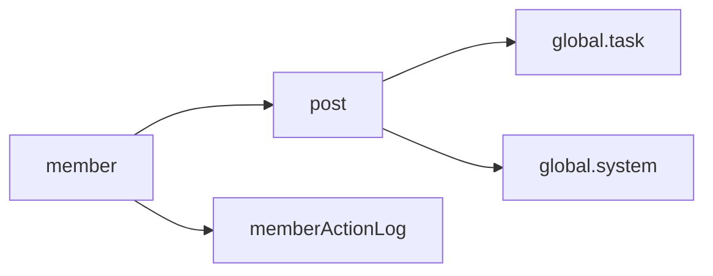
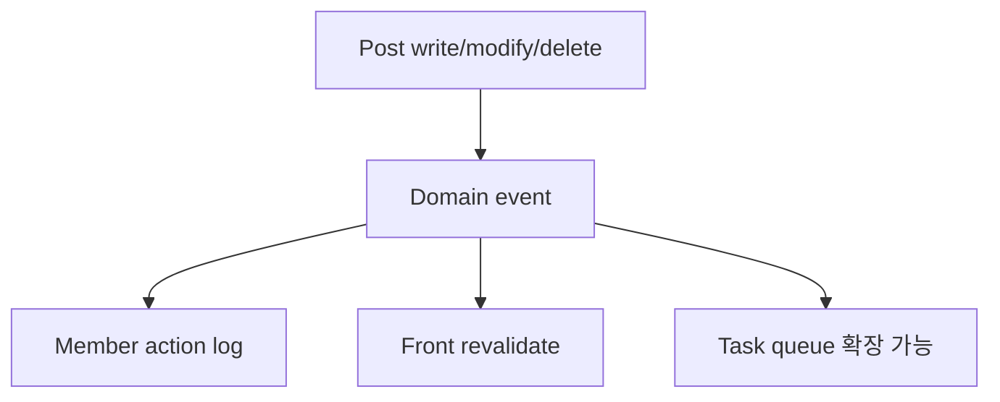

# Domain Design

Last updated: 2026-03-11

## Bounded Context

현재 백엔드는 `com.back.boundedContexts` 아래를 기준으로 도메인을 나눈다.

## 컨텍스트 책임 표

| Context | 핵심 Aggregate | 담당 기능 | 외부 연결 |
| --- | --- | --- | --- |
| `member` | `Member` | 인증, 회원가입, 관리자 판별, 프로필 | Kakao OAuth, 쿠키 |
| `post` | `Post` | 글/댓글/좋아요/조회/이미지 | MinIO, optional front cache invalidation |
| `home` | 없음 또는 최소 엔드포인트 | 홈/루트 응답 | 없음 |
| `global.system` | 없음 | 운영 상태 조회 | DB, Redis |
| `global.task` | `Task` | 비동기 작업 처리 | Redis lock, JPA |

### `member`

- 회원가입
- 일반 로그인
- 카카오 OAuth 로그인
- 현재 로그인 사용자 조회
- 관리자 프로필 조회
- 사용자 프로필/추가 속성 관리
- 사용자 행동 로그 적재

핵심 규칙:

- 관리자 여부는 `Member.username == custom.admin.username` 규칙으로 판별한다.
- 관리자 비밀번호는 DB 비밀번호보다 환경변수 `custom.admin.password`를 우선 적용할 수 있다.
- 일반 계정 비밀번호는 BCrypt 해시를 사용한다.

### `post`

- 게시글 작성/수정/삭제
- 목록 조회, 상세 조회, 내 글 조회
- 임시 글 생성
- 좋아요, 조회 수, 댓글
- 관리자용 전체 글 목록
- 이미지 업로드 및 조회

핵심 규칙:

- `published=false`면 항상 비공개이며 `listed`도 자동으로 `false`가 된다.
- `published=true`, `listed=false`는 상세 링크 접근 전용 공개 글이다.
- `published=true`, `listed=true`는 메인 피드 노출 대상이다.
- 댓글/좋아요/수정/삭제 권한은 `postMixin`, `postCommentMixin` 정책 믹스인에서 계산한다.

### `home`

- 루트 헬스/홈 진입 관련 최소 엔드포인트 담당

### `global.system`

- 관리자 시스템 상태 조회
- DB/Redis 간단 헬스 확인

### `global.task`

- 비동기 작업 큐
- 재시도, 지수 백오프, 상태 추적

## 주요 액터와 유스케이스

| 액터 | 주요 행위 | 도메인 제약 |
| --- | --- | --- |
| 비로그인 사용자 | 글 읽기, 공개 글 탐색 | 비공개 글 접근 불가 |
| 일반 회원 | 로그인, 댓글, 좋아요 | 관리자 API 접근 불가 |
| 관리자 | 글 발행/수정/삭제, 서버 상태 확인 | `username == custom.admin.username` 필요 |
| 시스템 작업자 | revalidate hook, background task 처리 | 장애가 본 기능을 막지 않도록 non-blocking 우선 |

## 이벤트 및 사이드이펙트

게시글과 멤버 관련 이벤트 클래스가 분리되어 있으며, 부수 효과는 이벤트 리스너/작업 큐로 확장 가능하게 설계되어 있다.

예:

- 게시글 작성/수정/삭제 이벤트
- 댓글 작성/수정/삭제 이벤트
- 좋아요/좋아요 취소 이벤트
- 사용자 액션 로그 적재

## 프론트와의 계약

- 인증은 쿠키 기반이다.
- 프론트는 `/member/api/v1/auth/me`로 로그인 상태를 판별한다.
- 관리자 화면은 `isAdmin` 기반으로 제어된다.
- 게시글 본문은 Markdown 문자열 그대로 내려간다.
- 태그/카테고리는 현재 백엔드 DTO 필드가 아니라 본문 메타데이터 파싱에 의존한다.

## 공개 상태 모델

프론트 관리자 UI는 다음 3단계 visibility 모델을 사용한다.

- `PRIVATE`
- `PUBLIC_UNLISTED`
- `PUBLIC_LISTED`

백엔드 저장값은 다음과 같이 변환된다.

| UI visibility | published | listed |
| --- | --- | --- |
| `PRIVATE` | `false` | `false` |
| `PUBLIC_UNLISTED` | `true` | `false` |
| `PUBLIC_LISTED` | `true` | `true` |

## 현재 구조의 장점

- 도메인별 패키지 경계가 비교적 명확하다.
- 입력(`in`), 출력(`out`), 도메인(`domain`), 서비스(`app`)가 분리되어 있다.
- 운영 기능과 일반 사용자 기능이 API 경로 수준에서도 분리되어 있다.

## 현재 구조의 한계

- 태그/카테고리 도메인이 아직 없다.
- 관리자 권한 모델이 정교한 role table이 아니라 운영용 username 규칙 기반이다.
- 이미지 파일 메타데이터가 정규화되어 있지 않다.

## 확장 방향 표

| 영역 | 현재 상태 | 권장 방향 |
| --- | --- | --- |
| 권한 | username 기반 admin | role/permission 모델 |
| 콘텐츠 분류 | 본문 메타 파싱 | tag/category aggregate |
| 파일 관리 | object key만 사용 | file metadata aggregate |
| 운영 액션 | 단순 health API | 운영 대시보드/알림 연동 |
