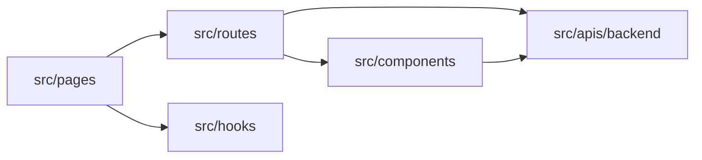

# Frontend Working Guide

Last updated: 2026-03-13

## 3줄 요약

- 화면/UX 수정이면 이 문서를 먼저 보고, 성능 이슈가 보일 때만 `Frontend-Performance-Guide.md`로 이동한다.
- 현재 프론트 핵심 기준은 `Pages Router`, 평평한 댓글 구조, 관리자 4개 경로, 중앙 컬럼 기준 피드 필터다.
- 새 UI는 상용 서비스 패턴을 우선하고, 깊은 카드 중첩·중복 설명 문구·페이지 내부 중복 로그아웃을 만들지 않는다.

## 이 문서의 목적

이 문서는 프론트엔드 수정 시 "무엇을 어떻게 바꿔야 하는가"를 빠르게 판단하기 위한 작업 기준 문서다.

설계 설명보다 실제 작업 기준에 더 가깝다.

- 어떤 UI를 유지해야 하는가
- 어떤 패턴은 피해야 하는가
- 인증/댓글/피드/관리자 화면은 어떤 철학으로 다뤄야 하는가
- 수정 전에 어떤 파일을 먼저 봐야 하는가

## 현재 프론트 구조 한 줄 요약

프론트는 `Next.js Pages Router` 기반이고, `src/pages`는 엔트리, `src/routes`는 화면 조합, `src/apis`는 백엔드 계약, `src/components`는 범용 UI 역할을 맡는다.

성능 최적화 기준은 별도 문서인 [Frontend Performance Guide](./Frontend-Performance-Guide.md)를 함께 본다. 특히 hydration 경계, `next/dynamic`, third-party script 지연 로딩은 그 문서를 우선 기준으로 삼는다.



## 가장 중요한 UX 원칙

### 0. 구조를 잡을 때는 이미 검증된 상용 서비스 패턴을 우선 참고한다

UI를 수정할 때는 화면 내부 논리만 맞추지 말고, 이미 많은 사용자가 익숙하게 써온 상용 서비스 패턴을 우선 기준으로 삼는다.

참고 기준:

- 블로그/콘텐츠 화면: `티스토리`, `벨로그`, `네이버 블로그`
- 운영/관리/도구 화면: `당근`, `번개장터` 같은 실서비스 운영형 UX

의미:

- 새롭고 특이한 배치보다 익숙하고 예측 가능한 배치를 우선한다.
- 설명을 늘리는 것보다, 이미 많은 서비스가 검증한 흐름을 따른다.
- 컴포넌트 하나만 예쁘게 만드는 것보다 화면 전체 리듬과 밀도를 먼저 본다.

수정 전에 스스로 확인할 질문:

- 이 필터 바가 벨로그나 티스토리에서 봐도 어색하지 않은가?
- 이 댓글 영역이 네이버 블로그/벨로그 기준으로도 과설명 없이 자연스러운가?
- 이 운영 도구 화면이 당근/번개장터 같은 서비스의 관리자 UX처럼 `실행 -> 결과 확인` 흐름이 분명한가?
- 이 요소가 콘텐츠보다 더 눈에 띄고 있지는 않은가?

기본 태도:

- 레이아웃이 애매할 때는 독창성보다 검증된 패턴을 택한다.
- 모바일/데스크톱 모두에서 익숙한 구조를 우선한다.
- "왜 이렇게 생겼지?"라는 느낌이 들면 대부분 구조가 잘못된 것이다.

### 1. 사용자를 가르치려는 문구를 남발하지 않는다

사용자가 이미 알 수 있는 행동은 설명하지 않는다.

예:

- `대댓글은 각 댓글의 답글 버튼으로 이어서 작성할 수 있습니다.`
- `로그인된 계정으로 바로 댓글과 답글을 작성할 수 있습니다.`

이런 문구는 기능 안내가 아니라 방해가 되기 쉽다.

기준:

- 버튼이 보이면 설명 문구를 따로 두지 않는다.
- 안내는 진짜 막힘이 있을 때만 쓴다.
- 화면의 1차 정보는 "행동"이어야지 "설명"이 아니어야 한다.

### 2. 메인 작업 공간을 보조 패널이 침범하면 안 된다

대표적인 나쁜 사례:

- 글쓰기 화면 우측에 `최근 API 응답` 콘솔이 붙어서 에디터 폭을 줄이는 구조

원칙:

- 글쓰기 화면의 1순위는 제목, 본문, 메타데이터, 미리보기다.
- 디버그 정보/API 응답/관리 보조 정보는 접을 수 있거나 하단으로 내려가야 한다.
- 메인 편집 폭을 줄이는 부가기능은 기본적으로 잘못된 구조다.

관리자 도구/작성 화면 추가 기준:

- 백엔드가 admin-scope와 actor-scope API를 둘 다 제공하더라도, 현재 서비스 운영 현실에서 결과가 사실상 같다면 UI에서는 둘을 동시에 노출하지 않는다.
- 특히 단일 관리자/단일 작성자 구조에서는 `전체 글`, `내 글`처럼 의미가 겹치는 필터를 나란히 두지 않는다.
- 확장 대비는 API 경계에 남기고, 현재 UI는 지금 운영자가 실제로 이해하고 쓸 흐름만 보여준다.

### 3. 인증은 흐름을 끊지 않는 방향으로 개입한다

댓글창처럼 로그인 없이도 읽을 수 있는 영역은 다음 기준을 따른다.

- 입력창은 보이게 둔다.
- 실제 작성 시도 시 로그인 모달을 띄운다.
- 사용자를 다른 페이지로 먼저 밀어내지 않는다.

즉, "보이되 막는" 것이 아니라 "흐름을 유지하다가 필요한 순간에 인증을 요청"해야 한다.

추가 기준:

- 로그인/회원가입으로 넘기는 `next` 값은 그대로 신뢰하지 말고 항상 정규화한다.
- `/_next/data/...json` 같은 Pages Router 내부 데이터 경로가 `next`에 섞이면 raw JSON 페이지로 이동할 수 있다.
- 관리자 SSR 페이지는 `initialMember`를 "첫 로딩 동안만" 사용하고, 클라이언트 세션이 한 번 해석된 뒤에는 `me` 상태를 우선한다.
- 로그아웃 직후에도 `initialMember`를 다시 보여주면 "로그아웃이 안 된 것처럼 보이는" UX가 발생하므로 피한다.
- 관리자 서브페이지(`/admin/profile`, `/admin/tools`, `/admin/posts/new`)에는 페이지 내부 로그아웃 버튼을 중복으로 두지 않는다. 로그아웃은 전역 상단 네비에서만 제공한다.

### 4. 상단 네비와 필터는 시각 무게가 가벼워야 한다

메인 피드나 헤더에서 컨트롤은 강조 대상이 아니라 "자연스럽게 사용하는 도구"다.

피해야 할 것:

- 과하게 큰 검색 카드
- 세로로 무겁게 쌓인 정렬 버튼
- 의미 없는 큰 배지/히어로 문구
- 버튼 하나만 유독 큰 크기

좋은 방향:

- 얇은 pill/button
- 적절한 높이 통일
- 시선이 글 목록과 상세 본문으로 흘러가게 구성

### 5. 아이콘은 가능하면 SVG 기반으로 통일한다

이모지 글리프는 플랫폼별 모양 차이, 모바일 왜곡, 재페인트 이슈가 있다.

특히 컨트롤 아이콘은 SVG가 기준이다.

대상:

- 카테고리 아이콘
- 검색 아이콘
- 태그 아이콘
- 다크/라이트 모드 토글

추가 기준:

- 페이지 이동 시 이모지나 글자가 꿈틀거리면, 먼저 웹폰트 기반 emoji 처리부터 의심한다.
- 상단 카드 제목, 필터 바, 프로필 라벨처럼 반복 노출되는 장식용 emoji는 시스템 glyph로 두지 말고 SVG 아이콘으로 치환한다.
- 헤더, 메인 검색/필터, 사이드 카드처럼 hot path에 있는 아이콘은 `react-icons`보다 로컬 SVG 컴포넌트를 우선한다.
- 가능하면 인증 모달과 로그인/회원가입 화면까지 포함해 프론트 전체 아이콘 체계를 로컬 SVG로 맞춘다.
- 인증 모달은 모달 전체만 lazy load하는 데서 멈추지 않고, 필요하면 로그인/회원가입/전송 완료 패널까지 단계적으로 분리한다.

### 6. 반복 노출되는 상단 프로필 이미지는 공통 컴포넌트에서 preload한다

관리자 프로필 이미지는 메인, About, 관리자 허브, 관리자 프로필 페이지처럼 여러 진입점에서 반복해서 상단에 보인다.

기준:

- 각 화면에서 제각각 최적화하지 말고 `ProfileImage` 공통 컴포넌트에서 처리한다.
- above-the-fold 프로필 이미지는 `priority`를 걸고, 공통 컴포넌트에서 preload/eager/high priority를 같이 준다.
- "관리자 프로필 사진이 느리다" 같은 문제는 화면별 패치보다 공통 컴포넌트 개선이 먼저다.
- 메인 피드 소개 카드의 타이틀/설명은 관리자 프로필 페이지에서 수정한다. 같은 `profileCard` API를 다른 화면에서 재사용할 때는 `homeIntroTitle`, `homeIntroDescription`을 누락해서 기존 값을 지우지 않도록 항상 함께 보존한다.

## 현재 화면별 기준

## 홈 피드 (`/`)

우선순위:

1. 프로필
2. 블로그 소개
3. 검색/카테고리/정렬
4. 글 목록

규칙:

- 검색창은 한 줄 입력 흐름으로 유지
- 검색 아래 보조 필터는 `좌측 compact category selector + 우측 sort segmented control` 한 줄 패턴을 기본으로 한다
- 카테고리 셀렉트는 전체폭 입력 필드처럼 만들지 않는다
- 정렬은 가볍고 짧은 segmented control이 맞다
- 히어로는 제목/설명 중심으로 충분하다

주의:

- 필터 UI가 리스트보다 더 시선을 빼앗으면 안 된다.
- 쿼리 변경 시 레이아웃이 흔들리면 UX 품질이 크게 떨어진다.
- 카테고리 드롭다운은 아래 컨트롤과 겹치지 않는 행 구조를 먼저 만든 뒤, 그 안에서만 오버레이로 연다.
- 메인 피드 필터 바는 viewport media query보다 중앙 컬럼 실제 폭을 기준으로 반응해야 한다. 가능하면 `FeedHeader` 자체를 container로 두고 container query로 가로/세로 배치를 전환한다.
- 카테고리 드롭다운은 `width: 100%` 고정 패널보다 `min-width = trigger width`, `width = fit-content`, `max-width = viewport-safe width` 정책이 잘림과 count 누락에 더 강하다.
- 중앙 컬럼이 애매하게 좁아지는 구간에서는 카테고리/정렬 컨트롤을 억지로 전체폭으로 늘리지 않는다. 중간 폭에서는 compact width를 유지하고, 아주 좁은 구간에서만 100% 폭으로 전환한다.
- 카테고리 패널은 트리거와 같은 폭에 묶지 말고, `min-width >= trigger`, `width = max-content`, `max-width = viewport-safe width`로 두어 항목 라벨과 count가 함께 보이게 한다.
- 트리거형 필터 버튼에 `width: 100%`를 줄 때는 `box-sizing: border-box`를 같이 강제한다. padding/border가 부모 폭 밖으로 밀리면 축소 폭에서 바로 레이아웃이 터진다.
- absolute 패널이 중앙 컬럼 레이아웃을 다시 흔들면, 드롭다운은 부모 안에 묶지 말고 `fixed + portal` 레이어로 분리한다. 트리거와 패널은 같은 DOM 계층에 둘 필요가 없다.
- 검색 입력만 즉시 필요하다면, 태그/정렬/카테고리 필터는 별도 island로 쪼개서 초기 하이드레이션 범위를 줄인다.
- 메인 카드 요약은 첨부 이미지의 alt 텍스트를 본문처럼 노출하지 않는다. 목록 미리보기는 첫 첨부 이미지를 썸네일로 쓰고, summary는 순수 텍스트 본문만 기준으로 만든다.

## 상세 페이지 (`/posts/[id]`, legacy `/:slug` redirect)

우선순위:

1. 글 제목
2. 작성자/작성 시각/메타
3. 본문
4. 댓글

규칙:

- 제목은 크되 과장되지 않게
- 본문 헤딩은 노션 정도 밀도로 유지
- 댓글 영역은 설명보다 입력/읽기 흐름을 우선
- 관리자 전용 수정/삭제 액션은 상세 헤더 메타 영역에만 작게 노출한다. 일반 사용자에게는 보여주지 않는다.
- 댓글 액션은 자연스러운 위치에
  - 수정/삭제: 상단 관리 액션
  - 답글: 본문 아래 왼쪽
- 댓글은 데스크톱/모바일 모두 카드 안 카드 구조로 깊게 중첩하지 않는다.
- 답글은 "가벼운 들여쓰기 + 최소한의 문맥 표시" 수준으로만 드러내고, 본문 폭을 최대한 보존한다.
- 댓글 트리는 블록 카드 컬렉션보다 "평평한 리스트 + 얕은 계층감"에 가깝게 유지한다.
- 원댓글과 답글은 같은 행 톤으로 섞지 않는다. 원댓글은 기본 행, 답글은 부모 아래 nested block과 reply rail로 한눈에 구분되게 한다.
- 답글 깊이가 여러 단계여도 화면에서는 한 단계 들여쓰기만 유지한다. 시각적 depth는 늘리지 않는다.
- 답글 작성 버튼을 누르면 입력창에는 `@닉네임 `을 자동으로 채워 넣되, 이 문자열은 UX 보조용이다. 실제 알림 대상 계산은 멘션 파싱이 아니라 `parentCommentId`와 작성자 기준으로 처리한다.
- 알림은 현재 서비스 규모 기준으로 `WebSocket`보다 `SSE`가 맞다. 댓글 작성은 기존 HTTP 요청을 유지하고, 새 알림만 헤더 알림벨로 push 받는다.
- 마크다운 기반 본문 렌더링은 단순 HTML 출력이 아니라, 기술 글을 읽기 쉬운 형태로 재구성하는 단계까지 포함한다.
- Mermaid 다이어그램은 원본 SVG 비율을 보존하고, GitHub Markdown과 유사하게 "원본 폭 + 필요 시 가로 스크롤" 방식을 우선한다.
- `<aside> ... </aside>` 블록은 콜아웃으로 변환한다. 첫 줄이 `ℹ️`, `💡`, `⚠️`, `📋`, `✅`, `📚` 같은 marker면 대응되는 콜아웃 타입으로 해석한다.
- `ℹ️` marker는 기본적으로 `Information` 콜아웃으로 매핑한다.
- 콜아웃의 header icon 크기, header 높이, 본문 padding, 색감은 로컬 레퍼런스 프로젝트 `aquila-log`의 callout 스타일 값을 기준으로 유지한다.
- `💡 -> Tip`, `⚠️ -> Warning`, `📋 -> 개요`, `✅ -> 정답`, `📚 -> 정리`를 기본 매핑으로 사용한다.
- marker 다음 첫 번째 의미 있는 줄이 `**제목**` 또는 markdown heading이면, 그 줄은 본문이 아니라 콜아웃 헤더 제목으로 승격한다.
- 기존 `> [!TIP]` 형태 콜아웃도 계속 지원한다.
- Mermaid 테마는 과도한 커스텀(themeVariables/themeCSS) 대신 GitHub 유사 프리셋(`light=neutral`, `dark=dark`)을 기본으로 둔다.
- Mermaid 컨테이너에는 gradient 배경/그림자 같은 장식을 넣지 않고, 본문 흐름 안에서 단순 렌더를 유지한다.
- fenced code block은 단순 배경 박스가 아니라 "언어 배지 + 복사 버튼 + Prism 토큰 하이라이팅"을 기본 UX로 본다.
- 코드블럭은 기술 블로그 문맥에서 IDE처럼 읽히는 경험을 우선한다. 기본 방향은 `IDE형 상단 chrome + 언어명 + 복사 버튼 + 줄번호 gutter`다.
- 코드블럭 복사 버튼은 텍스트 버튼보다 하단 우측의 아이콘 액션으로 두는 편이 본문 읽기를 덜 방해한다.
- ` ```java `, ` ```kotlin `처럼 언어 식별자가 있으면 상단 툴바에 사람이 읽을 수 있는 언어명을 표시한다.
- Java/Kotlin 하이라이팅은 Prism 언어 파일만 올리면 부족할 수 있으므로, `clike` 같은 선행 의존 로더까지 함께 로드한다.
- 코드블럭 바깥 문장이 `**bold**` 그대로 보인다면, 우선 실제 저장된 마크다운에서 코드 fence가 닫혔는지부터 확인한다. 렌더러보다 입력값이 잘못된 경우가 많다.

추가 기준:

- SSR에서 이미 `auth/me`를 hydrate한 페이지는 클라이언트 진입 직후 동일 요청을 다시 보내지 않도록 한다.
- 익명 사용자의 `401 /auth/me`는 정상 흐름일 수 있으므로, 상세 페이지 같은 콘텐츠 화면에서는 불필요한 재조회로 noisy network를 만들지 않는 쪽을 우선한다.

## 관리자 글쓰기 (`/admin/posts/new`)

우선순위:

1. 제목
2. 태그/카테고리/공개 범위
3. 본문 편집
4. 미리보기
5. 저장/작성 액션

규칙:

- 에디터 폭을 제일 먼저 확보
- 보조 도구는 접거나 하단으로 보낸다
- 태그/카테고리 버튼 라벨은 현재 상태를 바로 보여줘야 한다
- 현재 글에 선택된 태그는 회색 pill이 아니라, 선택 상태가 바로 읽히는 액센트 칩으로 보이게 유지한다.
- 태그 카탈로그도 선택된 항목은 동일한 톤으로 연결해, "지금 글에 포함된 태그"라는 걸 한눈에 알 수 있어야 한다.
- `메인 노출 조건` 같은 설명은 해당 필드 바로 아래에만 둔다
- 글 작성/수정 성공·실패 알림은 화면 중간 임의 위치에 두지 말고, 하단 저장 액션 버튼 바로 근처에 붙인다.
- 상세 페이지의 관리자 수정 진입은 새 화면을 만들기보다 `/admin/posts/new?postId={id}` 식으로 기존 작업실을 재사용하는 쪽을 우선한다.
- 태그/카테고리 입력은 한글 IME 조합 중 `Enter`를 무시해 중복 생성 버그를 막는다.
- 본문 미리보기가 무거운 화면에서는 입력 상태와 미리보기 렌더 상태를 분리한다. 타이핑은 즉시 반영하고, 미리보기는 `deferred` 또는 `debounced` 값으로 따라오게 한다.

피해야 할 것:

- 디버그 콘솔이 편집 폭을 갉아먹는 구조
- 과설명 문구
- 한눈에 이해 안 되는 버튼 라벨

## 관리자 허브 (`/admin`)

우선순위:

1. 현재 관리자 계정 상태
2. 빠른 이동
3. 최근 운영 진입점

규칙:

- 허브는 "무엇을 할 수 있는지"를 보여주는 페이지지, 모든 작업을 다 수행하는 페이지가 아니다.
- 프로필 수정, 글 작성, 운영 도구는 각각 전용 하위 경로로 이동시키는 편이 유지보수에 유리하다.
- 허브 카드가 실제 작업 화면보다 더 많은 정보와 상태를 품기 시작하면 구조를 다시 나눠야 한다.

## 관리자 운영 도구 (`/admin/tools`)

우선순위:

1. 댓글 점검
2. 시스템 상태 확인
3. 회원가입 메일 진단

규칙:

- 회원가입 메일 진단은 글쓰기 화면이 아니라 운영 도구에서 다룬다.
- 운영 도구는 카드에서 요약을 먼저 보여주고, task type별 상세 상태와 최근 실패 샘플은 같은 섹션 안에서 바로 읽히게 둔다.
- 실행 버튼은 요약 카드가 아니라 콘솔/실행 영역에 두고, 원본 API 응답과 함께 확인하는 흐름을 유지한다.
- `상태 요약 -> 연결 확인 -> 테스트 메일 발송` 순서가 한 카드 안에서 자연스럽게 보여야 한다.
- `task queue`, `storage cleanup` 같은 운영성 진단도 같은 패턴으로 요약 카드를 두고, 실제 진단 실행 버튼은 콘솔과 같은 시야 안에 둔다.
- 최근 API 응답 콘솔은 유지하되, 버튼보다 더 앞에 나오면 안 된다.
- 원본 API 응답을 주로 읽는 버튼은 콘솔과 같은 시야 안에 둔다.
- `aquila 준비 완료`처럼 모호한 상태 문구 대신, 지금 무엇이 실행 중인지와 마지막 결과가 무엇인지 문장으로 보여준다.
- SMTP 관련 값이 누락됐을 때는 버튼보다 먼저 누락 키를 읽을 수 있게 보여준다.

## 인증 UX 기준

현재 구현 상태:

1. 상단 네비에서 `Signup` 직접 노출 제거
2. `Login` 클릭 시 공용 `AuthEntryModal` 오픈
3. 댓글창 로그인 유도도 같은 모달을 재사용
4. 모달 안에서
   - 로그인
   - 이메일 기반 회원가입 메일 발송
   - 카카오 로그인
   으로 갈라진다.
5. 메일 링크는 `/signup/verify` 최종 가입 폼으로 이어진다.

현재 파일 기준:

- `front/src/components/auth/AuthEntryModal.tsx`
- `front/src/pages/login.tsx`
- `front/src/pages/signup.tsx`
- `front/src/pages/signup/verify.tsx`

즉, 지금은 아래처럼 이해하면 된다.

| 구분 | 현재 상태 | 목표 상태 |
| --- | --- | --- |
| 상단 로그인 | 모달 기반 | 유지 |
| 상단 회원가입 | 제거됨 | 유지 |
| 회원가입 시작 | 이메일 입력 후 메일 발송 | 유지 |
| 최종 가입 | `/signup/verify` 폼 | 유지 |
| 댓글 인증 유도 | 공용 인증 모달 | 유지 |

## 작업 전 먼저 볼 파일

## 인증

- `front/src/layouts/RootLayout/Header/NavBar.tsx`
- `front/src/pages/login.tsx`
- `front/src/pages/signup.tsx`
- `front/src/components/auth/AuthShell.tsx`
- `front/src/hooks/useAuthSession.ts`
- `front/src/apis/backend/client.ts`

## 댓글

- `front/src/routes/Detail/PostDetail/CommentBox/index.tsx`

## 홈 피드

- `front/src/routes/Feed/index.tsx`
- `front/src/routes/Feed/SearchInput.tsx`
- `front/src/routes/Feed/FeedHeader/FeedHeader.tsx`
- `front/src/routes/Feed/FeedHeader/CategorySelect.tsx`
- `front/src/routes/Feed/FeedHeader/OrderButtons.tsx`

## 관리자 글쓰기

- `front/src/pages/admin/posts/new.tsx`

## 피해야 할 안티패턴

- 설명 문구가 버튼보다 더 크게 보이는 UI
- 사용자가 이미 보고 있는 행동을 텍스트로 다시 설명하는 UI
- 메인 작업 공간을 줄이는 우측 콘솔/보조 패널
- 한 화면에서 버튼 규격이 제각각인 헤더
- 소셜 로그인 버튼을 일반 CTA처럼 처리하는 방식
- 모바일에서 흔들리는 이모지/아이콘 의존 UI
- 카테고리 필터와 정렬 토글이 서로 겹치거나 침범하는 레이아웃

## 앞으로 이 문서를 어떻게 쓸 것인가

앞으로 프론트 수정은 아래 순서로 판단한다.

1. 이 화면의 1순위 행동이 무엇인가
2. 설명이 행동을 방해하고 있지 않은가
3. 메인 작업 공간을 보조 기능이 침범하고 있지 않은가
4. 같은 역할의 버튼/입력/아이콘이 같은 규격을 갖고 있는가
5. 이미 이 문서에서 금지한 패턴을 다시 만들고 있지 않은가

즉, 이 문서는 "프론트 작업 체크리스트"이자 "UX 회귀 방지 기준"이다.
