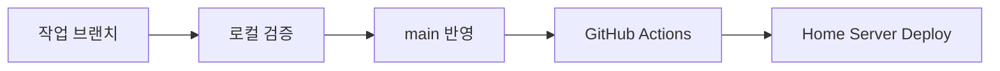

# Git Workflow

Last updated: 2026-03-12

## 이 문서가 보여주는 것

이 문서는 단순한 Git 사용법이 아니라, 실제 운영 배포 브랜치를 가진 저장소에서 변경 검증과 릴리즈 리스크를 어떻게 관리했는지를 보여준다.

## 현재 저장소 기준 운영 방식

- 배포 트리거 브랜치는 `main`
- `main` push 시 GitHub Actions가 테스트, 이미지 빌드, 홈서버 배포, 릴리즈 생성까지 수행
- 배포 이력은 `deploy-<runId>-<shortSha>` 형식의 release tag로 남음

즉, `main`은 단순 통합 브랜치가 아니라 실제 운영 배포 브랜치다.

## 권장 작업 흐름

1. `main` 최신 상태 pull
2. 기능 또는 버그 수정은 별도 브랜치에서 작업
3. 로컬 검증
   - 백엔드: `cd back && ./gradlew ktlintCheck`
   - 백엔드: `cd back && ./gradlew compileKotlin`
   - 백엔드: `cd back && ./gradlew test`
   - 프론트: `cd front && yarn build`
   - 참고: `cd back && ./gradlew test`는 전용 test infra(Postgres/Redis)를 자동으로 bootstrap하고 종료 시 정리한다.
   - 참고: test task가 실제로 실행될 때만 infra를 올리고, `UP-TO-DATE` 또는 스킵된 경우에는 Docker bootstrap 비용을 쓰지 않는다.
4. 커밋 메시지는 현재 저장소 흐름처럼 `feat:`, `fix:`, `refactor:`, `test:` 형식을 유지
5. 검토 후 `main`에 병합
6. Actions 성공 여부와 홈서버 health check 확인

## 커밋 메시지 스타일

최근 히스토리는 Conventional Commit 스타일을 따른다.

예:

- `feat(front): redesign auth and admin experience`
- `fix: harden minio upload init and surface storage errors`
- `refactor: stabilize admin profile and reduce feed query overhead`
- `test: add performance sanity query guards`

## 작업 유형별 권장 흐름

| 작업 유형 | 브랜치 분리 | 최소 검증 | 배포 전 체크 |
| --- | --- | --- | --- |
| UI 수정 | 권장 | `front/yarn build` | API base URL 영향 여부 |
| 도메인/비즈니스 로직 | 필수 수준 권장 | `back/gradlew ktlintCheck`, `compileKotlin`, `test` | DB/권한 회귀 |
| 인프라/배포 | 필수 | workflow/스크립트 리뷰 | Secret, alias, health check |
| 운영 hotfix | 상황 따라 `main` 직접 가능 | 최소 재현 + 핵심 테스트 | 즉시 smoke test |

## 백엔드 수정 필수 검증

백엔드 코드를 수정했다면 아래 3개는 선택이 아니라 기본 검증으로 본다.

1. `cd back && ./gradlew ktlintCheck`
2. `cd back && ./gradlew compileKotlin`
3. `cd back && ./gradlew test`

의미:

- `ktlintCheck`: Kotlin 스타일/포맷 규칙 위반 차단
- `compileKotlin`: 전체 Kotlin 컴파일 및 generated code 영향 확인
- `test`: 기능 회귀 및 아키텍처/통합 테스트 확인
  - 실행 중 격리된 test DB/Redis가 자동으로 올라오므로, 로컬 dev infra와 별개로 취급한다.

부분 테스트만 먼저 돌릴 수는 있지만, 최종 커밋 전에는 위 3개를 전체 기준으로 다시 확인한다.

- 순수 로직/도메인 테스트는 가능하면 plain unit test로 유지하고, DB/Redis/MockMvc가 실제로 필요한 경우에만 `@SpringBootTest`를 사용한다.
- 단순 위임 서비스 테스트나 보정 로직 테스트도 가능하면 plain unit test로 유지한다.
  예: `ActorApplicationServiceTest`, `PostLikeReconciliationServiceTest`
- 컨트롤러가 진단/응답 조합만 담당하는 얇은 케이스는 가능하면 `@WebMvcTest`로 내려서 컨텍스트 비용을 줄인다.
  예: `ApiV1AdmSystemControllerTest`, `ApiV1AdmPostControllerTest`

## 배포 안전 규칙

- `main`에 직접 푸시하는 경우 로컬 검증 없이 올리지 않는다.
- 운영 시크릿과 강하게 결합된 변경은 커밋 전에 `.env` placeholder, 도메인, CORS, 쿠키 도메인을 같이 점검한다.
- `HOME_SERVER_ENV`에 들어갈 값이 바뀌는 수정은 코드보다 Secret 반영 여부가 더 중요하다.

## Hotfix 흐름

운영 장애 대응 시 권장 순서:

1. 장애 원인 재현 또는 로그 확보
2. 최소 수정 커밋 생성
3. `main` 반영
4. Actions의 `blueGreenDeploy` 성공 확인
5. `api` health check, 로그인, 관리자 핵심 기능 수동 확인

## 병합 후 확인 표

| 확인 항목 | 성공 기준 |
| --- | --- |
| Actions `test` | green |
| Actions `buildAndPush` | green |
| Actions `blueGreenDeploy` | green |
| API health | 2xx/3xx/4xx 응답 |
| 관리자 핵심 기능 | 로그인, 글 발행, 목록 반영 정상 |

## 문서/운영 파일 변경 규칙

- `deploy/homeserver/*`, `.github/workflows/deploy.yml` 변경은 인프라 영향이 크므로 일반 기능 수정과 분리하는 편이 안전하다.
- `docs/` 변경은 기능 커밋과 함께 묶을 수 있지만, 운영 규칙이 바뀌는 경우에는 같은 PR/커밋 안에서 갱신하는 것이 좋다.

## 하지 말아야 할 것

- 확인되지 않은 Secret 포맷 변경
- `main`에 미검증 대규모 리팩터링 직접 반영
- storage endpoint, cookie domain, CORS origin을 동시에 바꾸고 테스트 없이 배포
