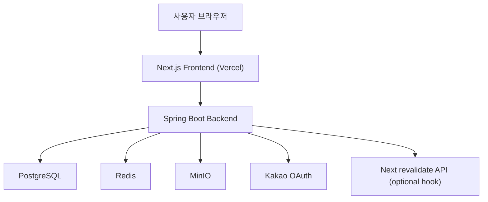
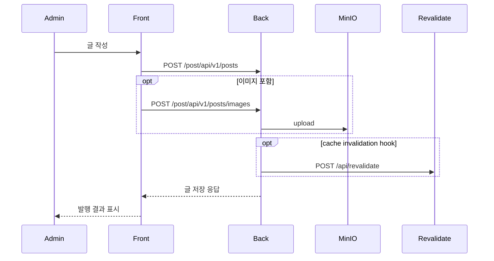

# System Architecture

Last updated: 2026-03-11

## 전체 그림

현재 프로젝트는 "콘텐츠/인증/운영은 자체 백엔드", "사용자 화면은 Next.js SSR + 짧은 CDN 캐시"로 분리된 블로그 시스템이다.

## 시스템 인터페이스 표

| 구간 | 프로토콜 | 주요 엔드포인트/설정 | 비고 |
| --- | --- | --- | --- |
| Browser -> Front | HTTPS | `www.<domain>` | Vercel |
| Front -> Back | HTTPS/HTTP | `BACKEND_INTERNAL_URL`, `NEXT_PUBLIC_BACKEND_URL` | SSR/브라우저 분리 |
| Back -> DB | JDBC | `spring.datasource.url` | PostgreSQL |
| Back -> Redis | TCP | `spring.data.redis.*` | session/cache/lock |
| Back -> MinIO | S3 API | `CUSTOM_STORAGE_*` | 게시글/프로필 이미지 |
| Back -> Front revalidate | HTTP POST | `/api/revalidate` | 선택적 cache invalidation hook |

## 읽기 흐름

1. 프론트가 게시글 목록/상세를 백엔드에서 조회한다.
2. 목록 DTO는 제목/요약/공개 상태 중심으로 받는다.
3. 상세 DTO는 Markdown 본문 전체를 받는다.
4. 프론트는 본문에서 태그/카테고리 메타데이터를 추가 파싱한다.
5. 상세 화면은 custom renderer로 코드블럭, 머메이드, 콜아웃, 테이블을 렌더링한다.
6. 메인 페이지(`/`)는 `getServerSideProps` + `Cache-Control: public, s-maxage=30, stale-while-revalidate=120` 전략을 사용한다.

## 쓰기 흐름

1. 관리자 로그인
2. `/admin`에서 글 작성/수정
3. 백엔드가 게시글 저장
4. 필요 시 이미지 업로드는 MinIO에 저장
5. 백엔드는 필요 시 프론트 revalidate hook을 비차단성으로 호출한다.
6. 메인 페이지는 SSR + 짧은 CDN 캐시 만료 또는 revalidate hook을 통해 새 데이터 기준으로 갱신된다.

## 인증 흐름

지원 방식:

- 일반 아이디/비밀번호 로그인
- 카카오 OAuth 로그인

공통 특징:

- 인증 결과는 쿠키(`apiKey`, `accessToken`)로 내려간다.
- 프론트는 `credentials: include`로 API를 호출한다.
- 로그인 상태 확인은 `/member/api/v1/auth/me`
- 관리자 표시 여부는 `me.isAdmin` 값으로 제어

## 주요 사용자 여정

| 여정 | 시작점 | 핵심 API | 결과 |
| --- | --- | --- | --- |
| 공개 글 탐색 | `/` | `/post/api/v1/posts` | 목록/검색/필터 |
| 글 상세 조회 | `/:slug` | `/post/api/v1/posts/{id}` | Markdown 렌더 |
| 로그인 | `/login` | `/member/api/v1/auth/login` | 쿠키 발급 |
| 회원가입 | `/signup` | `/member/api/v1/members` | 계정 생성 |
| 관리자 작성 | `/admin` | `/post/api/v1/posts`, `/post/api/v1/adm/posts` | 발행/검색/수정 |

## 관리자 구조

관리자 페이지는 다음 기능을 한 화면에 묶어 둔다.

- 글 작성/수정/삭제
- 관리자용 전체 글 검색
- 서버 상태 조회
- 관리자 프로필 이미지/역할/소개 관리
- 이미지 업로드 도우미

## 설정 경계

Frontend:

- `BACKEND_INTERNAL_URL`
  서버 사이드 빌드/SSR 전용
- `NEXT_PUBLIC_BACKEND_URL`
  브라우저 런타임 전용

Backend:

- `CUSTOM__ADMIN__USERNAME`
- `CUSTOM__ADMIN__PASSWORD`
- `CUSTOM__REVALIDATE__URL`
- `CUSTOM__REVALIDATE__TOKEN`
- `CUSTOM_STORAGE_*`

현재 운영에서 특히 중요한 점:

- 메인 피드는 정적 빌드가 아니라 API/SSR 기반이다.
- `CUSTOM__REVALIDATE__*`는 즉시 반영 시간을 더 줄이기 위한 보조 장치이지, 데이터 정합성의 유일한 경로는 아니다.
- 관리자 프로필 이미지 업로드도 MinIO(`CUSTOM_STORAGE_*`) 의존이다.

## 현재 구조의 장점

- 프론트와 백엔드를 독립 배포할 수 있다.
- 홈서버에서 DB/Redis/MinIO를 직접 제어할 수 있다.
- 관리자 글쓰기와 퍼블릭 읽기 트래픽을 같은 API 계약으로 유지한다.

## 현재 구조의 주의점

- 프론트 일부 파일명과 컴포넌트명은 과거 템플릿 유산이 남아 있다.
- 태그/카테고리 계산이 프론트 파싱에 일부 의존한다.
- 운영 환경변수 실수는 빌드 성공 후 런타임 장애로 이어질 수 있다.
