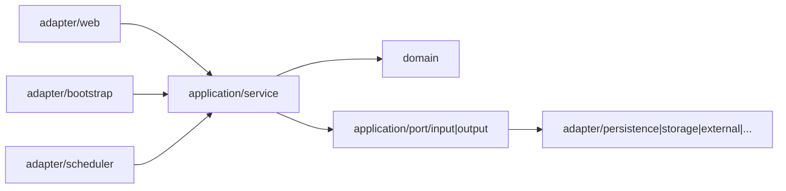

# Package Structure

Last updated: 2026-03-15

## 3줄 요약

- 코드 탐색 시작점이 필요할 때 이 문서를 먼저 읽는다.
- 프론트는 `pages/routes/components/apis`, 백엔드는 `boundedContexts/global + adapter/application/domain` 구조다.
- 화면 수정은 프론트 가이드로, 백엔드 경계 수정은 도메인/아키텍처 문서로 바로 연결하면 된다.

## 이 문서가 보여주는 것

이 문서는 단순 디렉터리 목록이 아니라, 현재 코드베이스가 어떤 리팩터링 과도기 상태에 있고 어떤 방향으로 구조를 정리하고 있는지를 설명한다.

## Top-level

```text
.
├── .github
├── back
├── deploy
├── docs
└── front
```

| 디렉터리 | 역할 | 진입점 |
| --- | --- | --- |
| `.github` | CI/CD 워크플로 | `.github/workflows/*` |
| `back` | Spring Boot + Kotlin 백엔드 | `BackApplication.kt` |
| `front` | Next.js Pages Router 프론트엔드 | `src/pages/*` |
| `deploy` | 홈서버 운영/배포 스크립트 | `homeserver/blue_green_deploy.sh` |
| `docs` | 설계/운영 문서 | 현재 문서 세트 |

## Backend 패키지 규칙

백엔드는 여전히 `com.back.boundedContexts.<context>` 경계를 기준으로 나뉜다.

```text
boundedContexts/
├── home
├── member
└── post
```

현재 백엔드는 `adapter`, `application`, `domain` 축으로 정리되어 있다.
입력/출력 방향은 예약어를 피해서 `adapter/{web|event|scheduler|...}`와 `application/port/{input|output}`로 명시한다.

실제 member/post 컨텍스트에서는 다음 구조가 보인다.

```text
member/
├── adapter
│   ├── web
│   ├── bootstrap
│   └── persistence
├── application
│   ├── port
│   └── service
├── config
├── domain
├── dto
└── subContexts
```

```text
post/
├── adapter
│   ├── web
│   ├── bootstrap
│   ├── scheduler
│   ├── persistence
│   ├── storage
│   └── external
├── application
│   ├── port
│   └── service
├── config
├── domain
├── dto
└── event
```



### 현재 해석 원칙

- `adapter/web`, `adapter/bootstrap`, `adapter/event`, `adapter/scheduler`
  HTTP, 초기화, 이벤트, 스케줄러 같은 입력 채널
- `application/service`
  유스케이스 오케스트레이션, 퍼사드 성격의 서비스
- `application/port/input`, `application/port/output`
  입력 유스케이스 계약과 출력 포트 계약
- `adapter/persistence`, `adapter/storage`, `adapter/external`
  port 구현체
- `domain`
  엔티티, 정책, 믹스인, 도메인 규칙
- `global/*/application`
  컨텍스트 간 공통 애플리케이션 서비스

글로벌 공통 코드는 다음에 모여 있다.

- `com.back.global`
- `com.back.standard`

## Frontend 패키지 규칙

프론트는 Pages Router 기반이며, SSR 엔트리와 화면 조합이 비교적 분리되어 있다.

- `src/pages`
  Next.js 라우트 엔트리, SSR, redirect, cache header
- `src/routes`
  페이지 본문 조합
- `src/apis`
  백엔드 API 계약
- `src/hooks`
  상태 및 화면 훅
- `src/components`
  범용 UI
- `src/layouts`
  공통 레이아웃
- `src/libs`
  파서, 라우터 유틸, React Query 보조
- `src/styles`
  테마 및 스타일 토큰

## Frontend 레이어 표

| 레이어 | 예시 경로 | 책임 |
| --- | --- | --- |
| Page entry | `src/pages/index.tsx`, `src/pages/about.tsx`, `src/pages/posts/[id].tsx` | SSR, cache header, dehydrated query 전달 |
| Admin entry | `src/pages/admin.tsx`, `src/pages/admin/profile.tsx`, `src/pages/admin/posts/new.tsx`, `src/pages/admin/tools.tsx` | 관리자 허브/프로필/글 작업실/운영 도구 |
| Auth entry | `src/pages/login.tsx`, `src/pages/signup.tsx`, `src/pages/signup/verify.tsx` | 인증 UI와 이메일 인증 가입 마무리 |
| Route composition | `src/routes/Feed/*` | 메인 피드/상세 화면 조합 |
| API layer | `src/apis/backend/*` | fetch 계약, DTO 매핑 |
| Hook layer | `src/hooks/*` | 프로필, 상태, 데이터 훅 |
| Shared UI | `src/components/*` | 범용 UI 및 공통 쉘 |

추가로 기억할 페이지 엔트리:

- `src/pages/[slug].tsx`
  과거 `제목-id` 상세 링크를 `/posts/:id`로 리다이렉트하는 legacy 엔트리
- `src/pages/api/revalidate.ts`
  선택적 front revalidate hook

## 현재 구조에서 주의할 이름

- `src/routes/Detail/components/MarkdownRenderer`
  Markdown/콜아웃/머메이드 렌더링을 담당하는 상세 본문 핵심 컴포넌트다.
- `src/components/auth/AuthShell.tsx`
  로그인/회원가입 공통 쉘이며, 인증 UX 변경 시 먼저 봐야 하는 파일이다.

## 배포 관련 구조

- `deploy/homeserver`
  운영 Compose, Caddy, blue/green 스크립트, 하드닝 문서
- `.github/workflows`
  CI/CD 워크플로

## 수정 영향 범위 표

| 변경 위치 | 주 영향 |
| --- | --- |
| `back/boundedContexts/member/*` | 로그인, 회원가입, 관리자 판별, 프로필 |
| `back/boundedContexts/post/*` | 글 작성, 목록, 상세, 댓글, 이미지 |
| `front/src/apis/backend/*` | 프론트 전체 데이터 계약 |
| `front/src/pages/admin.tsx` | 관리자 허브/빠른 이동 |
| `front/src/pages/admin/profile.tsx` | 관리자 프로필 UX |
| `front/src/pages/admin/posts/new.tsx` | 글 작성/임시저장/미리보기 |
| `front/src/pages/admin/tools.tsx` | 댓글/시스템/메일 진단 |
| `front/src/pages/login.tsx`, `signup.tsx` | 인증 UX |
| `deploy/homeserver/*` | 운영 배포/라우팅 |

## 권장 유지 원칙

- 새 기능은 `boundedContexts` 경계를 우선 지키고, `global`에는 진짜 공통 로직만 둔다.
- `adapter/*`는 채널 의미가 이름으로 드러나야 한다(`web`, `event`, `scheduler`, `persistence`, `external` 등).
- `application/port/input`, `application/port/output` 네이밍을 고정해 Kotlin 예약어(`in`, `out`)를 피한다.
- 프론트는 `pages`에 로직을 몰지 말고 `routes`, `apis`, `hooks`로 분산한다.
- 인프라 변경은 `deploy/`와 문서를 함께 수정한다.
