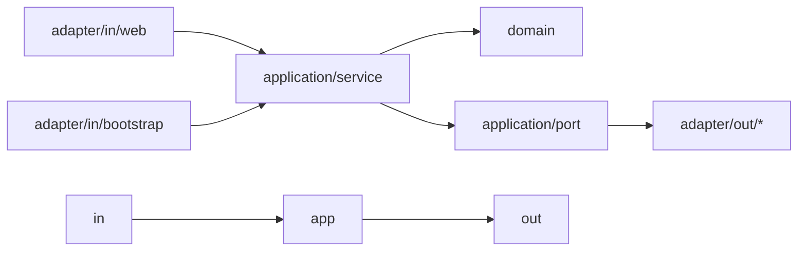

# Package Structure

Last updated: 2026-03-11

## 이 문서가 보여주는 것

이 문서는 단순 디렉터리 목록이 아니라, 현재 코드베이스가 어떤 리팩터링 과도기 상태에 있고 어떤 방향으로 구조를 정리하고 있는지를 설명한다.

## Top-level

```text
.
├── .github
├── back
├── deploy
├── docs
└── front
```

| 디렉터리 | 역할 | 진입점 |
| --- | --- | --- |
| `.github` | CI/CD, 모니터링 워크플로 | `.github/workflows/*` |
| `back` | Spring Boot + Kotlin 백엔드 | `BackApplication.kt` |
| `front` | Next.js Pages Router 프론트엔드 | `src/pages/*` |
| `deploy` | 홈서버 운영/배포 스크립트 | `homeserver/blue_green_deploy.sh` |
| `docs` | 설계/운영 문서 | 현재 문서 세트 |

## Backend 패키지 규칙

백엔드는 여전히 `com.back.boundedContexts.<context>` 경계를 기준으로 나뉜다.

```text
boundedContexts/
├── home
├── member
└── post
```

현재는 패키지 구조 전환기다.

- 신규/리팩터링 축: `adapter`, `application`, `domain`
- 기존 축: `app`, `in`, `out`
- 즉, 완전히 한 패턴으로 정리된 상태가 아니라 두 구조가 공존한다.

실제 member/post 컨텍스트에서는 다음 구조가 보인다.

```text
member/
├── adapter
│   ├── in
│   └── out
├── application
│   ├── port
│   └── service
├── app
├── config
├── domain
├── dto
├── in
├── out
└── subContexts
```

```text
post/
├── adapter
│   ├── in
│   └── out
├── application
│   ├── port
│   └── service
├── app
├── config
├── domain
├── dto
├── event
├── in
└── out
```



### 현재 해석 원칙

- `adapter/in/web`
  Controller, bootstrap, 외부 입력 진입점
- `application/service`
  유스케이스 오케스트레이션, 퍼사드 성격의 서비스
- `application/port`
  외부 저장소/연동 추상화
- `adapter/out/persistence`, `adapter/out/internalApi`
  port 구현체
- `domain`
  엔티티, 정책, 믹스인, 도메인 규칙
- `app`, `in`, `out`
  아직 제거되지 않은 기존 계층

즉, 현재 코드를 읽을 때는 "신규 구조가 어디까지 들어왔는지"를 먼저 확인해야 한다.

글로벌 공통 코드는 다음에 모여 있다.

- `com.back.global`
- `com.back.standard`

## Frontend 패키지 규칙

프론트는 Pages Router 기반이며, SSR 엔트리와 화면 조합이 비교적 분리되어 있다.

- `src/pages`
  Next.js 라우트 엔트리, SSR, redirect, cache header
- `src/routes`
  페이지 본문 조합
- `src/apis`
  백엔드 API 계약
- `src/hooks`
  상태 및 화면 훅
- `src/components`
  범용 UI
- `src/layouts`
  공통 레이아웃
- `src/libs`
  파서, 라우터 유틸, React Query 보조
- `src/styles`
  테마 및 스타일 토큰

## Frontend 레이어 표

| 레이어 | 예시 경로 | 책임 |
| --- | --- | --- |
| Page entry | `src/pages/index.tsx` | SSR, cache header, dehydrated query 전달 |
| Admin entry | `src/pages/admin.tsx` | 관리자 운영 UI, 인증 redirect |
| Auth entry | `src/pages/login.tsx`, `src/pages/signup.tsx` | 인증 UI |
| Route composition | `src/routes/Feed/*` | 메인 피드/상세 화면 조합 |
| API layer | `src/apis/backend/*` | fetch 계약, DTO 매핑 |
| Hook layer | `src/hooks/*` | 프로필, 상태, 데이터 훅 |
| Shared UI | `src/components/*` | 범용 UI 및 공통 쉘 |

## 현재 구조에서 주의할 이름

- `src/routes/Detail/components/NotionRenderer`
  이름은 NotionRenderer지만 실제 역할은 Markdown/콜아웃/머메이드 렌더러다.
- `src/libs/utils/notion/*`
  과거 템플릿 유산이 일부 남아 있지만, 실제 글 데이터 원본은 자체 백엔드 API다.
- `src/components/auth/AuthShell.tsx`
  로그인/회원가입 공통 쉘이며, 인증 UX 변경 시 먼저 봐야 하는 파일이다.

## 배포 관련 구조

- `deploy/homeserver`
  운영 Compose, Caddy, blue/green 스크립트, 하드닝 문서
- `.github/workflows`
  배포/모니터링 워크플로

## 수정 영향 범위 표

| 변경 위치 | 주 영향 |
| --- | --- |
| `back/boundedContexts/member/*` | 로그인, 회원가입, 관리자 판별, 프로필 |
| `back/boundedContexts/post/*` | 글 작성, 목록, 상세, 댓글, 이미지 |
| `front/src/apis/backend/*` | 프론트 전체 데이터 계약 |
| `front/src/pages/admin.tsx` | 관리자 운영 UX |
| `front/src/pages/login.tsx`, `signup.tsx` | 인증 UX |
| `deploy/homeserver/*` | 운영 배포/라우팅 |

## 권장 유지 원칙

- 새 기능은 `boundedContexts` 경계를 우선 지키고, `global`에는 진짜 공통 로직만 둔다.
- 백엔드 리팩터링 중에는 `adapter/application`과 `app/in/out` 중 어느 축을 따르는 코드인지 문서와 커밋 메시지에 명시하는 편이 안전하다.
- 프론트는 `pages`에 로직을 몰지 말고 `routes`, `apis`, `hooks`로 분산한다.
- 인프라 변경은 `deploy/`와 문서를 함께 수정한다.
