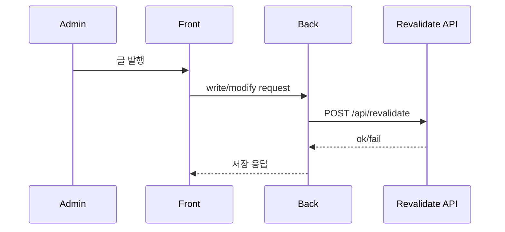

# SW Connect Service Plan

Last updated: 2026-03-11

## 목적

이 문서는 현재 프로젝트에서 서비스 간 연결 지점을 정리하고, 앞으로 어떤 부분을 더 명확히 계약화해야 하는지 기록하기 위한 문서다.

## 현재 연결 구조

## 서비스 연결 표

| Producer | Consumer | 인터페이스 | 현재 상태 |
| --- | --- | --- | --- |
| Frontend | Backend | REST + Cookie | 운영 중 |
| Backend | PostgreSQL | JPA/JDBC | 운영 중 |
| Backend | Redis | Spring Session/Cache/ShedLock | 운영 중 |
| Backend | MinIO | S3 API | 운영 중 |
| Backend | Kakao | OAuth2 | 운영 중 |
| Backend | Front revalidate API | HTTP POST | 선택적 보조 경로 |
| GitHub Actions | Home Server | Tailscale + SSH | 운영 중 |

### Frontend -> Backend

- 데이터 조회: `front/src/apis/backend/posts.ts`
- 인증 조회/로그인/로그아웃: `/member/api/v1/auth/*`
- 관리자 기능: `/post/api/v1/adm/*`, `/member/api/v1/adm/*`, `/system/api/v1/adm/*`
- 이미지 업로드: `/post/api/v1/posts/images`, `/member/api/v1/adm/members/{id}/profileImageFile`

중요 설정:

- SSR/빌드 시: `BACKEND_INTERNAL_URL`
- 브라우저 런타임 시: `NEXT_PUBLIC_BACKEND_URL`
- 둘 다 없으면 브라우저에서 `api.<현재도메인>`을 추론

### Backend -> Frontend

- 게시글 변경 후 홈 재검증
- `custom.revalidate.url`
- `custom.revalidate.token`

현재 구현은 홈(`/`) 중심 재검증이며, 실패해도 글 작성/수정 자체를 막지 않도록 non-blocking 처리한다.
다만 메인 피드 자체는 SSR + 짧은 CDN 캐시를 사용하므로, revalidate hook은 즉시 반영 시간을 줄이는 보조 수단으로 보는 편이 정확하다.

### Backend -> Kakao OAuth

- provider: Kakao
- 목적: 소셜 로그인
- redirect URI는 Spring Security OAuth2 client 설정을 따른다

### Backend -> PostgreSQL / Redis / MinIO

- PostgreSQL: 정규 데이터 저장
- Redis: 세션/캐시/락
- MinIO: 게시글 이미지 저장

### GitHub Actions -> Home Server

- Tailscale로 사설 네트워크 연결
- SSH로 서버 접속
- GHCR 이미지 pull
- blue/green cutover 수행

## 현재 계약의 약한 부분

- 태그/카테고리가 정규 API 필드가 아니라 본문 메타데이터 파싱에 의존한다.
- 관리자 권한이 role table이 아니라 운영용 username 규칙에 묶여 있다.
- 이미지 파일에 대한 메타데이터 테이블과 관리 API가 없다.
- 시스템 상태 API는 최소 정보만 제공하며 알림 연동은 별도 구현되어 있지 않다.

## 계약 안정성 평가

| 연결 | 안정성 | 이유 |
| --- | --- | --- |
| Front -> Backend 글 조회 | 높음 | 엔드포인트/DTO가 단순 |
| Front -> Backend 인증 | 중간 | 쿠키/CORS/도메인 설정 민감 |
| Backend -> MinIO | 중간 | env 오타와 endpoint 형식에 민감 |
| Backend -> Revalidate | 중간 | token/url 누락 시 즉시 반영이 늦어질 수 있으나, 데이터 정합성 자체를 깨지는 않음 |
| Actions -> Home Server | 중간 | Tailscale/SSH/Secret 의존 |

## 개선 우선순위

1. 태그/카테고리 정규 모델 도입
2. 관리자 권한 모델을 role 기반으로 확장
3. 이미지 메타데이터 저장 및 orphan cleanup 전략 추가
4. 시스템 상태 조회를 DB/Redis/MinIO/Caddy/Tunnel 단위로 확장
5. 프론트 재검증 범위를 홈 외 상세 페이지까지 더 명시적으로 관리

## 환경변수 계약

특히 운영에서 중요한 계약:

- `HOME_SERVER_ENV`는 실제 운영 `.env.prod`의 원본이다.
- `CUSTOM_STORAGE_ENDPOINT`는 완성된 URI여야 한다.
- `CUSTOM_STORAGE_ACCESSKEY`, `CUSTOM_STORAGE_SECRETKEY`는 placeholder 없이 실값이어야 한다.
- 비밀번호에 `#`가 있으면 큰따옴표로 감싼다.

## 검증 체크리스트

- 프론트에서 로그인 후 `/member/api/v1/auth/me` 성공
- 관리자 페이지 진입 가능 여부
- 글 발행 후 메인 목록 반영
- 이미지 업로드 후 MinIO object URL 로드
- `api.<domain>/actuator/health` 성공

## 연결 이상 시 우선 확인 표

| 증상 | 우선 확인 | 후보 원인 |
| --- | --- | --- |
| 로그인 불가 | `/auth/login`, `/auth/me` | CORS, cookie, API base URL |
| 이미지 업로드 실패 | `/posts/images` | MinIO env, bucket init, size/type |
| 글은 저장되지만 메인 반영 안 됨 | 목록 API, 캐시 헤더, revalidate API | SSR 캐시 구간, token/url 누락 |
| 관리자 페이지 401 | `/system/api/v1/adm/health` | 로그인 상태, admin 판별 |
