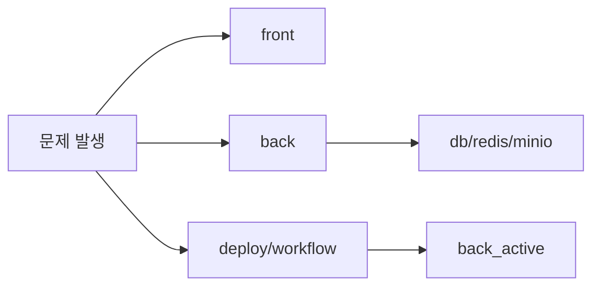

# Session Handoff

Last updated: 2026-03-13

## 이 문서가 보여주는 것

이 문서는 단순한 인수인계 메모가 아니라, 실제 운영 중 어떤 지점을 가장 먼저 확인하고 어떤 방식으로 빠르게 트리아지하는지를 보여주는 운영 노트다.

## 현재 상태 요약

- 운영 구조는 `Vercel(front) + Home Server(back/db/redis/minio/caddy/cloudflared)`이다.
- 글 데이터 소스는 더 이상 Notion이 아니라 자체 백엔드 API다.
- 프론트는 Next.js Pages Router 기반이고, 백엔드는 Spring Boot 4 + Kotlin 기반이다.
- blue/green 배포는 `back_active` alias를 중심으로 동작한다.



## 최근 반영된 큰 변화

- 관리자 화면을 `/admin` 허브, `/admin/profile`, `/admin/posts/new`, `/admin/tools`로 분리했다.
- 게시글 상세 canonical URL을 `/posts/:id`로 고정했고, 기존 `/:slug` 경로는 리다이렉트만 담당한다.
- 좋아요는 `PUT /like`, `DELETE /like` 멱등 경로를 우선 사용하고, 조회수는 dedupe + 원자 증가 방식으로 보강했다.
- 프로필 이미지는 direct URL + version 파라미터 기준으로 렌더하고, 메인/About/상세는 SSR 초기값을 먼저 사용한다.
- Kakao OAuth callback URL은 `${custom.site.backUrl}/login/oauth2/code/{registrationId}`로 고정했고, 프록시에서는 `X-Forwarded-Proto=https`를 명시한다.
- 백엔드는 여전히 `adapter/application` 구조와 `app/in/out` 구조가 공존하는 과도기 상태다.

## 지금 가장 중요한 운영 메모

- 구현, 수정, 운영 점검을 시작할 때는 먼저 `docs/`에서 관련 문서를 확인한다.
- 백엔드 테스트는 `back/testInfra/docker-compose.yml` 기반의 격리된 Postgres/Redis를 자동 bootstrap하므로, 로컬 dev DB/Redis와 테스트를 섞지 않는다.
- 현재 코드와 문서가 어긋나면 같은 작업 안에서 문서도 함께 맞춘다.
- 관련 기준 문서가 없으면 `docs/design/` 아래에 새 문서를 만들고 `docs/README.md` 인덱스에도 등록한다.
- `HOME_SERVER_ENV`가 운영 `.env.prod`를 덮어쓴다.
- storage 관련 env는 placeholder 없이 실값을 넣어야 한다.
  잘못 넣으면 `URISyntaxException: Expected scheme-specific part at index 5: http:` 류의 장애가 난다.
- `MINIO_ROOT_PASSWORD` 같은 값에 `#`가 들어가면 반드시 큰따옴표로 감싼다.
- 프론트 SSR과 브라우저 런타임 API 주소는 각각 `BACKEND_INTERNAL_URL`, `NEXT_PUBLIC_BACKEND_URL`로 분리된다.
- 로그인 시도 제한은 Redis 우선, 메모리 fallback 구조다.
- task processor 기본값은 `60초`, batch size는 `50`이다.
- task queue 상태는 `/system/api/v1/adm/tasks`에서 backlog, stale processing, task type별 적체를 바로 볼 수 있다.
- `/system/api/v1/adm/tasks`에서 task type별 retry 정책, 최근 실패 샘플, stale processing 샘플도 같이 확인한다.
- `PROCESSING` 상태가 오래 머무르면 scheduler가 stale task를 자동 복구한다.
- 회원가입 메일 설정은 `/system/api/v1/adm/mail/signup`에서 준비 상태를 바로 볼 수 있다.
- 회원가입 메일 진단은 SMTP 연결 상태뿐 아니라 signup mail task backlog와 마지막 connection error도 같이 보여준다.
- 회원가입 메일 발송과 홈 revalidate는 task queue를 통해 처리되므로, write API 직후 외부 I/O가 바로 보이지 않아도 정상일 수 있다.
- 관리자 회원 목록은 프로필 이미지/role/bio를 batch hydrate 하므로, attr 조회 로직을 손볼 때는 `MemberProfileHydrator`의 단건/목록 경로를 같이 봐야 한다.
- 로그인은 실패 시 raw member만 조회하고, 비밀번호 검증이 끝난 뒤에만 hydrated member를 다시 읽는다.
- 댓글 삭제는 게시글 전체 댓글을 스캔하지 않고 subtree 전용 recursive 조회로 대상 댓글만 soft delete 한다.
- 좋아요 토글은 정상 경로에서 `post_attr` 원자 증감을 사용하고, 충돌/예외 시에만 실제 count 재동기화한다.
- 좋아요 수 불일치는 reconciliation 잡이 최근 변경분을 재검산해 보정한다.
- secure tip은 내부 MockMvc 호출 없이 공용 `SecurityTipProvider`에서 직접 가져온다.
- 이미지 정리 상태는 `/system/api/v1/adm/storage/cleanup`에서 purge 후보 수, safety threshold, 샘플 object key를 바로 확인할 수 있다.
- 이미지 cleanup은 `TEMP`, `PENDING_DELETE`를 함께 대상으로 보며, purge 후보가 비정상적으로 많으면 실제 삭제를 멈추고 진단만 남긴다.
- Kakao 로그인 점검 시에는 브라우저에서 `/oauth2/authorization/kakao` 응답의 `Location` 헤더 안 `redirect_uri`가 `https://api.<domain>/login/oauth2/code/kakao`인지 먼저 본다.

## 빠른 트리아지 표

| 증상 | 제일 먼저 볼 파일/지점 | 확인 포인트 |
| --- | --- | --- |
| 로그인 실패 | `front/src/apis/backend/client.ts` | API base URL, credentials 포함 여부 |
| 로그인 차단이 제멋대로임 | `LoginAttemptService`, Redis 연결 | Redis TTL 키 공유 여부, fallback 여부 |
| 관리자 401 | `front/src/libs/server/adminGuard.ts`, `ApiV1AuthController` | SSR 가드, `me.isAdmin`, username 규칙 |
| 글 목록 비어 있음 | `front/src/apis/backend/posts.ts` | 목록 API 응답, `published/listed` |
| 상세 링크가 이상함 | `front/src/pages/posts/[id].tsx`, `front/src/pages/[slug].tsx` | canonical `/posts/:id`, legacy redirect |
| 이미지 오류 | `back/src/main/kotlin/com/back/boundedContexts/post/adapter/out/storage/PostImageStorageAdapter.kt` | endpoint, accessKey, secretKey |
| Kakao OAuth 실패 | `deploy/homeserver/Caddyfile`, `application.yaml` | `X-Forwarded-Proto`, `custom.site.backUrl`, `redirect_uri` |
| 배포 실패 | `.github/workflows/deploy.yml`, `blue_green_deploy.sh` | Secret, alias, health |
| 구조 파악이 안 됨 | `docs/design/package-structure.md` | `adapter/application` vs `app/in/out` 공존 여부 |

## 빠른 점검 포인트

1. `https://api.<domain>/actuator/health/readiness`
2. `/system/api/v1/adm/mail/signup`
3. `/system/api/v1/adm/tasks`
4. `/system/api/v1/adm/storage/cleanup`
5. 프론트 로그인 후 `/member/api/v1/auth/me`
6. `/admin/posts/new`에서 글 발행
7. 메인 페이지 목록 반영
8. 이미지 업로드와 프로필 이미지 표시
9. Kakao 로그인 시작 URL의 `redirect_uri`가 `https`인지 확인

## 점검 명령과 성공 기준

| 명령/화면 | 기대 결과 |
| --- | --- |
| `./gradlew ktlintCheck` | Kotlin 스타일 검사 통과 |
| `./gradlew test` | 백엔드 테스트 green |
| `./gradlew compileKotlin` | Kotlin 컴파일 성공 |
| `yarn build` | 프론트 프로덕션 빌드 성공 |
| `https://api.<domain>/actuator/health/readiness` | readiness 응답 |
| `/admin` | 허브 카드와 빠른 이동 링크 표시 |
| `/admin/profile` | 관리자 프로필 조회/수정 정상 |
| `/admin/posts/new` | 글 작성/임시저장/미리보기 정상 |
| `/admin/tools` | 댓글/시스템/메일 진단 정상 |
| `/system/api/v1/adm/tasks` | backlog, stale processing, task type별 적체, retry 정책, 최근 실패 샘플 확인 가능 |
| `/system/api/v1/adm/storage/cleanup` | purge 후보 수, threshold, 샘플 object key 확인 가능 |
| task backlog 존재 시 1분 후 재조회 | `PENDING` 감소 또는 `PROCESSING/COMPLETED` 증가 |

## 자주 보는 파일

- `back/src/main/resources/application.yaml`
- `back/src/main/kotlin/com/back/boundedContexts/post/app/PostImageStorageService.kt`
- `front/src/apis/backend/client.ts`
- `front/src/apis/backend/posts.ts`
- `front/src/pages/admin.tsx`
- `front/src/pages/admin/profile.tsx`
- `front/src/pages/admin/posts/new.tsx`
- `front/src/pages/admin/tools.tsx`
- `front/src/pages/posts/[id].tsx`
- `front/src/pages/[slug].tsx`
- `front/src/libs/server/adminGuard.ts`
- `.github/workflows/deploy.yml`
- `deploy/homeserver/blue_green_deploy.sh`
- `deploy/homeserver/Caddyfile`
- `deploy/homeserver/docker-compose.prod.yml`

## 로컬 검증 명령

```bash
cd back && ./gradlew ktlintCheck
cd back && ./gradlew test
cd back && ./gradlew compileKotlin
cd front && yarn build
```

- `cd back && ./gradlew test`는 test 시작 전에 전용 Docker infra를 자동으로 올리고, 종료 후 정리한다.
- `cd back && ./gradlew test`는 test task가 실제로 실행될 때만 전용 Docker infra를 올린다. `UP-TO-DATE` 재실행에서는 Docker bootstrap 비용을 쓰지 않는다.
- 기본 테스트 포트는 Postgres `15432`, Redis `16379`다.

## 백엔드 수정 규칙

- 백엔드 코드를 수정한 턴에서는 `ktlintCheck`, `compileKotlin`, `test`를 전체 기준으로 확인하는 것을 기본 원칙으로 본다.
- 단일 테스트만 먼저 돌렸더라도, 최종 반영 전에는 전체 백엔드 검증으로 다시 닫는다.
- 단순 위임 서비스 테스트나 보정 로직 테스트는 가능하면 plain unit test로 유지한다. 현재 `ActorApplicationServiceTest`, `PostLikeReconciliationServiceTest`는 스프링 컨텍스트 없이 돈다.
- 순수 로직 테스트는 가능하면 plain unit test로 유지하고, DB/Redis/MockMvc가 필요한 경우에만 `@SpringBootTest`를 쓴다.

## 다음에 손대기 좋은 영역

- 태그/카테고리 정규화
- 관리자 role 모델 고도화
- 이미지 메타데이터/정리 전략
- 시스템 상태 조회 범위 확장
