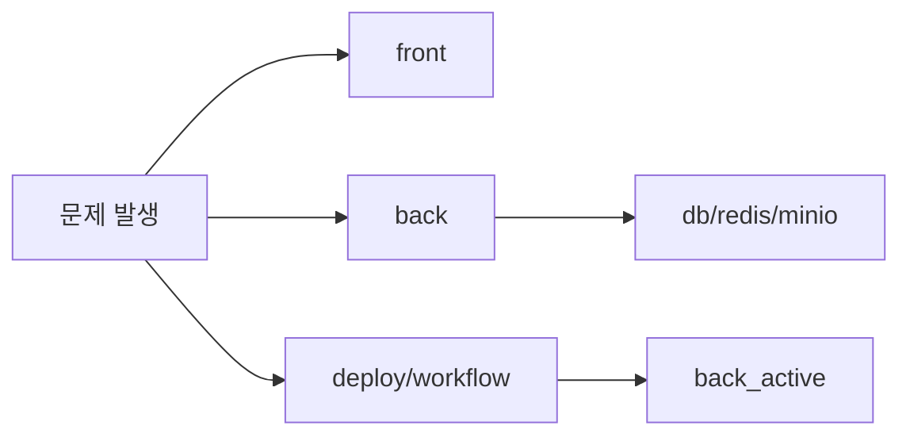

# Session Handoff

Last updated: 2026-03-12

## 이 문서가 보여주는 것

이 문서는 단순한 인수인계 메모가 아니라, 실제 운영 중 어떤 지점을 가장 먼저 확인하고 어떤 방식으로 빠르게 트리아지하는지를 보여주는 운영 노트다.

## 현재 상태 요약

- 운영 구조는 `Vercel(front) + Home Server(back/db/redis/minio/caddy/cloudflared)`이다.
- 글 데이터 소스는 더 이상 Notion이 아니라 자체 백엔드 API다.
- 프론트는 Next.js Pages Router 기반이고, 백엔드는 Spring Boot 4 + Kotlin 기반이다.
- blue/green 배포는 `back_active` alias를 중심으로 동작한다.



## 최근 반영된 큰 변화

- `c4bde1e` `feat(front): redesign auth and admin experience`
- `416428e` `fix: harden minio upload init and surface storage errors`
- `fb0f1cc` `feat(profile): switch admin profile upload to minio and use direct url for fast render`
- `74d28f9` `feat(profile): manage admin role/bio from admin page and reduce site.config dependency`
- `66bb820` `fix(back): harden login throttling and task queue processing`
- 로컬 워킹트리 기준으로 backend는 `adapter/application` 구조로 이동 중이며, 기존 `app/in/out`와 공존하는 과도기 상태다.

## 지금 가장 중요한 운영 메모

- `HOME_SERVER_ENV`가 운영 `.env.prod`를 덮어쓴다.
- storage 관련 env는 placeholder 없이 실값을 넣어야 한다.
  잘못 넣으면 `URISyntaxException: Expected scheme-specific part at index 5: http:` 류의 장애가 난다.
- `MINIO_ROOT_PASSWORD` 같은 값에 `#`가 들어가면 반드시 큰따옴표로 감싼다.
- 프론트 SSR과 브라우저 런타임 API 주소는 각각 `BACKEND_INTERNAL_URL`, `NEXT_PUBLIC_BACKEND_URL`로 분리된다.
- 로그인 시도 제한은 Redis 우선, 메모리 fallback 구조다.
- task processor 기본값은 `60초`, batch size는 `50`이다.
- 회원가입 메일 설정은 `/system/api/v1/adm/mail/signup`에서 준비 상태를 바로 볼 수 있다.

## 빠른 트리아지 표

| 증상 | 제일 먼저 볼 파일/지점 | 확인 포인트 |
| --- | --- | --- |
| 로그인 실패 | `front/src/apis/backend/client.ts` | API base URL, credentials 포함 여부 |
| 로그인 차단이 제멋대로임 | `LoginAttemptService`, Redis 연결 | Redis TTL 키 공유 여부, fallback 여부 |
| 관리자 401 | `ApiV1AuthController`, admin env | `me.isAdmin`, username 규칙 |
| 글 목록 비어 있음 | `front/src/apis/backend/posts.ts` | 목록 API 응답, `published/listed` |
| 이미지 오류 | `back/src/main/kotlin/com/back/boundedContexts/post/adapter/out/storage/PostImageStorageAdapter.kt` | endpoint, accessKey, secretKey |
| 배포 실패 | `.github/workflows/deploy.yml`, `blue_green_deploy.sh` | Secret, alias, health |
| 구조 파악이 안 됨 | `docs/design/package-structure.md` | `adapter/application` vs `app/in/out` 공존 여부 |

## 빠른 점검 포인트

1. `https://api.<domain>/actuator/health/readiness`
2. `/system/api/v1/adm/mail/signup`
3. 프론트 로그인 후 `/member/api/v1/auth/me`
4. 관리자 페이지에서 글 발행
5. 메인 페이지 목록 반영
6. 이미지 업로드와 프로필 이미지 표시

## 점검 명령과 성공 기준

| 명령/화면 | 기대 결과 |
| --- | --- |
| `./gradlew ktlintCheck` | Kotlin 스타일 검사 통과 |
| `./gradlew test` | 백엔드 테스트 green |
| `./gradlew compileKotlin` | Kotlin 컴파일 성공 |
| `yarn build` | 프론트 프로덕션 빌드 성공 |
| `https://api.<domain>/actuator/health/readiness` | readiness 응답 |
| `/admin` | 관리자 도구 표시 및 API 정상 |
| task backlog 존재 시 1분 후 재조회 | `PENDING` 감소 또는 `PROCESSING/COMPLETED` 증가 |

## 자주 보는 파일

- `back/src/main/resources/application.yaml`
- `back/src/main/kotlin/com/back/boundedContexts/post/app/PostImageStorageService.kt`
- `front/src/apis/backend/client.ts`
- `front/src/apis/backend/posts.ts`
- `front/src/pages/admin.tsx`
- `.github/workflows/deploy.yml`
- `deploy/homeserver/blue_green_deploy.sh`
- `deploy/homeserver/docker-compose.prod.yml`

## 로컬 검증 명령

```bash
cd back && ./gradlew ktlintCheck
cd back && ./gradlew test
cd back && ./gradlew compileKotlin
cd front && yarn build
```

## 백엔드 수정 규칙

- 백엔드 코드를 수정한 턴에서는 `ktlintCheck`, `compileKotlin`, `test`를 전체 기준으로 확인하는 것을 기본 원칙으로 본다.
- 단일 테스트만 먼저 돌렸더라도, 최종 반영 전에는 전체 백엔드 검증으로 다시 닫는다.

## 다음에 손대기 좋은 영역

- 태그/카테고리 정규화
- 관리자 role 모델 고도화
- 이미지 메타데이터/정리 전략
- 시스템 상태 조회 범위 확장
