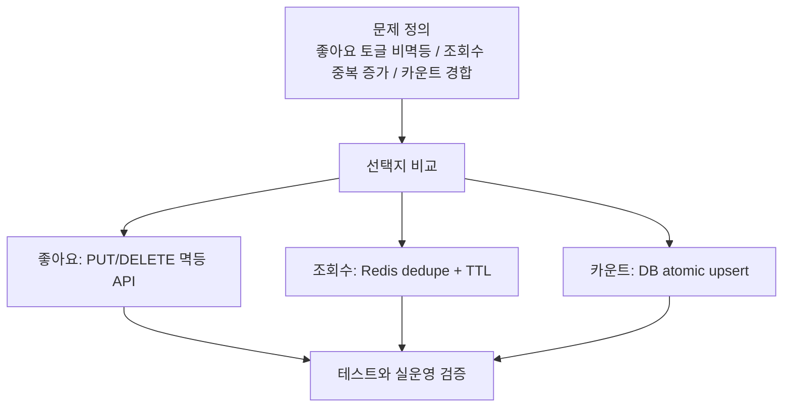
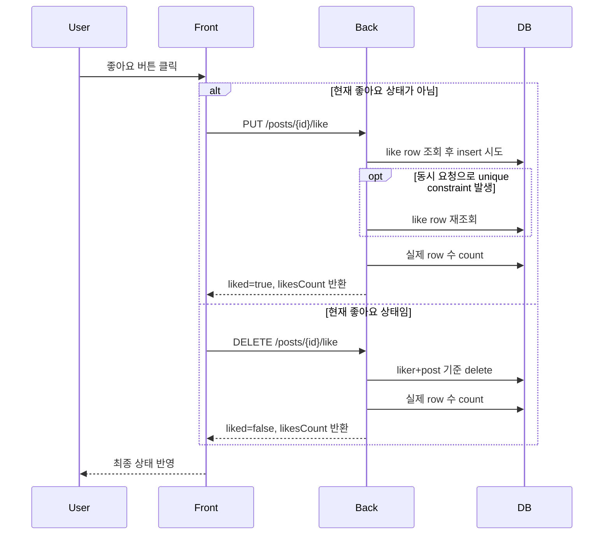
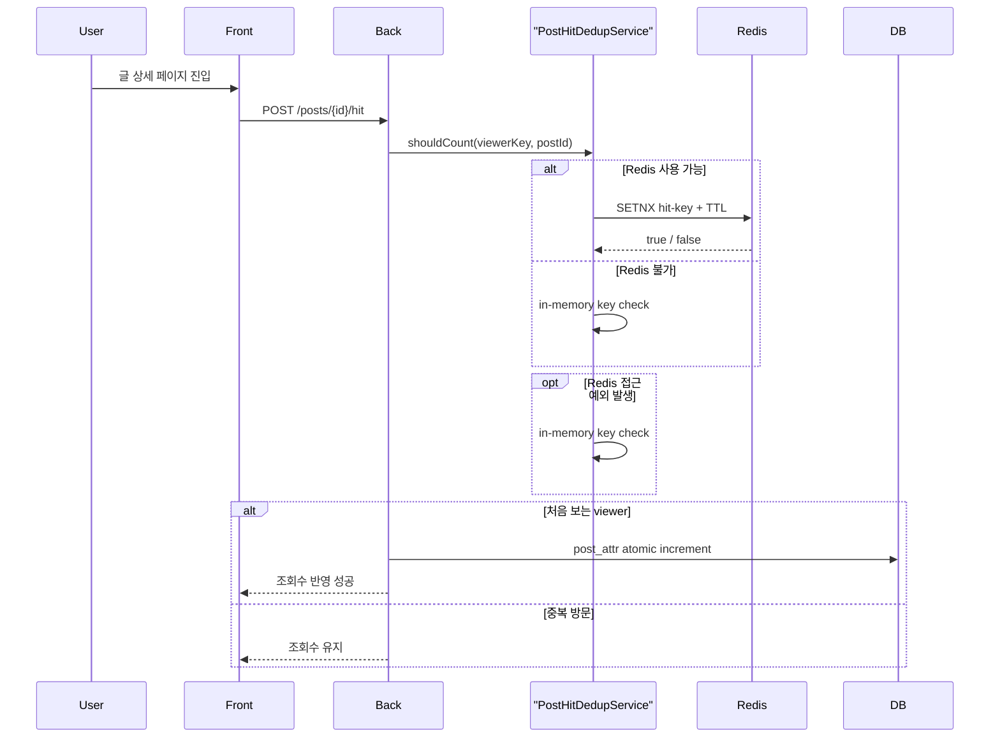
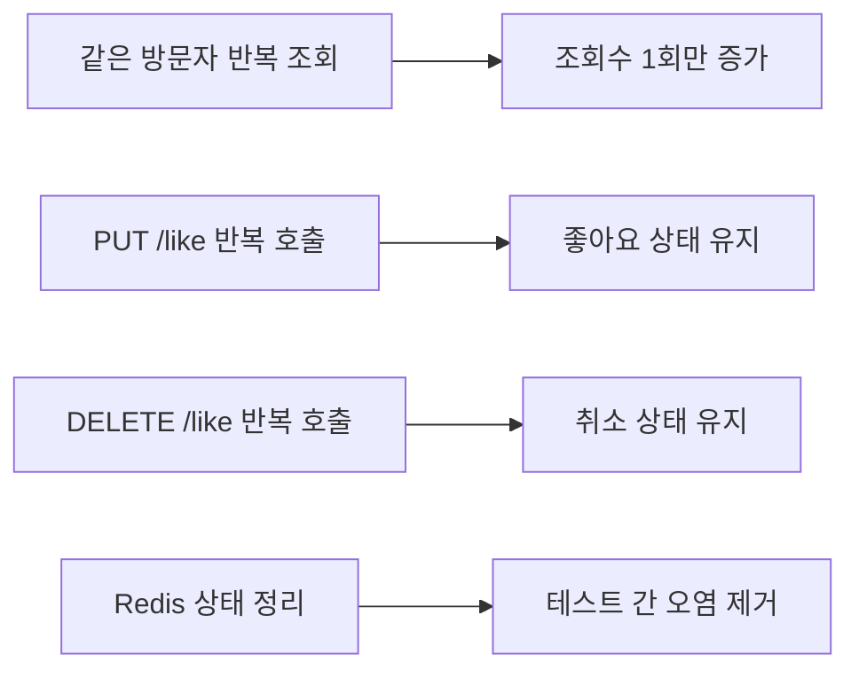

# 좋아요/조회수 동시성·멱등성 개선기

## 3줄 요약

- 좋아요/조회수 정합성, 멱등성, 동시성 이슈를 다룰 때 이 문서를 먼저 읽는다.
- 최종 선택은 `좋아요 PUT/DELETE 멱등 API + 조회수 dedupe + 원자 증가` 조합이다.
- 더 큰 규모의 카운팅 시스템으로 갈지 판단할 때 현재 선택의 한계와 검증 근거를 여기서 확인한다.

## 1. 왜 이 작업을 했는가

블로그의 `좋아요`와 `조회수`는 기능 자체는 단순해 보이지만, 실제 운영에서는 데이터 신뢰성과 사용자 경험을 동시에 건드리는 영역이다.

특히 아래 상황은 서비스 신뢰도를 빠르게 떨어뜨린다.

- 같은 사용자가 좋아요 버튼을 여러 번 눌렀을 때 최종 상태가 예측되지 않음
- 네트워크 재시도나 중복 요청으로 좋아요 요청이 비정상적으로 반영됨
- 동시에 여러 요청이 들어오면 카운트가 유실됨
- 같은 사용자가 새로고침만 반복해도 조회수가 계속 증가함

이 문서는 단순한 트러블슈팅 기록이 아니라, 위 문제를 어떤 기준으로 정의하고 어떤 선택지를 비교했는지, 그리고 현재 서비스 규모에서 왜 이 구현을 최종 선택했는지를 설명하는 포트폴리오 문서다.

## 2. 프로젝트 맥락

현재 서비스는 다음 특성을 가진다.

- 개인 기술 블로그
- 관리자 1명 중심 운영
- 글 상세 페이지에서 좋아요와 조회수가 직접 노출됨
- Spring Boot + PostgreSQL + Redis 기반
- 대규모 이벤트 파이프라인이나 분석 전용 저장소는 아직 없음

즉, "대형 플랫폼용 분산 카운터"까지는 과하지만, 그렇다고 단순 토글 버튼 수준으로 두기에는 운영 리스크가 있는 규모다.

## 3. 문제 정의

### 3.1 좋아요는 토글 방식이라 멱등하지 않았다

기존 구현은 `POST /post/api/v1/posts/{id}/like` 한 개로만 동작했다.

내부 로직은 다음과 같았다.

1. 현재 사용자의 좋아요 row 조회
2. 있으면 삭제
3. 없으면 생성

이 방식은 UI에서 다루기 쉬워 보이지만, API 의미가 `토글`이기 때문에 멱등하지 않다.

예를 들어 같은 요청이 두 번 들어오면:

- 첫 번째 요청: 좋아요 추가
- 두 번째 요청: 좋아요 취소

즉, 사용자의 의도는 "좋아요를 누른다"였는데 최종 상태는 반대로 끝날 수 있었다.

### 3.2 유니크 제약만으로는 운영 안정성이 충분하지 않았다

`post_like` 테이블에는 `(liker_id, post_id)` 유니크 제약이 있다.

이 제약은 중복 row 저장은 막아주지만, 동시에 첫 좋아요 요청이 2개 들어오면 한 요청은 성공하고 다른 요청은 예외로 실패할 수 있다.

즉, 데이터 정합성은 일부 보장해도 사용자 경험은 깨질 수 있었다.

### 3.3 카운트는 read-modify-write 방식이라 경합에 취약했다

좋아요 수와 조회수는 `PostAttr` 값을 읽어와 메모리에서 `+1/-1`한 뒤 다시 저장하는 방식이었다.

이 방식은 동시에 요청이 들어오면 아래 문제가 생긴다.

- 두 요청이 같은 값을 읽음
- 각각 증가 계산을 수행함
- 마지막 저장만 반영되어 증가분 일부가 유실됨

조회수처럼 빈도가 높은 값에서는 특히 더 위험하다.

### 3.4 조회수에 "같은 방문자"에 대한 정책이 없었다

상세 페이지 진입 때마다 조회수가 증가하는 구조였다.

그 결과:

- 새로고침
- 뒤로가기 후 재진입
- 같은 글을 여러 탭에서 열기

같은 사용자의 반복 방문도 전부 조회수로 누적됐다.

개인 블로그에서도 raw pageview를 쓸 수는 있지만, 일반적으로 사용자가 기대하는 "조회수"는 이보다 더 보수적인 값에 가깝다.

## 4. 목표와 비목표

### 목표

- 좋아요 요청을 멱등하게 만든다
- 동시 요청에서도 좋아요/조회수 카운트가 쉽게 깨지지 않도록 한다
- 같은 방문자의 반복 조회를 일정 수준 제어한다
- 기존 아키텍처 경계를 크게 흔들지 않는다

### 비목표

- 대규모 실시간 분석 시스템 구축
- 이벤트 소싱 기반 카운터 시스템 도입
- 완전한 고유 방문자 분석
- 비로그인 사용자의 좋아요 허용

## 5. 선택지 비교

## 5.1 좋아요 API 설계

### 선택지 A. 기존 토글 API 유지

- 장점: 구현 단순, 프론트 변경 적음
- 단점: 멱등성이 없음, 재시도와 중복 요청에 취약

### 선택지 B. `PUT /like`, `DELETE /like` 분리

- 장점: API 의미가 명확하고 멱등성 확보 가능
- 장점: 프론트가 현재 상태를 기준으로 의도를 보낼 수 있음
- 단점: 엔드포인트가 늘어남

### 선택지 C. 좋아요 이벤트 큐 + 비동기 집계

- 장점: 대규모 트래픽에서 확장성 좋음
- 단점: 현재 서비스 규모에서는 과함
- 단점: 운영 복잡도와 장애 지점 증가

### 최종 선택

`선택지 B`

이유:

- 현재 서비스 규모에서는 가장 실용적이다
- API 멱등성을 확보할 수 있다
- 기존 포트/어댑터 구조 안에서 확장이 가능하다
- 프론트와 백엔드 모두 변경 범위를 작게 유지할 수 있다

## 5.2 조회수 중복 방문 제어

### 선택지 A. 단순 raw pageview 유지

- 장점: 구현 단순
- 단점: 새로고침/중복 탭/재진입에 너무 취약

### 선택지 B. `post_view` 테이블에 방문 이력 저장

- 장점: 가장 정교한 제어 가능
- 장점: 분석 확장성이 좋음
- 단점: 저장 비용과 테이블 관리 비용이 커짐
- 단점: 현재 개인 블로그 운영에는 과한 설계

### 선택지 C. Redis 기반 viewer dedupe + TTL

- 장점: 중복 조회 제어 가능
- 장점: 저장 비용이 낮고 구현이 단순함
- 장점: 단일 서비스 규모에 적합
- 단점: 완전한 unique visitor 분석은 아님

### 최종 선택

`선택지 C`

이유:

- 현재 서비스 규모에서 운영 비용 대비 효과가 가장 좋다
- Redis가 없더라도 fallback 전략으로 유지 가능하다
- "조회수 과다 누적 방지"라는 현실적 목표에는 충분하다

## 5.3 카운터 증가 방식

### 선택지 A. 애플리케이션에서 `current + 1`

- 장점: 구현 단순
- 단점: 동시성에 취약

### 선택지 B. DB atomic update

- 장점: 카운트 유실 가능성을 크게 줄일 수 있음
- 장점: 현재 PostgreSQL 구조와 잘 맞음
- 단점: native query 관리가 필요함

### 선택지 C. 별도 카운터 저장소 도입

- 장점: 대규모 트래픽에서 유리
- 단점: 현재 규모에서는 과함

### 최종 선택

`선택지 B`

이유:

- 현재 구조와 가장 잘 맞고
- 구현 복잡도도 통제 가능하며
- 동시성 문제를 실질적으로 완화할 수 있기 때문이다

## 6. 최종 설계

### 6.1 좋아요는 멱등 API로 분리

- `PUT /post/api/v1/posts/{id}/like`
- `DELETE /post/api/v1/posts/{id}/like`

기존 `POST /like` 토글 엔드포인트는 호환성을 위해 유지하되, 실제 사용자 경로는 idempotent API로 옮겼다.

관련 파일:

- `back/src/main/kotlin/com/back/boundedContexts/post/adapter/web/ApiV1PostController.kt`
- `back/src/main/kotlin/com/back/boundedContexts/post/application/service/PostApplicationService.kt`
- `back/src/main/kotlin/com/back/boundedContexts/post/application/port/input/PostUseCase.kt`
- `back/src/main/kotlin/com/back/boundedContexts/post/application/service/PostUseCaseAdapter.kt`
- `front/src/routes/Detail/PostDetail/index.tsx`

### 6.2 좋아요 경합은 "실패"보다 "의도한 최종 상태"를 우선했다

좋아요 추가 시:

1. 먼저 기존 row 확인
2. 없으면 insert 시도
3. 동시에 다른 요청이 먼저 성공해 유니크 제약 예외가 나면
4. row를 다시 조회해 "이미 좋아요 상태"로 해석

이 설계는 "예외 없이 성공만 하자"가 아니라, 사용자 의도 기준으로 더 자연스러운 최종 상태를 보장하는 데 초점을 둔다.

### 6.3 좋아요 카운트는 실제 row 수를 기준으로 맞췄다

좋아요 row 자체가 사실(source of truth)이기 때문에, 좋아요/취소 후에는 `countByPost(post)`로 실제 개수를 다시 읽어 `likesCount`를 맞춘다.

즉, 파생 카운트가 경합 상황에서 틀어지더라도 실제 row 수 기준으로 복구할 수 있게 했다.

### 6.4 조회수는 viewer dedupe 서비스로 분리

`PostHitDedupService`를 별도 서비스로 두고, 같은 방문자의 반복 조회를 TTL 기준으로 제어했다.

viewer key 정책:

- 로그인 사용자: `member:{memberId}`
- 비로그인 사용자: `anon:{clientIp}|{userAgent}`

저장소 정책:

- Redis가 있으면 `SETNX + TTL`
- Redis가 없으면 in-memory fallback
- Redis가 일시적으로 불안정해도 조회수 요청 자체는 fallback으로 계속 처리

관련 파일:

- `back/src/main/kotlin/com/back/boundedContexts/post/application/service/PostHitDedupService.kt`
- `back/src/main/kotlin/com/back/global/web/application/Rq.kt`

### 6.5 조회수 증가는 DB에서 원자적으로 처리

`PostAttr`는 native upsert를 사용해 DB에서 직접 증가시키도록 바꿨다.

핵심 포인트:

- `ON CONFLICT (subject_id, name) DO UPDATE`
- `int_value = post_attr.int_value + excluded.int_value`

구현 과정에서 실제로 겪었던 함정도 있었다.

- `post_attr`는 시퀀스 PK(`id`)를 사용하기 때문에
- insert 시 `id`를 비워두면 `null value in column "id"` 예외가 발생했다
- 따라서 `nextval('post_attr_seq')`를 명시하는 방식으로 보완했다

관련 파일:

- `back/src/main/kotlin/com/back/boundedContexts/post/adapter/persistence/PostAttrRepositoryCustom.kt`
- `back/src/main/kotlin/com/back/boundedContexts/post/adapter/persistence/PostAttrRepositoryImpl.kt`
- `back/src/main/kotlin/com/back/boundedContexts/post/adapter/persistence/PostAttrRepositoryAdapter.kt`
- `back/src/main/kotlin/com/back/boundedContexts/post/application/port/output/PostAttrRepositoryPort.kt`

## 7. 왜 이 설계가 현재 서비스 규모에 가장 적합했는가

이번 의사결정의 핵심은 "가장 완벽한 설계"가 아니라 "현재 서비스 규모에서 운영 가능한 최선의 설계"를 고르는 것이었다.

이번 선택은 다음 균형을 맞춘다.

- 대규모 플랫폼용 복잡도는 피한다
- 하지만 단순 토글/카운터 수준의 취약한 구현도 피한다
- 기존 아키텍처 경계는 유지한다
- Redis와 PostgreSQL이라는 이미 가진 인프라를 재활용한다

즉, 현재 블로그 서비스에는 과하지 않으면서도, 운영 관점에서 의미 있는 개선을 만드는 쪽으로 설계했다.

## 8. 검증 전략

구현만으로는 충분하지 않기 때문에, 실제 실패 가능성이 높은 시나리오를 테스트로 보강했다.

### 백엔드 검증

- 같은 방문자의 반복 조회는 한 번만 반영되는지
- `PUT /like`를 여러 번 보내도 좋아요 상태가 유지되는지
- `DELETE /like`를 여러 번 보내도 취소 상태가 유지되는지
- Redis 기반 상태가 테스트 간에 남지 않는지

관련 파일:

- `back/src/test/kotlin/com/back/boundedContexts/post/adapter/web/ApiV1PostControllerTest.kt`
- `back/src/test/kotlin/com/back/boundedContexts/member/adapter/web/ApiV1AuthControllerTest.kt`
- `back/src/main/kotlin/com/back/boundedContexts/member/application/service/LoginAttemptService.kt`

### 실행 검증

실제 적용 후 아래 검증을 수행했다.

- `./gradlew test --rerun-tasks`
- 프론트 상세 페이지에서 좋아요/조회수 동작 수동 확인
- `npm run lint`
- `npm run build`

즉, 단순히 코드 변경에 그치지 않고, 회귀 가능성이 높은 경로를 테스트와 빌드 검증으로 확인했다.

## 9. 적용 결과

적용 이후 기대되는 동작은 다음과 같다.

- 같은 사용자가 같은 좋아요 상태 요청을 반복해도 결과가 뒤집히지 않음
- 좋아요 추가 경합이 발생해도 사용자 경험상 실패로 드러나지 않음
- 조회수는 동일 방문자의 반복 새로고침에 과도하게 반응하지 않음
- 조회수 증가 시 카운트 유실 가능성이 이전보다 낮아짐
- Redis 일시 장애가 나도 조회수 API가 바로 사용자 화면 에러로 번지지 않음

## 10. 남겨둔 trade-off

이번 설계는 실무적으로 균형 잡힌 선택이지만, 일부 trade-off는 의도적으로 남겨두었다.

### 조회수는 완전한 unique visitor 분석이 아니다

- IP + User-Agent 기반이라 NAT/프록시 환경에서는 충돌 가능성이 있다
- 그러나 블로그 운영 기준에서는 충분히 실용적이다

### 좋아요는 로그인 사용자 기준이다

- 비로그인 좋아요를 허용하지 않는다
- 개인 블로그 운영에서는 오히려 이 정책이 더 단순하고 안전하다

### `likesCount`, `hitCount`는 여전히 파생 카운트다

- 완전한 이벤트 소싱 구조는 아니다
- 다만 현재 규모에서는 이 정도가 비용 대비 최선이다

## 11. 다음 확장 포인트

서비스가 더 커지면 아래 방향으로 확장할 수 있다.

- `post_view` 이벤트 저장 테이블 도입
- 운영 대시보드용 조회수 집계 분리
- 좋아요/조회수 변경 이벤트 비동기 처리
- 멀티 인스턴스 환경에서 Redis 정책 세분화

하지만 현재 단계에서는 이런 확장보다, 지금 수준의 안정성을 낮은 복잡도로 확보하는 것이 더 중요하다고 판단했다.

## 12. 요약

이번 작업은 단순한 버그 수정이 아니라, 다음 질문에 답하는 작업이었다.

- 이 기능은 멱등해야 하는가
- 어디까지를 같은 사용자로 볼 것인가
- 현재 서비스 규모에서 어떤 복잡도가 적정한가
- 운영 가능한 구조를 유지하면서 어떻게 안정성을 높일 것인가

결론적으로 이번 개선은:

- 좋아요는 `토글`에서 `의도 기반 멱등 API`로
- 조회수는 `무제한 증가`에서 `중복 방문 제어`로
- 카운트 업데이트는 `애플리케이션 계산`에서 `DB 원자 증가`로

바뀌었다.

이 선택은 지금의 블로그 서비스 규모에서 과하지 않으면서도, 운영 신뢰성과 사용자 경험을 함께 끌어올리는 방향이었다.
