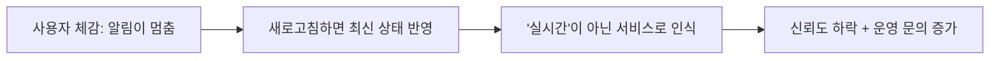
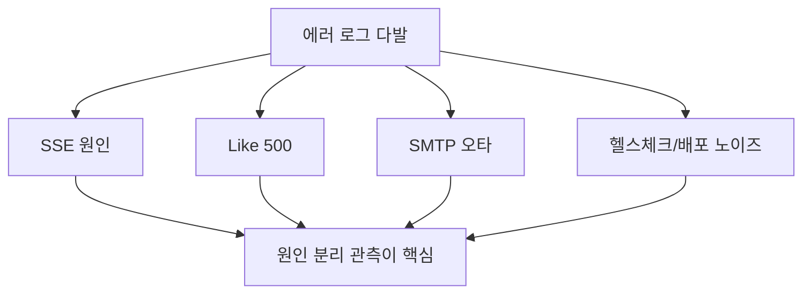
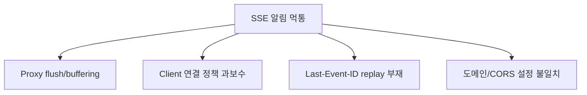
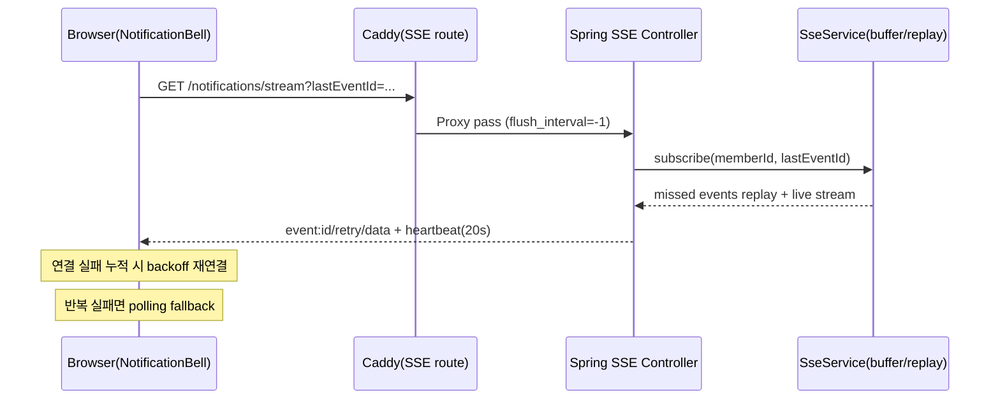
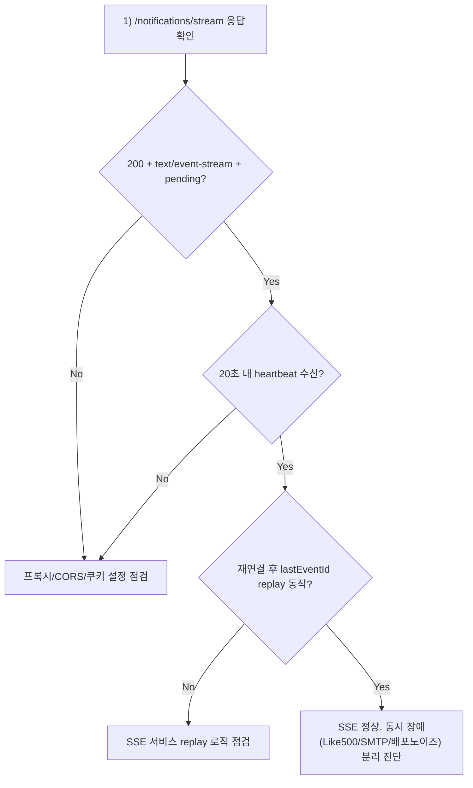

# SSE 알림이 "되다 멈춘다"를 끝낸 방법

`/member/api/v1/notifications/stream` 장애를 실제 운영 로그/커밋/대화 기록 기반으로 정리한 트러블슈팅 포스트다.  
핵심은 "SSE 하나만 고치는 것"이 아니라, **노이즈 에러를 분리하고 재연결 복구 경로를 만든 것**이다.

---

## TL;DR

| 항목 | 내용 |
| --- | --- |
| 증상 | 알림 벨이 실시간 갱신되지 않거나, 잠깐 동작 후 멈춤 |
| 단일 원인? | 아님. 프록시 flush/버퍼링 + 클라이언트 연결 정책 + 재연결 누락 + 도메인/CORS 정합성 문제의 조합 |
| 최종 해결 | SSE 전용 프록시 핸들러 + heartbeat + backoff + `Last-Event-ID` replay + same-site 우선 SSE + 환경 정합성 진단 |
| 관련 커밋 | `237cefe`, `43794d3`, `b31f14c` |

---

## 장애가 보였던 방식

- 댓글/답글 알림이 즉시 반영되지 않음
- 몇 분 뒤 알림 벨이 멈춘 것처럼 보임
- 네트워크 흔들림 이후 복구되어도 중간 이벤트 누락
- `www`/`api` 분리 환경에서 SSE 대신 polling으로만 동작



---

## 관측된 실제 에러 신호(대화/로그 원문 기반)

### 1) 좋아요 토글 500 (동시 발생한 교란 신호)

```text
POST https://api.aquilaxk.site/post/api/v1/posts/402/like 500 (Internal Server Error)
ApiError: API request failed (500) ... /post/api/v1/posts/402/like
{"timestamp":"2026-03-13T18:25:31.741Z","status":500,"error":"Internal Server Error","path":"/post/api/v1/posts/402/like"}
```

### 2) 라우팅 취소(2차 증상)

```text
Error: Loading initial props cancelled
```

### 3) SMTP 오타 장애(병행)

```text
SSLHandshakeException: (certificate_unknown) No subject alternative DNS name matching smtp.gamil.com found.
CertificateException: No subject alternative DNS name matching smtp.gamil.com found.
```

### 4) 배포/헬스체크 노이즈

```text
The host [back_blue:8080] is not valid
java.lang.IllegalArgumentException: The character [_] is never valid in a domain name.
healthcheck pending: back_blue (status=400)
...
healthcheck pending: back_green (status=503)
```



해석:
- 좋아요 500, SMTP, 헬스체크 에러가 같은 타임라인에 섞여 **SSE 장애처럼 보이는 착시**를 만들었다.
- 그래서 먼저 "SSE 스트림 자체 문제"와 "동시 발생한 별도 장애"를 분리했다.

---

## 근본 원인 4개

| 구분 | 무엇이 문제였나 | 왜 치명적이었나 |
| --- | --- | --- |
| Proxy 계층 | SSE 응답 flush/버퍼링 불안정 | 이벤트가 늦게 몰려오거나 끊김 |
| Client 정책 | `api != www`면 과도하게 polling 선택 | same-site 가능 환경에서도 SSE 장점을 못 씀 |
| Resume 부재 | 재연결 시 누락 이벤트 복구 로직 없음 | 잠깐 끊긴 구간의 알림 영구 손실 |
| Env 정합성 | URL/CookieDomain/API_DOMAIN 불일치 가능 | CORS/쿠키 전달이 환경별로 흔들림 |



---

## 해결 아키텍처 (최종)



핵심 포인트:
- 서버가 `id`, `retry`, `heartbeat`를 제공
- 클라이언트가 `lastEventId`를 추적하고 재연결에 사용
- 프록시가 SSE 스트림을 즉시 flush
- same-site면 SSE를 우선, cross-site면 polling 기본

---

## 커밋 단위 변경 내역

### `237cefe` - 기능 최초 도입

- SSE 엔드포인트/알림 벨/알림 도메인 초기 구성
- 관련 파일:
  - `back/.../ApiV1MemberNotificationController.kt`
  - `back/.../MemberNotificationSseService.kt`
  - [`front/src/layouts/RootLayout/Header/NotificationBell.tsx`](/Users/aquila/Custom/GitProjects/aquila-blog/front/src/layouts/RootLayout/Header/NotificationBell.tsx)

한계:
- 네트워크 변동/재연결/누락 복구 시나리오에 약함

### `43794d3` - 1차 안정화

- heartbeat(`20s`)
- 클라이언트 backoff 재연결
- Caddy SSE 전용 핸들러 + `flush_interval -1`
- 관련 파일:
  - [`deploy/homeserver/Caddyfile`](/Users/aquila/Custom/GitProjects/aquila-blog/deploy/homeserver/Caddyfile)
  - [`back/src/main/kotlin/com/back/boundedContexts/member/subContexts/notification/application/service/MemberNotificationSseService.kt`](/Users/aquila/Custom/GitProjects/aquila-blog/back/src/main/kotlin/com/back/boundedContexts/member/subContexts/notification/application/service/MemberNotificationSseService.kt)
  - [`front/src/layouts/RootLayout/Header/NotificationBell.tsx`](/Users/aquila/Custom/GitProjects/aquila-blog/front/src/layouts/RootLayout/Header/NotificationBell.tsx)

### `b31f14c` - 근본 보강

- `Last-Event-ID` replay(최근 100개)
- `event.lastEventId` 추적 후 재연결 전달
- stream 헤더 명시(`Cache-Control`, `Connection`, `X-Accel-Buffering`)
- CORS 허용 origin 강화(`frontUrl + cookieDomain`)
- same-site 우선 SSE 로직 개선
- `doctor.sh` 도메인 정합성 점검 추가
- 관련 파일:
  - [`back/src/main/kotlin/com/back/boundedContexts/member/subContexts/notification/adapter/in/web/ApiV1MemberNotificationController.kt`](/Users/aquila/Custom/GitProjects/aquila-blog/back/src/main/kotlin/com/back/boundedContexts/member/subContexts/notification/adapter/in/web/ApiV1MemberNotificationController.kt)
  - [`back/src/main/kotlin/com/back/boundedContexts/member/subContexts/notification/application/service/MemberNotificationSseService.kt`](/Users/aquila/Custom/GitProjects/aquila-blog/back/src/main/kotlin/com/back/boundedContexts/member/subContexts/notification/application/service/MemberNotificationSseService.kt)
  - [`front/src/layouts/RootLayout/Header/NotificationBell.tsx`](/Users/aquila/Custom/GitProjects/aquila-blog/front/src/layouts/RootLayout/Header/NotificationBell.tsx)
  - [`back/src/main/kotlin/com/back/global/security/config/SecurityConfig.kt`](/Users/aquila/Custom/GitProjects/aquila-blog/back/src/main/kotlin/com/back/global/security/config/SecurityConfig.kt)
  - [`deploy/homeserver/doctor.sh`](/Users/aquila/Custom/GitProjects/aquila-blog/deploy/homeserver/doctor.sh)

```mermaid
gantt
    title "SSE 안정화 타임라인"
    dateFormat X
    axisFormat %s
    section "초기"
    "237cefe: SSE 최초 도입" :a1, 0, 1
    section "1차 안정화"
    "43794d3: heartbeat/backoff" :a2, 1, 1
    "43794d3: Caddy flush_interval -1" :a3, 2, 1
    section "근본 보강"
    "b31f14c: Last-Event-ID replay" :a4, 3, 1
    "b31f14c: same-site 우선 SSE" :a5, 4, 1
    "b31f14c: doctor 정합성 진단" :a6, 5, 1
```



---

## 장애 재발 시 진단 플로우 (Runbook)



실행 명령:

```bash
bash deploy/homeserver/doctor.sh
```

특히 아래 경고를 우선 본다:

- `FRONTURL/BACKURL are cross-site`
- `COOKIEDOMAIN does not match ...`
- `API_DOMAIN does not match BACKURL ...`

---

## "임시방편 아니냐?"에 대한 답

폴링 폴백만 넣고 끝내면 맞다. 임시방편이다.  
이번 수정은 폴백만 넣은 게 아니라 아래를 같이 묶었다.

1. SSE 전용 프록시 경로 + flush 보장  
2. heartbeat + backoff + `Last-Event-ID` replay  
3. same-site에서 SSE 우선 사용  
4. 운영 환경 정합성 진단 자동화(`doctor.sh`)

즉, **근본 경로(SSE) 안정화 + 실패 시 안전망(polling)** 구조로 바꾼 것이다.

---

## 검증 결과 기준

| 검증 항목 | 기대 결과 |
| --- | --- |
| 댓글/답글 알림 | 1~2초 내 벨 카운트 반영 |
| 네트워크 순간 단절 | 재연결 후 누락 알림 replay |
| `www`/`api` 분리 same-site | SSE 우선 동작 |
| SSE 반복 실패 | polling 폴백으로 기능 지속 |

---

## 남은 리스크와 다음 단계

| 리스크 | 현재 상태 | 다음 단계 |
| --- | --- | --- |
| replay 버퍼 인메모리(100개) | 인스턴스 재시작 시 유실 가능 | Redis/Event log 기반 중앙 replay |
| 멀티 인스턴스 확장 | 단일 인스턴스 가정에 최적화 | Pub/Sub + consumer group 구조 |
| 터널/프록시 정책 변경 | 장기 연결 영향 가능 | SSE synthetic check + 알림 |
| 동시 장애 혼입 | 진단 시간 증가 | 대시보드에서 도메인별 에러 분리 표시 |

---

## 마무리

이번 건은 SSE 자체보다 "운영에서 원인을 어떻게 분리해서 보는가"가 더 큰 포인트였다.  
결론은 단순하다.

- SSE를 쓰려면 프록시/재연결/replay/환경정합성을 세트로 설계해야 한다.
- 에러가 많을수록 "진짜 원인"과 "동시 노이즈"를 분리해야 해결 속도가 올라간다.

이 문서는 이후 유사 장애 대응 시 기본 Runbook으로 재사용한다.
